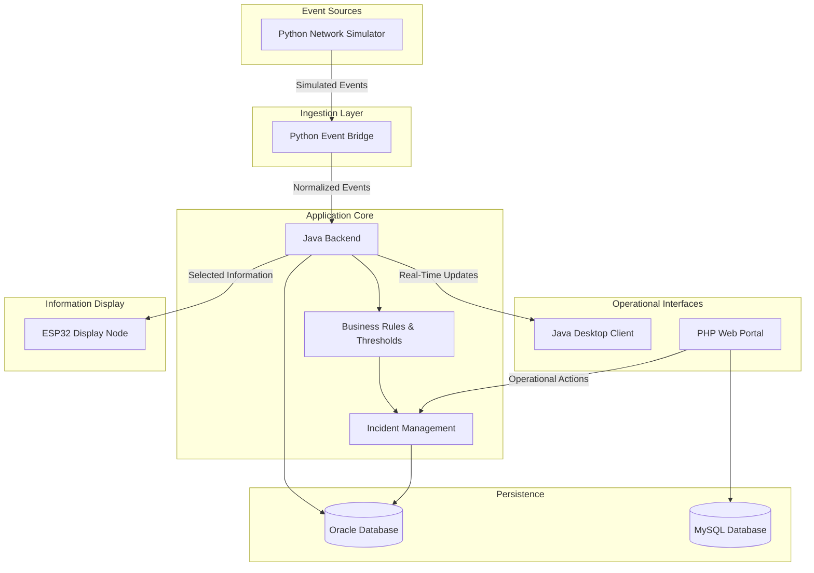
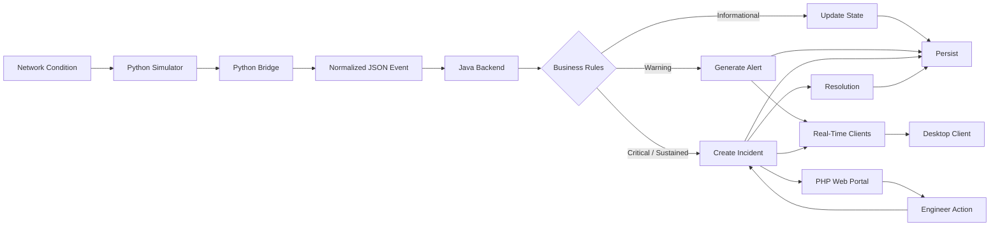
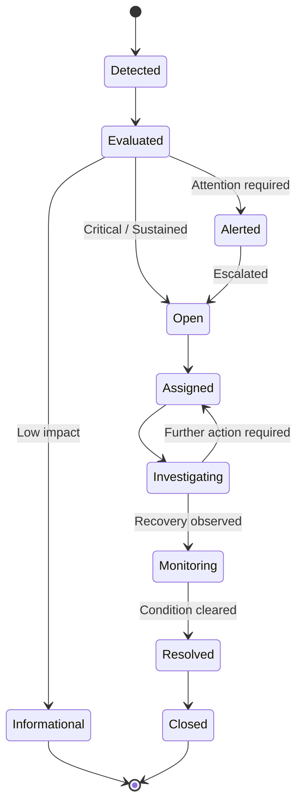
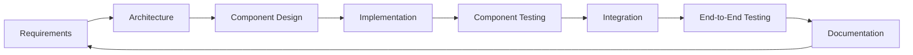

# NetPulse

[](#project-status)
[](#architecture)
[](#technology-stack)
[](#technology-stack)
[](#technology-stack)
[](#technology-stack)
[](#technology-stack)
[](#technology-stack)

> **NetPulse** is an academic, event-driven Network Operations and Monitoring platform that brings together network simulation, event ingestion, backend processing, relational databases, web applications, desktop interfaces, and a simple ESP32-based information display.

---

## Introduction

As a **second-year Computer Science student**, I have been studying several areas of computing that are often presented as separate subjects: databases, networking, programming, web development, and software engineering.

While each subject can be understood independently, I found that the more interesting challenge was understanding **how these technologies interact when they become parts of one larger system**.

That question led to the development of **NetPulse**.

Instead of treating each technology as an isolated academic exercise, NetPulse is an attempt to connect them through a single software architecture. The project is designed as a practical learning environment where concepts such as **database design, backend concurrency, event processing, web applications, desktop interfaces, communication protocols, and embedded systems** can be implemented together.

The objective is not to reproduce a commercial NOC platform. The objective is to build a technically coherent system that demonstrates how different areas of Computer Science can work together to solve an operational problem.

---

# What is NetPulse?

NetPulse is a simplified **Network Operations Center (NOC) platform** designed to simulate and manage operational events within a monitored environment.

The system can simulate network conditions and failures, process the resulting events, evaluate them against business rules, persist relevant information, notify connected interfaces, and manage incidents through a web-based workflow.

The platform is composed of several specialized components rather than a single application:

```text
Network Simulation
       │
       ▼
Python Event Bridge
       │
       ▼
Java Processing Core
       │
       ├──────────────► Oracle Database
       │
       ├──────────────► Real-Time Clients
       │
       └──────────────► Incident Workflow
                              │
                              ▼
                         PHP Web Portal

Java Desktop Client ◄──── Real-Time Updates

ESP32 ───────────────► Information Display Only
```

The ESP32 is intentionally **not part of the application's telemetry-ingestion path**.

It is used only to **display selected information**. It does not send telemetry, events, or commands back to the NetPulse application.

---

# Project Goals

NetPulse has four main goals:

### 1. Connect Academic Concepts

Bring together concepts from:

- Computer networking
- Database systems
- Object-oriented programming
- Concurrent programming
- Web development
- Software architecture
- Embedded systems
- Inter-process communication

### 2. Demonstrate System Integration

Show how independently developed components can communicate through clearly defined interfaces and data contracts.

### 3. Model an Operational Workflow

Represent a simplified sequence from:

**event → processing → alert → incident → action → resolution**

### 4. Provide a Practical Learning Project

Use a realistic system context to move beyond isolated assignments and gain experience with architectural decisions, integration problems, and end-to-end development.

---

# Architecture

NetPulse follows a modular, event-driven architecture based on **separation of concerns**.

Each major component has a specific responsibility:



> **Architectural note:** The diagram represents the intended logical architecture. Specific protocols, frameworks, deployment mechanisms, and internal implementation details may change during development.

---

# Architectural Principles

| Principle                       | Application in NetPulse                                                                                                       |
| ------------------------------- | ----------------------------------------------------------------------------------------------------------------------------- |
| **Separation of Concerns**      | Each component handles a distinct technical responsibility.                                                                   |
| **Loose Coupling**              | Components communicate through defined interfaces and structured data rather than relying on internal implementation details. |
| **Event-Driven Processing**     | Network changes are represented as events that move through the processing pipeline.                                          |
| **Domain-Oriented Persistence** | Different applications can use persistence mechanisms appropriate to their own responsibilities.                              |
| **Real-Time Communication**     | Connected operational clients can receive updates without relying entirely on periodic polling.                               |
| **Incremental Development**     | Components are implemented and tested independently before being integrated.                                                  |
| **Traceability**                | Important operational events and incident state changes are recorded for later inspection.                                    |

---

# Technology Stack

| Component                   | Technology      | Main Responsibility                                                                         |
| --------------------------- | --------------- | ------------------------------------------------------------------------------------------- |
| **Network Simulator**       | Python          | Generate simulated network events and operational conditions.                               |
| **Event Bridge**            | Python          | Receive, validate, normalize, and forward events.                                           |
| **Backend**                 | Java            | Process events, apply business rules, manage concurrency, and coordinate application logic. |
| **Desktop Client**          | Java            | Provide a real-time monitoring interface for NOC-style operations.                          |
| **Web Portal**              | PHP 8.x         | Provide browser-based ticket and incident management workflows.                             |
| **Primary Database**        | Oracle Database | Store backend operational data, event history, incidents, and audit information.            |
| **Web Database**            | MySQL           | Store web-application-specific data and portal state.                                       |
| **Real-Time Communication** | WebSocket       | Deliver selected real-time information to connected consumers.                              |
| **Display Node**            | ESP32 / C++     | Display selected information from the system.                                               |

---

# Component Architecture

## 1. Network Simulation

The network simulation layer represents the monitored infrastructure.

It is responsible for generating conditions such as:

- device state changes,
- interface failures,
- connectivity problems,
- simulated hardware events, and
- other operational conditions relevant to the project.

The simulator provides a controlled environment in which the rest of the platform can be tested without requiring a real enterprise network.

---

## 2. Python Event Bridge

The event bridge acts as the boundary between the simulator and the backend.

Its responsibilities include:

- receiving raw event data,
- validating incoming information,
- normalizing different event representations,
- converting events into structured JSON,
- forwarding normalized events to the Java backend.

This separation prevents the core backend from becoming dependent on the implementation details of the simulation layer.

### Example Event

```json
{
  "eventId": "evt-8f42c1",
  "timestamp": "2026-08-29T14:32:10Z",
  "source": "switch-sim-01",
  "eventType": "PORT_DOWN",
  "severity": "CRITICAL",
  "deviceId": "SW-001",
  "attributes": {
    "port": "Gi0/12",
    "previousState": "UP",
    "currentState": "DOWN"
  }
}
```

The exact event schema is expected to evolve as the system develops.

---

## 3. Java Backend

The Java backend is the central processing component of NetPulse.

Its responsibilities include:

- receiving normalized events,
- validating application-level data,
- managing concurrent event processing,
- applying business rules,
- evaluating thresholds,
- generating alerts,
- creating or updating incidents,
- coordinating persistence, and
- distributing relevant real-time updates.

The backend acts as the primary application-processing boundary between the event sources and the operational interfaces.

---

## 4. Oracle Database

Oracle serves as the main persistence layer for the backend domain.

Potential data includes:

- network events,
- telemetry-related records,
- alerts,
- incidents,
- ticket history,
- state transitions,
- audit information.

The database model is intended to emphasize:

- relational integrity,
- normalized data structures,
- transactional consistency,
- traceability, and
- clear relationships between operational entities.

---

## 5. PHP Web Portal

The PHP application provides the browser-based operational interface.

Its primary purpose is to support workflows such as:

- user authentication,
- role-based access control,
- ticket management,
- incident assignment,
- incident status updates,
- operational history,
- administrative functions.

The web portal is treated as a presentation and workflow layer rather than the location of core event-processing logic.

---

## 6. MySQL Database

MySQL is used to support the web application's own persistence requirements.

This provides a degree of separation between:

```text
Java / Operational Domain
        │
        ▼
     Oracle

PHP / Web Domain
        │
        ▼
     MySQL
```

The dual-database model is primarily an architectural and educational choice. It allows the project to explore **data ownership, workload separation, and integration between independently structured application components**.

It is not intended to imply that every enterprise application should use multiple relational database engines.

---

## 7. Java Desktop Client

The desktop application represents the NOC operator's real-time monitoring environment.

Its purpose is to provide a richer operational interface for information such as:

- active events,
- system status,
- alerts,
- monitored devices,
- incident states,
- real-time operational changes.

The desktop client focuses primarily on **monitoring and visualization**, while the PHP application focuses more heavily on **ticket and incident workflow**.

---

## 8. ESP32 Display Node

The ESP32 is included to demonstrate a simple connection between software systems and embedded hardware.

Its role is intentionally limited.

### The ESP32:

- displays selected information,
- provides a physical representation of system state,
- demonstrates embedded-system integration.

### The ESP32 does not:

- generate application telemetry,
- send network events to NetPulse,
- act as a sensor-data source for the backend,
- control the application's business logic,
- receive operational commands from NetPulse.

Conceptually:

```text
              NetPulse
                 │
                 │ Selected Information
                 ▼
          ┌───────────────┐
          │     ESP32     │
          │ Display Node  │
          └───────────────┘

                 ▲
                 │
        No telemetry / events
        are sent back to
        the application.
```

This makes the ESP32 a **display endpoint**, rather than a bidirectional IoT gateway.

---

# End-to-End Event Flow

The main operational flow can be summarized as:



---

# Event Lifecycle

A typical failure scenario follows this sequence:

### 1. Detection

The network simulator generates a condition such as:

```text
Switch SW-001
Port Gi0/12
State: UP → DOWN
```

### 2. Ingestion

The Python bridge receives the raw event and converts it into the platform's normalized event structure.

### 3. Processing

The Java backend receives the normalized event and evaluates it against the applicable business rules and thresholds.

### 4. Alerting

When appropriate, the system generates an operational alert and distributes the relevant information to connected clients.

### 5. Incident Creation

A sufficiently severe or sustained condition can result in the creation of an incident.

### 6. Investigation

An engineer reviews the incident through the web portal and performs the appropriate operational actions.

### 7. Recovery

The simulated network condition returns to normal.

### 8. Resolution

The incident is updated or closed and the relevant state transitions remain available in the persistence layer.

---

# Incident Model

NetPulse distinguishes between three related concepts:

| Concept      | Description                                                                 |
| ------------ | --------------------------------------------------------------------------- |
| **Event**    | A discrete occurrence or state change generated by a source.                |
| **Alert**    | A notification indicating that an event or condition may require attention. |
| **Incident** | A tracked operational issue that requires investigation and resolution.     |

This distinction is important because not every low-level event should automatically become a manually managed incident.

---

# Incident State Flow



The exact state machine is subject to refinement as the ticketing and incident-management requirements become more concrete.

---

# Real-Time Communication

Real-time communication is primarily intended for operational clients that benefit from immediate state changes.

The current conceptual model is:

```text
                 ┌───────────────────┐
                 │    Java Backend   │
                 └─────────┬─────────┘
                           │
                    Real-Time Updates
                           │
              ┌────────────┴────────────┐
              │                         │
              ▼                         ▼
      ┌───────────────┐         ┌───────────────┐
      │ Java Desktop  │         │ Other Clients │
      │     Client    │         │   as needed   │
      └───────────────┘         └───────────────┘
```

The ESP32 is not treated as a telemetry producer.

It may receive selected display information depending on the final implementation, but it does not send operational events or sensor data back into the NetPulse processing pipeline.

---

# Data Flow and Responsibility Boundaries

One of the main architectural goals is to keep responsibilities explicit.

```text
┌───────────────────┐
│ Network Simulator │
│ "What happened?"  │
└─────────┬─────────┘
          │
          ▼
┌───────────────────┐
│ Python Bridge     │
│ "Normalize it."   │
└─────────┬─────────┘
          │
          ▼
┌───────────────────┐
│ Java Backend      │
│ "What does it     │
│ mean and what     │
│ should happen?"   │
└───────┬─────┬─────┘
        │     │
        │     └──────────────► Clients / Alerts
        │
        ▼
┌───────────────────┐
│ Oracle            │
│ "What happened    │
│ and when?"        │
└───────────────────┘

PHP Portal
"How do operators
manage incidents?"

ESP32
"How can selected
information be shown
physically?"
```

---

# Repository Structure

```text
NetPulse/
│
├── backend/                  # Java backend and core processing
│   ├── src/
│   └── ...
│
├── bridge/                   # Python event ingestion and normalization
│   └── ...
│
├── desktop/                  # Java desktop monitoring client
│   └── ...
│
├── web/                      # PHP web portal
│   └── ...
│
├── firmware/                 # ESP32 firmware / display logic
│   └── ...
│
├── database/                 # Database schemas and scripts
│   ├── oracle/
│   └── mysql/
│
├── network/                  # Network simulation and scenarios
│   └── ...
│
├── docs/                     # Technical documentation
│   ├── architecture/
│   ├── requirements/
│   ├── database/
│   └── integration/
│
└── README.md
```

The repository is organized primarily around **system responsibility and component boundaries**, rather than simply grouping everything by programming language.

---

# Development Approach

NetPulse is being developed incrementally.

Rather than implementing the entire system at once, each architectural boundary is developed and validated independently.



This approach is particularly useful for a project involving several technologies because many of the most important problems appear **at the boundaries between components**, rather than inside individual components.

---

# Development Roadmap

| Phase                                          | Scope                                                                                             |     Status     |
| ---------------------------------------------- | ------------------------------------------------------------------------------------------------- | :------------: |
| **Phase I — Foundation**                       | Architecture, initial database design, repository structure, and project setup                    |  ✅ Complete   |
| **Phase II — Core Platform**                   | Java backend, Python bridge, PHP portal, database integration, business rules, and access control | 🚧 In Progress |
| **Phase III — Display & Hardware Integration** | ESP32 display functionality and communication with selected system information                    |   ⏳ Planned   |
| **Phase IV — Desktop & System Refinement**     | Desktop dashboard, end-to-end integration, testing, refinement, and final documentation           |   ⏳ Planned   |

The roadmap is iterative and may change as implementation, testing, and architectural evaluation progress.

---

# Documentation

Project documentation is maintained in the [`docs`](./docs) directory.

The recommended reading order is:

```text
1. Architecture
       ↓
2. Requirements
       ↓
3. Database Design
       ↓
4. Integration Contracts
       ↓
5. Implementation
       ↓
6. Testing
```

The documentation is intended to describe not only **what** was implemented, but also **why** particular architectural decisions were made.

---

# Testing Strategy

Testing is expected to cover multiple levels of the system.

| Test Level            | Purpose                                                           |
| --------------------- | ----------------------------------------------------------------- |
| **Unit Tests**        | Validate individual classes, functions, and business rules.       |
| **Component Tests**   | Validate individual services or applications in isolation.        |
| **Integration Tests** | Verify communication between major components.                    |
| **Database Tests**    | Validate schemas, constraints, queries, and persistence behavior. |
| **End-to-End Tests**  | Validate complete operational scenarios across the platform.      |
| **Scenario Tests**    | Reproduce realistic failure and recovery sequences.               |

A representative end-to-end scenario might be:

```text
Simulated Failure
      ↓
Event Ingestion
      ↓
Backend Processing
      ↓
Threshold Evaluation
      ↓
Alert / Incident
      ↓
Engineer Action
      ↓
Network Recovery
      ↓
Incident Resolution
      ↓
Audit Record
```

---

# Design Decisions

## Why Use Multiple Technologies?

The project is intentionally polyglot.

Each technology corresponds to a particular learning or architectural concern:

| Technology | Focus                                              |
| ---------- | -------------------------------------------------- |
| **Python** | Simulation, parsing, and ingestion                 |
| **Java**   | Backend architecture and concurrency               |
| **PHP**    | Web application and operational workflows          |
| **Oracle** | Relational persistence and auditing                |
| **MySQL**  | Web application persistence                        |
| **ESP32**  | Embedded hardware and physical information display |

The purpose is not to maximize the number of technologies. The purpose is to understand the **interfaces and responsibilities between them**.

---

## Why Use an Event-Driven Model?

Network operations naturally involve asynchronous state changes.

Multiple events may happen independently, and the application may need to:

- receive events continuously,
- process more than one event at a time,
- evaluate conditions against rules,
- notify connected clients,
- create incidents,
- record state changes.

An event-driven model therefore provides a useful architectural representation of the problem being studied.

---

## Why Separate the Web Portal from the Backend?

The PHP web application is treated as a dedicated operational interface rather than the core business engine.

This separation allows:

```text
Web Interface
     │
     ▼
Operational Workflow
     │
     ▼
Core Application Logic
     │
     ├── Persistence
     ├── Event Processing
     └── Notifications
```

This makes the system easier to reason about and helps prevent business logic from becoming tightly coupled to a particular user interface.

---

# Scope and Limitations

NetPulse is an academic engineering project and should be understood within that scope.

The project does **not** attempt to provide:

- a production-grade commercial NOC platform,
- carrier-grade network management,
- Internet-scale observability,
- universal support for network vendors and protocols,
- a complete enterprise ITSM implementation,
- production SaaS infrastructure,
- a fully bidirectional IoT monitoring architecture.

The emphasis is on **learning, architecture, integration, and practical implementation**.

The network environment is simulated, and the ESP32 component is deliberately limited to displaying selected information rather than acting as a telemetry source.

---

# Project Status

> 🚧 **Active Development**
>
> NetPulse is currently under development as a second-year Computer Science academic project.
>
> The architecture and implementation are expected to evolve as new components are completed, tested, and integrated. Some interfaces and technical decisions may therefore change during development.

---

# Current Focus

The current development effort is centered on establishing the system's core processing path:

```text
Python Simulation
       ↓
Event Bridge
       ↓
Java Backend
       ↓
Business Rules
       ↓
Persistence
       ↓
Operational Interfaces
```

The immediate priority is to establish reliable contracts and integration points before expanding the platform with additional interface and hardware functionality.

---

# Author

**Mohamed Bin Fares**
_Computer Science Student · Software Engineering Enthusiast_

NetPulse is a personal academic project developed as part of my exploration of software architecture, networking, backend development, databases, web systems, desktop applications, and embedded computing.

The project is primarily an exercise in understanding how individual Computer Science concepts can be connected into a single, maintainable system.
