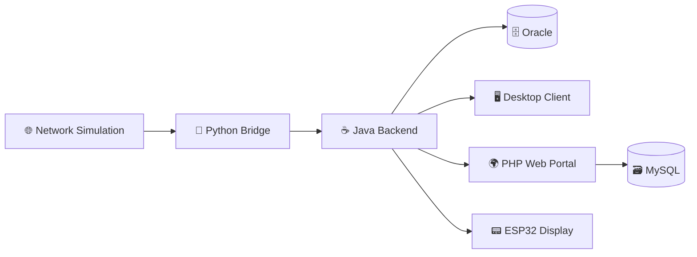
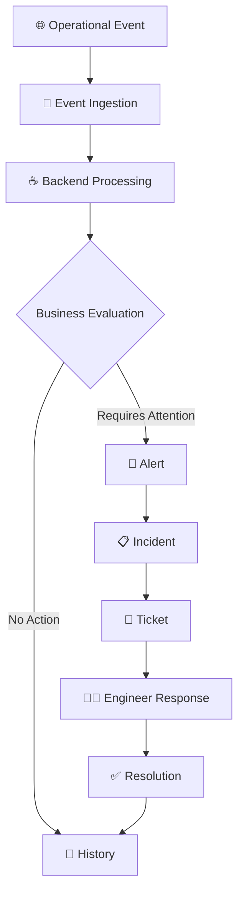

# 📡 NetPulse

### Network Operations & Monitoring — Academic Project

**A practical exploration of how networking, backend systems, databases, web applications, desktop interfaces, and embedded hardware can work together as one system.**

<p align="center">
  <!-- Project Status & Meta Badges -->
  <a href="#-development-roadmap"></a>
  
  
  
</p>

<p align="center">
  <!-- Tech Stack & Architecture Badges -->
  <a href="#-architectural-philosophy--technology-stack"></a>
  <a href="#1-python-the-ingestion--normalization-bridge"></a>
  <a href="#2-java-the-core-business-backend"></a>
  <a href="#3-php-the-web-portal--ticketing-interface"></a>
  <a href="#4-dual-database-strategy-oracle--mysql"></a>
  <a href="#4-dual-database-strategy-oracle--mysql"></a>
  <a href="#5-esp32-iot-the-physical-edge"></a>
</p>

<p>
  <a href="#about">About</a> •
  <a href="#vision">Vision</a> •
  <a href="#system-at-a-glance">System at a Glance</a> •
  <a href="#project-nature">Project Nature</a> •
  <a href="#technology-landscape">Technology Landscape</a> •
  <a href="#scope">Scope</a> •
  <a href="#roadmap">Roadmap</a>
</p>

---

## 🧭 About

**NetPulse** is a personal academic project built around a simple idea: different areas of Computer Science become more meaningful when they are understood as parts of a larger system rather than as isolated subjects.

The project explores a simplified **Network Operations Center (NOC)** environment where network-related events move through a connected set of software components and eventually become information that can be monitored and acted upon.

NetPulse is intentionally **modular and polyglot**. Python, Java, PHP, relational databases, and an ESP32 are used for different responsibilities within the same overall system.

> **NetPulse is an academic engineering project, not a commercial NOC platform.**

---

## 🎓 Why NetPulse?

I am currently studying **Computer Science in my second year**.

During my studies, topics such as networking, databases, programming, web development, and software engineering are often introduced separately. I wanted to explore what happens when these concepts are connected through a single practical project.

NetPulse is the result of that motivation.

Rather than treating every technology as a separate exercise, the project provides a common context in which their relationships can be explored, implemented, and understood.

---

## 🎯 Vision

The vision of NetPulse is to build a **small, coherent operational system** that demonstrates a complete journey from an observed event to an operational response.

At a conceptual level:

```text
Something Happens
       ↓
The System Receives It
       ↓
The Event Is Evaluated
       ↓
An Alert May Be Raised
       ↓
An Incident May Be Created
       ↓
An Engineer Responds
       ↓
The Problem Is Resolved
       ↓
The History Is Preserved
```

The emphasis is on **understanding the whole system**, not on maximizing its size or complexity.

---

## 🔭 System at a Glance



The diagram represents the **logical relationship between the project's main parts**, not a deployment specification.

---

## 🧩 Project Nature

NetPulse is primarily:

| Characteristic      | Description                                                                |
| ------------------- | -------------------------------------------------------------------------- |
| 🧱 **Modular**      | Responsibilities are divided into clearly separated components.            |
| ⚡ **Event-driven** | Operational changes are represented as events moving through the system.   |
| 🔗 **Integrated**   | Different areas of Computer Science are connected through one project.     |
| 🛠️ **Practical**    | The project is intended to be built and demonstrated, not only documented. |
| 🎓 **Academic**     | The scope and complexity remain appropriate for a student project.         |
| 🌱 **Evolving**     | The architecture can grow as the project and learning objectives develop.  |

---

## 🧭 Core Concept

NetPulse revolves around a simple operational chain:

**Event → Alert → Incident → Ticket → Resolution**

These concepts represent different stages of the same operational story:

- **Event** — something happened.
- **Alert** — the event has become relevant to monitoring.
- **Incident** — the condition requires operational attention.
- **Ticket** — the work is formally tracked.
- **Resolution** — the problem has been addressed and closed.

Not every event needs to become an incident or ticket.

---

## 🛠️ Technology Landscape

NetPulse uses different technologies to represent different areas of the system:

| Technology             | Role                                          |
| ---------------------- | --------------------------------------------- |
| 🐍 **Python**          | Network simulation and event ingestion        |
| ☕ **Java**            | Core application processing                   |
| 🌐 **PHP**             | Web-based operational and ticketing interface |
| 🗄️ **Oracle Database** | Operational system data                       |
| 🗃️ **MySQL**           | Web and ticketing data                        |
| 🖥️ **Java Desktop**    | Real-time monitoring interface                |
| 📟 **ESP32 / C++**     | Physical display of selected information      |

The purpose of using multiple technologies is not to make the project unnecessarily complex. It is to explore how different technical domains can fit together.

---

## 📟 ESP32 Role

The ESP32 is intentionally kept simple.

It acts as a **physical display component** for selected NetPulse information.

It is **not** part of the telemetry-ingestion path and does not send network events or sensor telemetry back to the application.

Conceptually:

```text
NetPulse
   │
   └── Selected Information
             ↓
         📟 ESP32
         Display
```

---

## 🔄 Workflow

The project's high-level workflow is:



This workflow is the conceptual center of NetPulse.

---

## 📐 Design Principles

NetPulse follows a few straightforward principles:

### Separation of Responsibility

Each component should have a clear purpose rather than mixing unrelated concerns.

### Simplicity

The project should remain understandable and achievable. Complexity is added only when it provides a clear benefit.

### Integration

The value of the project comes from the relationships between components, not from any individual technology.

### Traceability

Important operational actions should leave a clear history.

### Incremental Development

The system is built progressively, with the core workflow taking priority over secondary features.

---

## 📁 Repository Overview

The repository is organized around major project areas:

```text
NetPulse/
│
├── backend/       # Java backend
├── bridge/        # Python bridge
├── desktop/       # Desktop monitoring client
├── web/           # PHP web portal
├── firmware/      # ESP32 display
├── database/      # Database assets
├── network/       # Network simulation
├── docs/          # Project documentation
└── README.md
```

This structure provides a high-level map of the repository without prescribing implementation details.

---

## 📌 Scope

NetPulse focuses on:

- network-event simulation;
- event processing;
- monitoring;
- alerting;
- incident and ticket workflows;
- relational data persistence;
- real-time operational visibility;
- basic physical information display.

The project does **not** attempt to become a full commercial NOC or enterprise ITSM platform.

---

## 🚧 Current Status

**Active Development**

The overall architecture and project direction are established, while implementation continues incrementally.

The project is currently moving toward its **Minimum Viable Product (MVP)**.

---

## 🗺️ Roadmap

### Foundation

- [x] Project concept and architectural direction
- [x] Core component definition
- [x] Repository structure
- [x] Initial data-model direction

### MVP

- [ ] Event simulation and ingestion
- [ ] Java backend processing
- [ ] Basic alert and incident flow
- [ ] Operational persistence
- [ ] PHP ticketing workflow
- [ ] Desktop monitoring
- [ ] ESP32 information display
- [ ] End-to-end demonstration

### Later

- [ ] Refinement based on practical testing
- [ ] Documentation improvements
- [ ] Additional capabilities where they provide genuine value

> The roadmap is intentionally flexible. The priority is a stable and understandable core system.

---

## 📚 Documentation

Additional project documentation will be maintained in the [`docs`](./docs) directory.

The README provides the **project-level view**.

Detailed design decisions, requirements, data models, interfaces, and implementation notes belong in the project documentation rather than in this file.

---

## 🧑‍💻 Author

### Mohamed Bin Fares

**Computer Science Student — Second Year**

NetPulse is a personal academic project created to explore the practical connection between:

**Networking · Software Architecture · Backend Development · Databases · Web Development · Desktop Applications · Embedded Systems**

---

<div align="center">

### 📡 NetPulse

_Learning by connecting the pieces._

</div>
