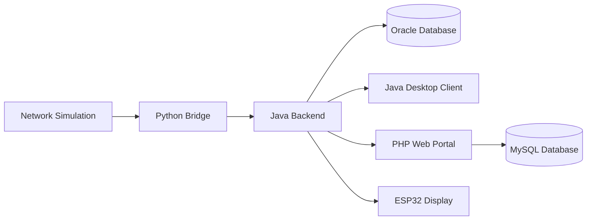
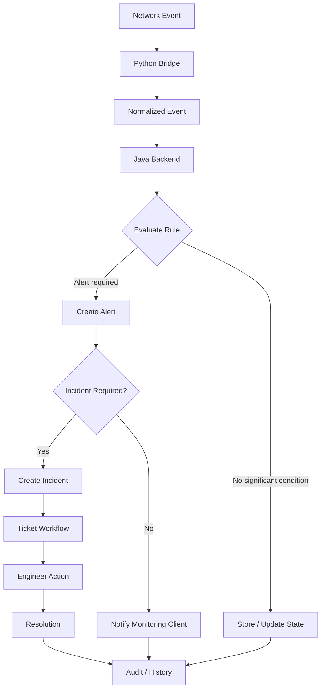

# 📡 NetPulse

### Network Operations & Monitoring — Academic Project

**A practical exploration of how networking, backend systems, databases, web applications, desktop interfaces, and embedded hardware can work together as one system.**

<p align="center">
  <!-- Project Status & Meta Badges -->
  <a href="#-development-roadmap"></a>
  
  
  
</p>

<p align="center">
  <!-- Tech Stack & Architecture Badges -->
  <a href="#-architectural-philosophy--technology-stack"></a>
  <a href="#1-python-the-ingestion--normalization-bridge"></a>
  <a href="#2-java-the-core-business-backend"></a>
  <a href="#3-php-the-web-portal--ticketing-interface"></a>
  <a href="#4-dual-database-strategy-oracle--mysql"></a>
  <a href="#4-dual-database-strategy-oracle--mysql"></a>
  <a href="#5-esp32-iot-the-physical-edge"></a>
</p>

<p>
  <a href="#about">About</a> •
  <a href="#vision">Vision</a> •
  <a href="#system-at-a-glance">System at a Glance</a> •
  <a href="#project-nature">Project Nature</a> •
  <a href="#technology-landscape">Technology Landscape</a> •
  <a href="#scope">Scope</a> •
  <a href="#roadmap">Roadmap</a>
</p>

---

## 1. Project Overview

NetPulse is a modular monitoring and incident-management system inspired by the general workflow of a **Network Operations Center (NOC)**.

The project represents a monitored environment in which network-related events are generated, processed, evaluated, stored, and presented to users through different interfaces.

The system is intentionally designed as a **polyglot application**, with each technology assigned a specific role rather than attempting to solve the entire problem with one technology.

At a high level:

```text
Network / Simulation
        ↓
Event Ingestion
        ↓
Backend Processing
        ↓
Alert & Incident Management
        ↓
Persistence
        ↓
Operational Interfaces
```

The project is primarily a practical exploration of **system integration and software architecture**.

---

# 2. Motivation

I am currently studying **Computer Science in my second year**.

During my studies, subjects such as networking, databases, programming, web development, and software engineering are often learned as separate areas. While this is useful for understanding individual concepts, it does not always show how those concepts interact when they become parts of a larger system.

NetPulse was created from that interest.

The project provides a practical environment in which different areas of Computer Science can be connected through a single system rather than being treated as isolated exercises.

The goal is not to build a commercial NOC product. The goal is to understand how the different technical pieces fit together and how decisions in one part of the system affect the others.

---

# 3. Vision

The vision of NetPulse is to create a **small but coherent operational platform** that demonstrates a complete lifecycle from an observed network event to an operational response.

The system should make it possible to follow a problem through the platform:

```text
Something happens
       ↓
The system receives it
       ↓
The backend understands it
       ↓
A rule determines its importance
       ↓
An alert may be created
       ↓
An incident may be opened
       ↓
An engineer handles it
       ↓
The problem is resolved
       ↓
The history remains recorded
```

This end-to-end perspective is the main idea behind the project.

---

# 4. Nature of the System

NetPulse is designed as a:

- **Modular system** — functionality is divided into clear components.
- **Event-driven system** — operational changes enter the system as events.
- **Polyglot system** — different technologies are used for different responsibilities.
- **Database-backed system** — important operational state is persisted.
- **Multi-interface system** — the same operational information can be presented through different clients.
- **Academic engineering project** — the architecture is intentionally realistic but remains appropriate for a student project.

The system is not intended to simulate every aspect of a real enterprise NOC. It focuses on the parts that are useful for understanding the underlying engineering concepts.

---

# 5. Main Components

## Network Simulation

The network simulation represents the monitored environment.

It can generate events such as:

```text
Device failure
Interface down
Interface recovery
Other simulated operational events
```

The simulator provides a controlled environment in which the rest of the system can be tested.

---

## Python Bridge

The Python Bridge acts as the boundary between raw or simulated network information and the main application.

Its basic responsibility is:

```text
Receive
  ↓
Parse
  ↓
Validate
  ↓
Normalize
  ↓
Forward
```

The Bridge prepares events in a consistent format before sending them to the Java Backend. This keeps input-processing concerns separate from the main business logic. fileciteturn0file0L3-L20

---

## Java Backend

The Java Backend is the central processing component of NetPulse.

It receives normalized events, applies application logic, evaluates alert rules, manages incidents, communicates with operational clients, and coordinates persistence.

Conceptually:

```text
Incoming Event
      ↓
Validation
      ↓
Business Rules
      ↓
Alert
      ↓
Incident
      ↓
Operational Response
```

The backend is therefore the main point where raw events become meaningful application state. fileciteturn0file0L66-L88

---

## Oracle Database

Oracle represents the main operational data store for the backend.

The project associates it with data such as:

- devices,
- events,
- alert rules,
- alerts,
- incidents,
- audit records.

The purpose is to maintain the system's operational history and important state in a structured relational database. fileciteturn0file0L283-L298

---

## PHP Web Portal

The PHP application provides the web-based operational side of the system.

Its main purpose is to support workflows such as:

```text
Login
  ↓
View Ticket
  ↓
Assign / Update
  ↓
Add Comment
  ↓
Resolve / Close
```

The portal is intended to be a practical interface for managing operational work rather than the place where the core event-processing logic lives.

---

## MySQL Database

MySQL supports the web-facing ticketing domain.

It is intended for information such as:

- tickets,
- comments,
- ticket history,
- web users.

The project therefore separates the operational backend data from the web ticketing data rather than treating both applications as one database-bound application.

---

## Java Desktop Client

The Java desktop application represents the monitoring side of the system.

Its purpose is to provide a real-time operational view of information such as:

- current events,
- alerts,
- incidents,
- system status.

The desktop client is focused primarily on **monitoring and visualization**.

---

## ESP32 Display

The ESP32 provides a small physical representation of the system.

Its role in NetPulse is intentionally limited to **displaying selected information**.

For example:

```text
NETPULSE
STATUS: ONLINE

ALERTS: 1
DEVICE: Core-R2
LEVEL: CRITICAL
```

The ESP32 is not part of the telemetry-ingestion architecture.

It does not act as a sensor source for the backend and does not send events back into NetPulse.

---

# 6. System Structure

The logical structure of NetPulse can be represented as:



The important idea is not the number of technologies, but the **boundary between their responsibilities**.

---

# 7. Core Workflow

The main NetPulse workflow follows a simple operational lifecycle.



---

# 8. Event → Alert → Incident → Ticket

One of the most important concepts in NetPulse is the distinction between these four stages.

| Stage        | Meaning                                          | Example                               |
| ------------ | ------------------------------------------------ | ------------------------------------- |
| **Event**    | Something happened                               | `Gi0/1 went DOWN`                     |
| **Alert**    | The event was evaluated as important             | `CRITICAL: Core-R2 uplink down`       |
| **Incident** | The condition requires operational investigation | `INC-1001 Core-R2 connectivity issue` |
| **Ticket**   | A formal work item is created for an engineer    | `TKT-1001 Investigate Core-R2 uplink` |

This means that not every event automatically becomes a ticket.

The backend first evaluates the event, then determines whether it is significant enough to require an alert or incident. The source architecture follows the same general distinction between Event, Alert, Incident, and Ticket. fileciteturn0file0L123-L159

---

# 9. Business Logic

The project's business logic is intentionally simple.

For example:

```text
IF
    device role = CORE
AND
    event type = LINK_DOWN

THEN
    severity = CRITICAL
    create alert
```

A critical condition may then be promoted:

```text
Alert
  ↓
Incident
  ↓
Ticket
```

The purpose of these rules is not to create a sophisticated rule engine. It is to demonstrate how raw events can be translated into operational decisions.

---

# 10. Monitoring and Response

NetPulse has two main forms of human interaction.

### Monitoring

The desktop client focuses on showing what is happening now:

```text
Events
Alerts
Incidents
System Status
```

### Operational Response

The web portal focuses on what the engineer does about it:

```text
Ticket
Assignment
Comments
Status
Resolution
```

This provides a simple separation between **observing the system** and **managing the resulting work**.

---

# 11. Auditability

The system maintains a basic history of important actions.

For example:

```text
14:32  Event detected
14:32  Alert created
14:32  Incident opened
14:35  Ticket assigned
14:40  Engineer updated ticket
14:48  Incident resolved
14:50  Ticket closed
```

The purpose of the audit trail is straightforward:

> **The system should be able to explain what happened and what changed.**

The source architecture also identifies audit logging as part of the backend's operational data model.

---

# 12. Technology Philosophy

NetPulse uses different technologies because each part of the project represents a different technical concern.

```text
Python
→ Simulation and Event Ingestion

Java
→ Backend Processing and Business Logic

Oracle
→ Operational Persistence

PHP
→ Web-based Ticketing

MySQL
→ Ticketing Persistence

Java Desktop
→ Real-Time Monitoring

ESP32
→ Physical Information Display
```

The purpose is not to use as many technologies as possible.

The purpose is to understand the **relationships between technologies and system boundaries**.

---

# 13. What NetPulse Represents

NetPulse represents a simplified version of an operational monitoring environment.

It demonstrates:

- event generation,
- event normalization,
- backend processing,
- rule-based alerting,
- incident management,
- ticket workflows,
- database persistence,
- real-time monitoring,
- basic auditing,
- interaction with a small embedded display.

It should be understood as a **learning-oriented system model**, not as a full enterprise NOC implementation.

---

# 14. Current Project Direction

The architecture is intended to remain understandable and practical.

The priority is:

```text
Clear Responsibilities
        +
Simple Interfaces
        +
Working End-to-End Flow
        =
Useful System
```

The project should avoid adding technical infrastructure simply because it is common in large enterprise systems.

Every component should have a reason to exist within the scope of the project.

---

# 15. MVP Phase

After establishing the overall project structure and architecture, development will move into the **Minimum Viable Product (MVP)** phase.

The MVP will focus on proving the core workflow rather than implementing every possible feature.

### MVP will contain:

- Python network event simulation;
- Python Bridge for event normalization;
- Java Backend for event processing and basic business rules;
- Oracle persistence for core operational data;
- basic alerts and incident creation;
- a simple PHP ticketing portal;
- MySQL persistence for ticketing;
- a Java desktop view for important real-time events;
- a simple ESP32 information display;
- basic audit logging.

### MVP priority

```text
Event
 ↓
Process
 ↓
Alert
 ↓
Incident
 ↓
Ticket
 ↓
Resolution
 ↓
Audit
```

The goal of the MVP is to make this complete flow **working, understandable, and demonstrable within the two-week implementation period**.

---

# 16. Project Principle

> **NetPulse is not about building the biggest system possible. It is about building a complete system that makes the relationships between its parts understandable.**

The project will therefore prioritize:

**clarity → integration → correctness → simplicity → extension**

rather than unnecessary complexity.

---

# 17. Author

**Mohamed Bin Fares**  
Computer Science Student — Second Year

NetPulse is a personal academic project developed to explore the practical integration of software architecture, networking, databases, backend development, web applications, desktop systems, and embedded hardware.
