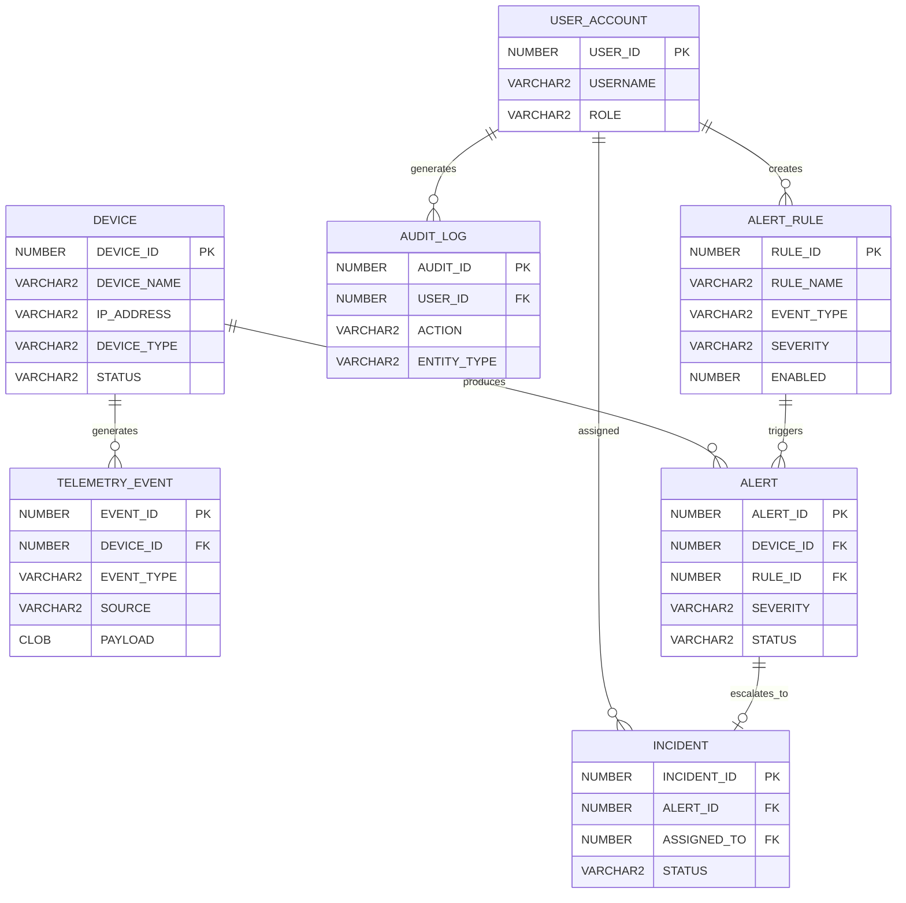
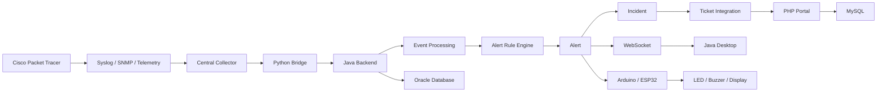
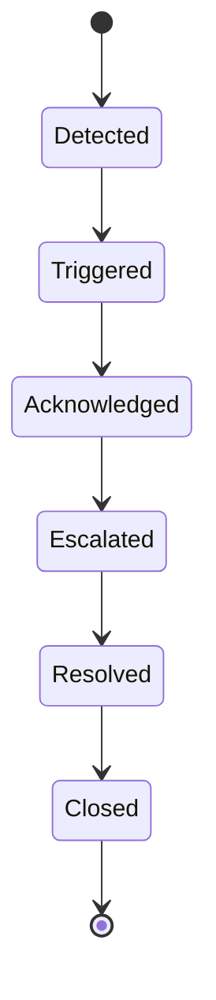
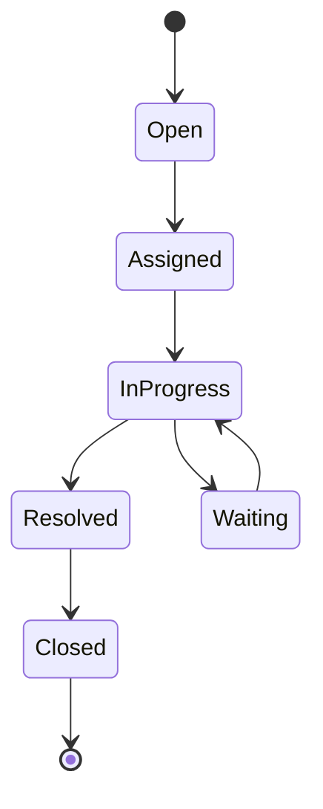
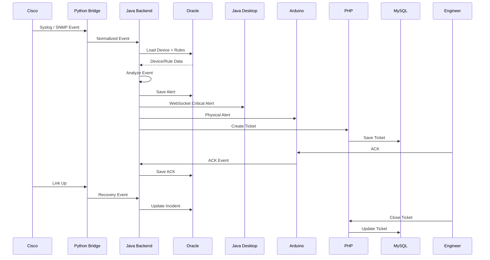

### Enterprise Network & Environmental Monitoring — NOC System

> **Document Type:** Architecture Design Document (ADD)  
> **System:** NetPulse  
> **Domain:** Network Operations Center (NOC) / Infrastructure Monitoring / Environmental Telemetry  
> **Architecture Style:** Hybrid Distributed Architecture  
> **Primary Backend:** Java  
> **Enterprise Database:** Oracle Database  
> **Ticketing Portal:** PHP / MySQL  
> **Network Simulation:** Cisco Packet Tracer  
> **Telemetry Bridge:** Python Bridge  
> **Real-Time Communication:** WebSockets  
> **Physical Alerting:** Arduino / ESP32  
> **Target Documentation Platform:** Obsidian

---

# 1. الوثيقة في نظرة واحدة

## 1.1 ما هو NetPulse؟

 مشروع **NetPulse** هو نظام مراقبة وتشغيل مركزي من نمط **Network Operations Center (NOC)**، يهدف إلى مراقبة البنية التحتية للشبكة والبيئة المحيطة بها، واستقبال الأحداث التشغيلية من أجهزة الشبكة، وتحليلها، وتحويل الأحداث المهمة إلى تنبيهات وحوادث وتذاكر دعم فني، مع إيصال التنبيه في الزمن الحقيقي إلى مهندسي الشبكات من خلال لوحات المراقبة والتطبيقات ووسائل الإنذار الفيزيائية.

المصدر التأسيسي يصف النظام على أنه أكثر من مجرد نظام لاكتشاف الأعطال؛ إذ يدير **دورة حياة العطل كاملة** من اكتشاف الحدث، إلى Alert، ثم Incident، ثم Ticket، ثم المعالجة والإغلاق.

يمكن اختصار فكرة النظام في السلسلة التالية:

```text
Network / Environment
        │
        ▼
Telemetry + Syslog + SNMP
        │
        ▼
Python Bridge
        │
        ▼
Java Backend
        │
        ├──────────────► Oracle Database
        │
        ├──────────────► Java Desktop NOC
        │
        ├──────────────► PHP Ticketing Portal
        │
        └──────────────► Arduino / ESP32
```

ثم تتحول دورة العطل إلى:

```text
Observation
    ↓
Event
    ↓
Alert
    ↓
Incident
    ↓
Ticket
    ↓
Acknowledgement
    ↓
Investigation
    ↓
Resolution
    ↓
Closure
    ↓
Audit / Historical Record
```

---

# 2. فلسفة اسم NetPulse

## 2.1 Net

كلمة **Net** هي اختصار مباشر لـ **Network**.

وهي تمثل المجال الأساسي الذي يعمل فيه النظام:

- Routers
    
- Switches
    
- Interfaces
    
- VLANs
    
- Routing
    
- Network Links
    
- Network Services
    
- Network Events
    

المصدر التأسيسي يربط Net بمجال المشروع والبنية التحتية للشبكة.

### مثال من المشروع

إذا كان لدينا:

```text
Core-R1
   │
   │
Core-R2
```

ثم انقطع الرابط بينهما، فإن NetPulse لا يتعامل مع الانقطاع على أنه مجرد رسالة نصية، بل يعتبره حدثاً يتعلق بصحة **Network Infrastructure**.

---

# 3. Pulse — نبض الشبكة

## 3.1 لماذا Pulse؟

كلمة **Pulse** تعني النبض.

الفكرة المعمارية هي أن الشبكة تشبه كائناً حياً:

```text
Healthy Network
      │
      ▼
Continuous Telemetry
      │
      ▼
NetPulse
      │
      ▼
"Network Pulse"
```

النظام يستقبل باستمرار بيانات عن حالة الشبكة، مثل:

- Interface Status
    
- Routing Events
    
- Port Security Events
    
- Resource Utilization
    
- Environmental Measurements
    
- Syslog Events
    
- SNMP Traps
    

وبالتالي فإن NetPulse لا ينتظر أن يسأل المستخدم:

> "هل الشبكة تعمل؟"

بل يحاول باستمرار معرفة:

> "ما هي حالة الشبكة الآن؟ وهل حدث تغير غير طبيعي؟"

المصدر يصف Pulse تحديداً باعتباره النبض المستمر للشبكة الناتج عن استقبال Telemetry ومراقبة حالة الأجهزة لحظة بلحظة.

---

# 4. NOC — Network Operations Center

## 4.1 ما هو NOC؟

الـ **NOC** هو مركز عمليات الشبكة.

في البيئة الحقيقية يكون NOC مسؤولاً عن:

- مراقبة الشبكة.
    
- اكتشاف الأعطال.
    
- تحليل الأحداث.
    
- التعامل مع الحوادث.
    
- متابعة التذاكر.
    
- التأكد من عودة الخدمات.
    
- تسجيل الأحداث.
    
- تحليل التاريخ التشغيلي.
    

لذلك NetPulse ليس مجرد:

```text
Monitoring Dashboard
```

بل:

```text
Monitoring
    +
Event Processing
    +
Alert Management
    +
Incident Management
    +
Ticketing
    +
Human Response
    +
Audit
```

---

# 5. Business Domain & Context

## 5.1 المشكلة التي يحلها النظام

في بيئة شبكة كبيرة قد توجد مئات الأجهزة:

```text
Routers
Switches
Servers
Access Points
IoT Sensors
```

ويولد كل جهاز أحداثاً باستمرار.

إذا تم التعامل مع كل حدث بشكل منفصل، سيواجه مهندس الشبكة مشكلة:

```text
Thousands of Events
        ↓
Information Overload
        ↓
Difficult Prioritization
        ↓
Delayed Response
```

لكن NetPulse يحاول تحويل هذه الكمية من البيانات إلى **معلومات تشغيلية قابلة للتصرف**.

---

# 6. المصطلحات الأساسية في المشروع

|المصطلح|المعنى|مثال داخل NetPulse|
|---|---|---|
|Device|جهاز شبكي|Core-R1|
|Telemetry|بيانات حالة الجهاز|CPU / Interface Status|
|Syslog|رسائل أحداث وتشغيل|Link Down|
|SNMP|بروتوكول مراقبة وإدارة|SNMP Trap|
|Event|حدث خام|Interface Down|
|Alert|تنبيه بعد تحليل الحدث|Critical Link Failure|
|Incident|مشكلة تشغيلية مؤكدة/مصعدة|Core-R2 Connectivity Incident|
|Ticket|سجل رسمي لمعالجة المشكلة|INC-2026-001|
|ACK|تأكيد استلام التنبيه|Engineer acknowledged|
|Resolution|حل المشكلة|Cable replaced|
|Closure|إغلاق دورة الحادث|Ticket Closed|
|Audit Log|سجل ما حدث ومن فعله|Admin changed rule|
|Alert Rule|قاعدة تحديد متى يصبح الحدث Alert|IF link_down THEN Critical|

---

# 7. البيئة التشغيلية للمشروع

المصدر التأسيسي يحدد NetPulse كمعمارية هجينة تجمع محاكاة الشبكات والمعالجة المركزية وقواعد البيانات المؤسسية وتطبيقات الويب وسطح المكتب وإنترنت الأشياء.

يمكن تقسيم النظام إلى:

```text
┌─────────────────────────────────────────────┐
│              NETWORK DOMAIN                 │
│                                             │
│ Cisco Packet Tracer                         │
│ Routers / Switches / VLANs / Routing       │
└─────────────────────┬───────────────────────┘
                      │
                      │ Events / Telemetry
                      ▼
┌─────────────────────────────────────────────┐
│              BRIDGE DOMAIN                  │
│                                             │
│ Python Bridge                               │
│ Packet/Event Collection & Normalization      │
└─────────────────────┬───────────────────────┘
                      │
                      ▼
┌─────────────────────────────────────────────┐
│              CORE DOMAIN                    │
│                                             │
│ Java Backend                                │
│ Event Processing / Business Logic           │
└──────────┬──────────────┬───────────────────┘
           │              │
           ▼              ▼
      Oracle DB       Real-Time Clients
                          │
             ┌────────────┼────────────┐
             ▼            ▼            ▼
       Java Desktop   PHP Portal   Arduino/ESP32
```

---

# 8. Network Infrastructure Layer

## 8.1 التقنية

**Cisco Packet Tracer**

المصدر يعتبر هذه الطبقة البيئة الفيزيائية والتشغيلية للشركة، ويصفها بصورة مجازية بأنها "المريض" الذي يقوم NetPulse بمراقبة نبضه وحالته الصحية.

---

# 9. Network Topology

## 9.1 Hierarchical Network Design

يعتمد التصميم على مفهوم الشبكة الهرمية:

```text
                 ┌─────────────┐
                 │   Core-R1   │
                 └──────┬──────┘
                        │
                 ┌──────┴──────┐
                 │   Core-R2   │
                 └──────┬──────┘
                        │
              ┌─────────┴─────────┐
              │ Distribution/MLS  │
              └───────┬───────────┘
                      │
       ┌──────────────┼──────────────┐
       │              │              │
      ICT          Sales          Finance
       │              │              │
    Access SW      Access SW      Access SW
```

المصدر يذكر طبقة Core/Distribution وطبقة Access، إضافة إلى VLANs وVLSM.

---

# 10. VLANs و VLSM

## VLAN

VLAN هي وسيلة لتقسيم الشبكة منطقياً.

مثلاً:

```text
VLAN 10 → ICT
VLAN 20 → Administration
VLAN 30 → Sales
VLAN 40 → Finance
VLAN 50 → Server Room
```

الفائدة:

- العزل المنطقي.
    
- تقليل Broadcast Domain.
    
- تحسين التنظيم.
    
- تحسين الأمن.
    
- تسهيل الإدارة.
    

## VLSM

VLSM يسمح بتقسيم عناوين IP بأحجام مختلفة حسب الحاجة.

مثال:

```text
ICT       → /24
Servers   → /28
Management→ /29
IoT       → /27
```

---

# 11. Inter-VLAN Routing

إذا كانت أجهزة VLAN مختلفة تحتاج إلى التواصل:

```text
VLAN 10
   │
   │
Inter-VLAN Routing
   │
   ▼
VLAN 50
```

يستطيع NetPulse الاستفادة من هذا التصميم في الوصول إلى الأجهزة الموجودة في أقسام مختلفة.

المصدر يؤكد أن Inter-VLAN Routing يسمح بعبور البيانات والتنبيهات من الأقسام المختلفة إلى نقطة التجميع المركزية.

---

# 12. Network Events التي يراقبها NetPulse

## 12.1 Interface Status

مثال:

```text
Interface Gi0/1
Status: UP
```

ثم:

```text
Interface Gi0/1
Status: DOWN
```

هذا قد ينتج:

```text
Event
 ↓
Alert
 ↓
Incident
```

المصدر يحدد Link Up / Down كأحد الأحداث الأساسية التي تتم مراقبتها لحظياً.

---

# 13. Port Security

إذا تم توصيل جهاز غير مصرح به:

```text
Unauthorized Device
        ↓
Switch Port Security
        ↓
Security Event
        ↓
NetPulse
        ↓
Security Alert
```

المصدر يذكر مراقبة محاولات توصيل أجهزة غير مبرمجة وإرسال تنبيه أمني فوري.

---

# 14. Routing Events

يمكن مراقبة الأحداث المتعلقة باستقرار التوجيه.

مثلاً:

```text
Routing Neighbor
      │
      ▼
State Change
      │
      ▼
Syslog Event
      │
      ▼
NetPulse
```

وهذا مهم لأن تغير Routing Neighbor قد يؤدي إلى تغير مسارات الشبكة.

---

# 15. Telemetry

Telemetry تعني البيانات التشغيلية التي تصف حالة النظام.

في NetPulse يمكن أن تشمل:

```text
Device
 ├── CPU
 ├── Memory
 ├── Interface State
 ├── Routing State
 ├── Security Events
 └── Environmental Data
```

المصدر يربط طبقة Cisco IOS بتوليد بيانات تشغيلية غنية تشمل حالة المنافذ والأمان والتوجيه ومؤشرات الأداء والبيئة.

---

# 16. Syslog

## 16.1 ما هو Syslog؟

Syslog هو أسلوب لإرسال رسائل الأحداث التشغيلية من الأجهزة إلى خادم مركزي.

مثال:

```text
%LINK-5-CHANGED:
Interface GigabitEthernet0/1 changed state to down
```

في NetPulse:

```text
Cisco Device
     │
     │ Syslog
     ▼
Central Server
     │
     ▼
Python Bridge
     │
     ▼
Java Backend
```

المصدر يوضح أن الأجهزة يتم إعدادها لتوجيه سجلاتها إلى خادم التجميع المركزي باستخدام `logging host`.

---

# 17. SNMP

SNMP يستخدم لمراقبة الأجهزة وإرسال معلومات أو Traps عن حالات معينة.

مثال:

```text
Device
   │
   │ SNMP Trap
   ▼
Collector
   │
   ▼
NetPulse
```

في المشروع يمكن استخدام SNMP Traps لمحاكاة أو تمثيل:

- Resource Conditions
    
- Environmental Conditions
    
- Device Conditions
    

---

# 18. Python Bridge

## 18.1 لماذا يوجد Bridge؟

الشبكة تنتج أحداثاً قد تكون بصيغ مختلفة.

لذلك نحتاج طبقة وسيطة:

```text
Raw Network Data
       ↓
Python Bridge
       ↓
Normalize
       ↓
Validate
       ↓
Forward
       ↓
Java Backend
```

> **ملاحظة هندسية:** الملف التأسيسي يذكر Python Bridge كوسيط لالتقاط الحزم الخام وتجهيزها لإرسالها إلى Java Backend، لكنه لا يحدد داخلياً بروتوكولاً أو مكتبة Python بعينها. لذلك فإن تفاصيل مثل parser library أو message broker تعتبر قرارات تنفيذية لاحقة وليست جزءاً مثبتاً من المصدر.

---

# 19. مسؤوليات Python Bridge

يمكن تصميمه منطقياً ليقوم بالمهام التالية:

```text
1. Receive
2. Parse
3. Validate
4. Normalize
5. Enrich
6. Forward
7. Log
```

مثال:

### Input

```text
RAW:
Device=Core-R2
Message=Interface Gi0/1 Down
Timestamp=...
```

### Normalized Event

```json
{
  "device": "Core-R2",
  "eventType": "INTERFACE_DOWN",
  "severity": "CRITICAL",
  "timestamp": "...",
  "interface": "Gi0/1"
}
```

---

# 20. Java Backend — Core Engine

الـ Java Backend هو **العقل المركزي للنظام**.

المصدر يصفه بأنه الخادم المركزي الذي يستقبل Telemetry وLogs، يحللها ويطبق Business Logic ويقرر ما إذا كان الحدث يحتاج إلى Alert ثم يبث التنبيهات عبر WebSockets.

يمكن تصور داخله كالتالي:

```text
┌──────────────────────────────────────┐
│          Java Backend                │
├──────────────────────────────────────┤
│ Event Receiver                       │
│ Event Parser                         │
│ Validation Engine                    │
│ Correlation Engine                  │
│ Alert Rule Engine                    │
│ Incident Manager                     │
│ Ticket Integration                   │
│ WebSocket Publisher                  │
│ Device Management                    │
│ Audit Service                        │
│ Oracle Repository                    │
└──────────────────────────────────────┘
```

---

# 21. Business Logic Engine

هذه أهم طبقة منطقية في NetPulse.

مثال:

```text
IF
    Device = Core-R2
AND Event = LINK_DOWN
AND Interface = Uplink
THEN
    Severity = CRITICAL
    Create Alert
```

ثم:

```text
IF
    Alert Severity = CRITICAL
AND
    Alert persists / requires operational response
THEN
    Create Incident
```

---

# 22. Event vs Alert vs Incident vs Ticket

هذا التفريق مهم جداً.

## Event

حدث خام.

```text
Gi0/1 changed to DOWN
```

## Alert

الحدث بعد تفسيره وتصنيفه.

```text
CRITICAL:
Core-R2 uplink is down
```

## Incident

مشكلة تشغيلية تحتاج إلى إدارة واستجابة.

```text
INC-001
Core-R2 Connectivity Incident
```

## Ticket

سجل رسمي للمتابعة والدعم.

```text
TKT-001
Replace/inspect Core-R2 uplink cable
```

---

# 23. Alert Rule

AlertRule هي القاعدة التي تحدد:

> متى يصبح Event معين Alert؟

مثال:

```text
Rule Name:
CORE_UPLINK_DOWN

Condition:
event_type = LINK_DOWN
AND device_role = CORE
AND interface_role = UPLINK

Severity:
CRITICAL
```

---

# 24. Alert Lifecycle

```text
NEW
 │
 ▼
TRIGGERED
 │
 ▼
ACKNOWLEDGED
 │
 ▼
ESCALATED
 │
 ▼
RESOLVED
 │
 ▼
CLOSED
```

> هذه الحالات تمثل **تصميماً منطقياً مقترحاً** لتفصيل دورة الحياة، بينما المصدر التأسيسي يثبت المراحل الرئيسية: Alert → Incident → Ticket → ACK → Closure.

---

# 25. Incident Lifecycle

```text
DETECTED
    ↓
CLASSIFIED
    ↓
ESCALATED
    ↓
ASSIGNED
    ↓
IN_PROGRESS
    ↓
RESOLVED
    ↓
CLOSED
```

---

# 26. Ticket Lifecycle

```text
OPEN
 ↓
ASSIGNED
 ↓
IN_PROGRESS
 ↓
WAITING
 ↓
RESOLVED
 ↓
CLOSED
```

---

# 27. Incident Escalation

ليس كل Event يجب أن يؤدي إلى Ticket.

مثلاً:

```text
Event:
Interface changed state

        ↓

Rule Engine

        ↓

Is it critical?
      /   \
    No     Yes
    │       │
 Ignore/   Alert
 Log        │
            ▼
         Incident
            │
            ▼
          Ticket
```

وهذه النقطة ضرورية لمنع إغراق نظام الدعم بآلاف التذاكر غير المهمة.

---

# 28. Oracle Database

Oracle هي طبقة البيانات المؤسسية الأساسية للـ Java Backend.

المصدر يحدد تخزين:

- Device Inventory
    
- Alert Rules
    
- Historical Network Faults
    
- Audit Logs
    

في Oracle.

---

# 29. Oracle Schema

## 29.1 DEVICE

|Column|Type|Key|Description|
|---|---|---|---|
|DEVICE_ID|NUMBER|PK|معرف الجهاز|
|DEVICE_NAME|VARCHAR2(100)||اسم الجهاز|
|DEVICE_TYPE|VARCHAR2(50)||Router/Switch/etc|
|IP_ADDRESS|VARCHAR2(45)||عنوان IP|
|HOSTNAME|VARCHAR2(100)||Hostname|
|LOCATION|VARCHAR2(150)||الموقع|
|DEPARTMENT|VARCHAR2(100)||القسم|
|DEVICE_ROLE|VARCHAR2(50)||Core/Access/etc|
|STATUS|VARCHAR2(30)||Current Status|
|CREATED_AT|TIMESTAMP||تاريخ التسجيل|
|UPDATED_AT|TIMESTAMP||آخر تحديث|

---

# 30. ALERT_RULE

|Column|Type|Key|Description|
|---|---|---|---|
|RULE_ID|NUMBER|PK|معرف القاعدة|
|RULE_NAME|VARCHAR2(100)||اسم القاعدة|
|EVENT_TYPE|VARCHAR2(50)||نوع الحدث|
|CONDITION_EXPR|CLOB||شرط المطابقة|
|SEVERITY|VARCHAR2(20)||Critical/High/etc|
|ENABLED|NUMBER(1)||حالة القاعدة|
|CREATED_BY|NUMBER|FK|منشئ القاعدة|
|CREATED_AT|TIMESTAMP||التاريخ|

---

# 31. ALERT

|Column|Type|Key|Description|
|---|---|---|---|
|ALERT_ID|NUMBER|PK|معرف التنبيه|
|DEVICE_ID|NUMBER|FK|الجهاز|
|RULE_ID|NUMBER|FK|القاعدة|
|EVENT_TYPE|VARCHAR2(50)||نوع الحدث|
|MESSAGE|CLOB||رسالة التنبيه|
|SEVERITY|VARCHAR2(20)||مستوى الخطورة|
|STATUS|VARCHAR2(30)||الحالة|
|DETECTED_AT|TIMESTAMP||وقت الاكتشاف|
|ACK_AT|TIMESTAMP||وقت ACK|
|RESOLVED_AT|TIMESTAMP||وقت الحل|

---

# 32. INCIDENT

|Column|Type|Key|Description|
|---|---|---|---|
|INCIDENT_ID|NUMBER|PK|معرف الحادث|
|ALERT_ID|NUMBER|FK|التنبيه المسبب|
|TITLE|VARCHAR2(200)||عنوان الحادث|
|DESCRIPTION|CLOB||وصف المشكلة|
|PRIORITY|VARCHAR2(20)||الأولوية|
|STATUS|VARCHAR2(30)||الحالة|
|ASSIGNED_TO|NUMBER|FK|المهندس|
|CREATED_AT|TIMESTAMP||الإنشاء|
|RESOLVED_AT|TIMESTAMP||الحل|
|CLOSED_AT|TIMESTAMP||الإغلاق|

---

# 33. USER_ACCOUNT

|Column|Type|Key|Description|
|---|---|---|---|
|USER_ID|NUMBER|PK|المستخدم|
|USERNAME|VARCHAR2(100)|UNIQUE|اسم المستخدم|
|PASSWORD_HASH|VARCHAR2(255)||كلمة المرور المشفرة|
|FULL_NAME|VARCHAR2(150)||الاسم|
|ROLE|VARCHAR2(50)||Admin/Engineer/Viewer|
|STATUS|VARCHAR2(20)||Active/Disabled|
|CREATED_AT|TIMESTAMP||الإنشاء|

---

# 34. AUDIT_LOG

|Column|Type|Key|Description|
|---|---|---|---|
|AUDIT_ID|NUMBER|PK|معرف السجل|
|USER_ID|NUMBER|FK|المستخدم|
|ACTION|VARCHAR2(100)||العملية|
|ENTITY_TYPE|VARCHAR2(50)||الكيان|
|ENTITY_ID|NUMBER||معرف الكيان|
|OLD_VALUE|CLOB||القيمة السابقة|
|NEW_VALUE|CLOB||القيمة الجديدة|
|IP_ADDRESS|VARCHAR2(45)||عنوان المصدر|
|CREATED_AT|TIMESTAMP||الوقت|

---

# 35. TELEMETRY_EVENT

|Column|Type|Key|Description|
|---|---|---|---|
|EVENT_ID|NUMBER|PK|الحدث|
|DEVICE_ID|NUMBER|FK|الجهاز|
|EVENT_TYPE|VARCHAR2(50)||نوع الحدث|
|SOURCE|VARCHAR2(30)||SYSLOG/SNMP/etc|
|SEVERITY|VARCHAR2(20)||الخطورة|
|PAYLOAD|CLOB||البيانات الخام|
|RECEIVED_AT|TIMESTAMP||وقت الاستقبال|
|PROCESSED_AT|TIMESTAMP||وقت المعالجة|

---

# 36. علاقة Oracle الأساسية



---

# 37. PHP / MySQL Ticketing Layer

المصدر يحدد PHP/MySQL كبوابة ويب خفيفة ومرنة مخصصة لإدارة التذاكر وتقارير الأداء. كما يوضح أن Java Backend يستطيع إنشاء Ticket تلقائياً عند اكتشاف عطل حرج.

---

# 38. MySQL Schema

## TICKET

|Column|Type|Key|Description|
|---|---|---|---|
|ticket_id|BIGINT|PK|معرف التذكرة|
|ticket_number|VARCHAR(50)|UNIQUE|الرقم|
|incident_id|BIGINT||Incident reference|
|title|VARCHAR(255)||العنوان|
|description|TEXT||التفاصيل|
|priority|VARCHAR(20)||الأولوية|
|status|VARCHAR(30)||الحالة|
|assigned_to|BIGINT|FK|الفني|
|created_at|DATETIME||الإنشاء|
|updated_at|DATETIME||آخر تعديل|
|closed_at|DATETIME||الإغلاق|

---

# 39. TICKET_COMMENT

|Column|Type|Key|Description|
|---|---|---|---|
|comment_id|BIGINT|PK|المعرف|
|ticket_id|BIGINT|FK|التذكرة|
|user_id|BIGINT|FK|الكاتب|
|comment_text|TEXT||التعليق|
|created_at|DATETIME||الوقت|

---

# 40. PHP User

|Column|Type|Key|
|---|---|---|
|user_id|BIGINT|PK|
|username|VARCHAR(100)|UNIQUE|
|password_hash|VARCHAR(255)||
|full_name|VARCHAR(150)||
|role|VARCHAR(50)||
|status|VARCHAR(20)||
|created_at|DATETIME||

---

# 41. Ticket History

```text
Ticket
  │
  ├── Status Changes
  ├── Assignment Changes
  ├── Comments
  └── Closure Information
```

يمكن تمثيل ذلك بجدول:

```text
TICKET_HISTORY
```

والهدف منه عدم فقدان تاريخ التذكرة.

---

# 42. MySQL ERD

```mermaid
erDiagram

    WEB_USER ||--o{ TICKET : handles
    WEB_USER ||--o{ TICKET_COMMENT : writes
    TICKET ||--o{ TICKET_COMMENT : contains
    TICKET ||--o{ TICKET_HISTORY : tracks

    TICKET {
        BIGINT ticket_id PK
        VARCHAR ticket_number
        BIGINT incident_id
        VARCHAR title
        VARCHAR priority
        VARCHAR status
        BIGINT assigned_to FK
    }

    WEB_USER {
        BIGINT user_id PK
        VARCHAR username
        VARCHAR role
        VARCHAR status
    }

    TICKET_COMMENT {
        BIGINT comment_id PK
        BIGINT ticket_id FK
        BIGINT user_id FK
        TEXT comment_text
    }

    TICKET_HISTORY {
        BIGINT history_id PK
        BIGINT ticket_id FK
        VARCHAR old_status
        VARCHAR new_status
        BIGINT changed_by FK
    }
```



---

# 43. لماذا Oracle وMySQL معاً؟

هذا القرار جزء من المعمارية الهجينة للمشروع.

```text
                 NetPulse
                    │
          ┌─────────┴─────────┐
          │                   │
      Core System         Support Portal
          │                   │
       Java                 PHP
          │                   │
       Oracle               MySQL
```

## Oracle

مناسبة في تصميم المشروع لتخزين:

- Network Inventory
    
- Telemetry
    
- Alerts
    
- Rules
    
- Incidents
    
- Audit Logs
    

## MySQL

مخصصة في التصميم لطبقة:

- Ticketing
    
- Web Users
    
- Comments
    
- Ticket History
    
- Lightweight Reporting
    

> هذا الفصل لا يعني أن القاعدتين يجب أن تكونا نسختين من نفس البيانات. يجب تحديد **Source of Truth** لكل نوع من البيانات، وإلا ستظهر مشكلة Data Duplication وData Consistency.

---

# 44. Java Desktop NOC Dashboard

المصدر يحدد Java Desktop كتطبيق Thick Client مخصص لمهندسي الشبكات ومديري NOC، يعرض البيانات اللحظية والتنبيهات ويوفر إدارة الأجهزة والإعدادات المتقدمة.

واجهة التطبيق يمكن تقسيمها إلى:

```text
┌───────────────────────────────────────────┐
│ NetPulse NOC Dashboard                    │
├───────────────┬───────────────────────────┤
│ Navigation    │ Main Monitoring Area      │
│               │                           │
│ Dashboard     │ Network Health            │
│ Devices       │ Alerts                    │
│ Alerts        │ Incidents                 │
│ Incidents     │ Telemetry                 │
│ Rules         │ Charts                    │
│ Reports       │                           │
│ Audit         │                           │
└───────────────┴───────────────────────────┘
```

---

# 45. WebSockets

WebSockets مهمة لتحقيق Real-Time Monitoring.

بدلاً من:

```text
Client → Request
Server → Response
```

كل فترة، يكون لدينا اتصال مستمر:

```text
Java Desktop
       ⇅
   WebSocket
       ⇅
Java Backend
```

وعندما يصل Critical Alert:

```text
Cisco
  ↓
Backend
  ↓
WebSocket
  ↓
Dashboard
```

فتظهر الرسالة مباشرة.

---

# 46. Arduino / ESP32

الـ Arduino/ESP32 يمثل **Physical Alert Layer**.

المصدر يحدد استخدامه كعميل يتصل بـ Java Backend، ويصدر LED أحمر وصفارة ويعرض تفاصيل العطل، ويستمر حتى يقوم المهندس بالضغط على زر Acknowledge.

---

# 47. Physical Alert Workflow

```text
Critical Alert
      ↓
Java Backend
      ↓
Arduino / ESP32
      ↓
┌───────────────┐
│ LED = RED     │
│ Buzzer = ON   │
│ Display = MSG │
└───────────────┘
      ↓
Engineer presses ACK
      ↓
Buzzer = OFF
      ↓
ACK recorded
```

---

# 48. لماذا Physical Alert؟

لأن غرفة NOC قد تحتوي على مهندسين لا يراقبون الشاشة طوال الوقت.

لذلك:

```text
Dashboard
+
Audio
+
Visual
+
Physical Interaction
```

تزيد من سرعة الاستجابة.

---

# 49. System Entities

## 49.1 Device

يمثل جهازاً في البنية التحتية.

أمثلة:

```text
Core-R1
Core-R2
Access-SW-01
Server-SW-01
```

---

## 49.2 TelemetryEvent

يمثل حدثاً خاماً تم استقباله من الشبكة.

```text
Source = SYSLOG
Type = LINK_DOWN
Device = Core-R2
```

---

## 49.3 Alert

يمثل تنبيهاً نتج عن تطبيق Rule على Event.

---

## 49.4 Incident

يمثل مشكلة تشغيلية تمت ترقيتها من Alert.

---

## 49.5 Ticket

يمثل مهمة الدعم الرسمية المرتبطة بالمشكلة.

---

## 49.6 User

يمثل الشخص الذي يستخدم النظام.

الأدوار المقترحة:

```text
ADMIN
NOC_ENGINEER
SUPPORT_ENGINEER
VIEWER
```

---

## 49.7 AuditLog

يسجل العمليات المهمة.

مثال:

```text
User Mohammed
Action = UPDATE_ALERT_RULE
Rule = CORE_LINK_DOWN
Old Severity = HIGH
New Severity = CRITICAL
```

---

## 49.8 AlertRule

تحدد شروط تحويل الأحداث إلى Alerts.

---

# 50. Business Rules

## Rule 01 — Event Validation

لا تتم معالجة Event غير صالح.

```text
IF device_id IS NULL
THEN
    Reject Event
    Log Error
```

---

## Rule 02 — Device Recognition

يجب أن يكون الجهاز معروفاً أو قابلاً للتعريف.

```text
Incoming Event
      ↓
Find Device
      ↓
Known?
 ┌────┴────┐
Yes        No
 │          │
Process    Unknown Event
```

---

# 51. Rule 03 — Severity

مثال منطقي:

```text
IF Core Device + Uplink Down
    → CRITICAL

IF Access Port Down
    → MEDIUM

IF Informational Syslog
    → INFO
```

هذه أمثلة تصميمية وليست قواعد مثبتة حرفياً في المصدر؛ يجب أن يتم اعتماد القيم النهائية ضمن Configuration/Alert Rules.

---

# 52. Rule 04 — Alert Deduplication

إذا أرسل الجهاز نفس الحدث عدة مرات:

```text
LINK_DOWN
LINK_DOWN
LINK_DOWN
LINK_DOWN
```

لا نريد:

```text
4 Incidents
4 Tickets
```

بل:

```text
1 Alert
+
Repeated Event Counter
```

وهذا يمنع Alert Storm.

---

# 53. Rule 05 — Alert Correlation

إذا كان هناك:

```text
Core-R1 DOWN
```

ثم ظهرت:

```text
Access-SW-01 DOWN
Access-SW-02 DOWN
Access-SW-03 DOWN
```

يجب ألا نفترض مباشرة أن هناك أربع مشاكل مستقلة.

قد تكون:

```text
Core-R1 Failure
      ↓
Multiple Downstream Devices
```

لذلك يمكن لمحرك Correlation ربط الأحداث ببعضها.

---

# 54. Alert → Incident

الانتقال المقترح:

```text
Alert
  │
  ├── Low → Log only
  │
  ├── Medium → Alert
  │
  ├── High → Alert + Incident
  │
  └── Critical → Incident + Ticket + Physical Alert
```

القيم الدقيقة يجب أن تكون قابلة للتهيئة عبر Alert Rules.

---

# 55. Incident → Ticket

عندما يقرر النظام أن الحادث يحتاج إلى تدخل بشري:

```text
Incident Created
       ↓
Ticket Creation
       ↓
PHP/MySQL
       ↓
Support Engineer
```

---

# 56. Ticket → ACK

هناك أكثر من قناة للاستجابة:

```text
Engineer
   │
   ├── Java Desktop ACK
   │
   └── Arduino Button ACK
```

ثم:

```text
ACK
 ↓
Stop Physical Alarm
 ↓
Record Timestamp
 ↓
Assign/Start Work
```

المصدر يذكر صراحة إمكانية ACK من زر Arduino أو تطبيق سطح المكتب.

---

# 57. Resolution

الحل يعني أن سبب المشكلة تمت معالجته.

مثال:

```text
Root Cause:
Broken Cable

Action:
Cable replaced

Verification:
Link Up
```

---

# 58. Closure

الإغلاق ليس مجرد الضغط على زر.

يجب أن يعني:

```text
Problem Resolved
      +
Service Restored
      +
Engineer Confirmed
      +
Ticket Updated
      +
Audit Recorded
```

المصدر يربط الإغلاق بإصلاح الكابل وعودة Link Up ثم إغلاق التذكرة عبر PHP، مع الاحتفاظ بدورة حياة المشكلة في قواعد البيانات.

---

# 59. End-to-End Workflow

## السيناريو الكامل: Core-R2 Link Failure

### Step 1 — Failure

```text
Core-R2
Gi0/1
   ↓
LINK DOWN
```

---

### Step 2 — Syslog

Cisco يولد:

```text
LINK DOWN Event
```

ويرسله إلى الخادم المركزي.

المصدر يصف هذه الآلية من خلال `logging host` لتوجيه السجلات إلى Server-PT.

---

### Step 3 — Python Bridge

```text
Raw Packet
    ↓
Python
    ↓
Parse
    ↓
Normalize
```

---

### Step 4 — Java Backend

```text
Event Received
      ↓
Identify Device
      ↓
Load Device Data
      ↓
Evaluate Alert Rules
```

---

### Step 5 — Alert

```text
Rule:
CORE_UPLINK_DOWN

Result:
CRITICAL ALERT
```

---

### Step 6 — Store

```text
Oracle
 ├── TelemetryEvent
 ├── Alert
 └── Audit/History
```

---

### Step 7 — Real-Time Broadcast

```text
Java Backend
      │
      ├── WebSocket → Java Desktop
      │
      └── Network → Arduino
```

---

### Step 8 — Dashboard

Java Desktop يعرض:

```text
CRITICAL ALERT

Device: Core-R2
Interface: Gi0/1
Status: DOWN
Time: 23:05
```

---

### Step 9 — Physical Alarm

Arduino:

```text
LED = RED
BUZZER = ON
DISPLAY = Core-R2 DOWN
```

---

### Step 10 — Ticket Creation

Java Backend يتسبب في إنشاء:

```text
TKT-2026-0001
```

في PHP/MySQL.

---

### Step 11 — Engineer ACK

المهندس يضغط:

```text
ACK
```

إما من:

```text
Arduino
```

أو:

```text
Java Desktop
```

---

### Step 12 — Investigation

المهندس يفحص:

```text
Cable
Interface
Neighbor
Routing
Switch Port
```

---

### Step 13 — Resolution

يتم إصلاح الكابل.

---

### Step 14 — Link Up

Cisco يرسل:

```text
LINK UP
```

---

### Step 15 — Backend Verification

```text
Backend
   ↓
Receive LINK_UP
   ↓
Correlate with Incident
   ↓
Mark Technical Condition Resolved
```

---

### Step 16 — Ticket Closure

المهندس يغلق Ticket من PHP Portal.

---

### Step 17 — Historical Record

يصبح لدينا:

```text
Device
  ↓
Telemetry
  ↓
Alert
  ↓
Incident
  ↓
Ticket
  ↓
ACK
  ↓
Resolution
  ↓
Closure
```

---

# 60. Full Data Flow



---

# 61. Logical Architecture

```text
┌─────────────────────────────────────────────────────────┐
│                    NETPULSE SYSTEM                      │
├─────────────────────────────────────────────────────────┤
│                                                         │
│  ┌──────────────┐                                       │
│  │ Network      │                                       │
│  │ Infrastructure│                                      │
│  │ Cisco PT     │                                       │
│  └──────┬───────┘                                       │
│         │                                               │
│         ▼                                               │
│  ┌──────────────┐                                       │
│  │ Python       │                                       │
│  │ Bridge       │                                       │
│  └──────┬───────┘                                       │
│         │                                               │
│         ▼                                               │
│  ┌──────────────────────────┐                           │
│  │ Java Backend             │                           │
│  │                          │                           │
│  │ Event Processing         │                           │
│  │ Alert Rules              │                           │
│  │ Incident Management      │                           │
│  │ WebSocket                │                           │
│  └───────┬─────────┬────────┘                           │
│          │         │                                    │
│          ▼         ▼                                    │
│      ┌───────┐  ┌────────────┐                         │
│      │Oracle │  │ Real-Time  │                         │
│      │       │  │ Clients    │                         │
│      └───────┘  └──────┬─────┘                         │
│                        │                               │
│            ┌───────────┼───────────┐                   │
│            ▼           ▼           ▼                   │
│       Java Desktop PHP Portal Arduino/ESP32            │
│                         │           │                   │
│                       MySQL      Physical Alarm         │
│                                                         │
└─────────────────────────────────────────────────────────┘
```

---

# 62. Responsibility Matrix

|Component|Responsibility|Does Not Own|
|---|---|---|
|Cisco|Generate network events|Business logic|
|Python Bridge|Capture/normalize/forward|Incident lifecycle|
|Java Backend|Core processing|Web ticket UI|
|Oracle|Enterprise data|Browser interface|
|Java Desktop|NOC monitoring/control|Ticket database ownership|
|PHP|Ticketing interface|Network telemetry processing|
|MySQL|Ticketing data|Network inventory|
|Arduino|Physical alert|Business rules|

---

# 63. Source of Truth

يجب تحديد ملكية البيانات بوضوح.

```text
Oracle
 ├── Devices
 ├── Telemetry
 ├── Alert Rules
 ├── Alerts
 ├── Incidents
 └── Audit Logs

MySQL
 ├── Tickets
 ├── Ticket Comments
 ├── Ticket History
 └── Web Portal Users
```

ولا ينبغي أن يقوم كلا النظامين بتعديل نفس البيانات دون آلية واضحة للمزامنة.

---

# 64. Security Architecture

رغم أن الوثيقة التأسيسية تركز على الوظائف الأساسية، فإن النظام المؤسسي يجب أن يتعامل مع الأمن كطبقة Cross-Cutting Concern.

```text
Authentication
      +
Authorization
      +
Encryption
      +
Audit
      +
Input Validation
```

---

# 65. Authentication

كل مستخدم يجب أن يملك حساباً.

```text
Username
Password
Role
Status
```

ولا يجب تخزين كلمات المرور بصورتها الأصلية.

يتم تخزين:

```text
Password Hash
```

---

# 66. Authorization

مثال:

|Role|View|ACK|Ticket|Rules|Admin|
|---|--:|--:|--:|--:|--:|
|Viewer|✓|||||
|Engineer|✓|✓|✓|||
|NOC Manager|✓|✓|✓|✓||
|Admin|✓|✓|✓|✓|✓|

---

# 67. Audit

كل عملية حساسة يجب أن تكون قابلة للتتبع:

```text
WHO?
WHAT?
WHEN?
WHERE?
BEFORE?
AFTER?
```

مثال:

```text
User: Admin
Action: Changed Alert Rule
Entity: CORE_UPLINK_DOWN
Old: HIGH
New: CRITICAL
Time: 2026-08-20 23:10
```

---

# 68. Reliability Considerations

يجب ألا يؤدي فشل أحد المكونات إلى فقدان جميع البيانات.

مثال:

```text
Arduino Down
    ↓
Network Monitoring continues
```

وكذلك:

```text
Java Desktop Down
    ↓
Backend continues processing
```

أي أن Dashboard ليس هو النظام نفسه.

---

# 69. Failure Scenarios

## Python Bridge Down

```text
Cisco
 ↓
Collector
 ↓
X Python Bridge
```

النتيجة:

```text
Event Processing Delayed
```

الحل التصميمي:

- Logging.
    
- Retry.
    
- Health Check.
    
- Queue/Buffer عند الحاجة.
    

---

## Java Backend Down

```text
Network
   ↓
Bridge
   ↓
X Backend
```

النتيجة:

```text
No Central Processing
```

لذلك يمكن لاحقاً إضافة:

```text
Persistent Queue
```

---

## Oracle Down

قد يستمر Backend في استقبال البيانات مؤقتاً إذا تم تصميم Buffering، لكن لا ينبغي اعتبار البيانات محفوظة نهائياً حتى يتم تأكيد التخزين.

---

## Arduino Down

لا ينبغي أن يؤدي ذلك إلى توقف NOC.

```text
Arduino Failure
      ↓
Physical Alert Lost
      ↓
Dashboard remains active
```

---

# 70. Observability of NetPulse itself

نظام المراقبة يجب أن يراقب نفسه.

يجب أن نراقب:

```text
Bridge Status
Backend Status
Database Status
WebSocket Connections
Arduino Connection
PHP Availability
```

مثلاً:

```text
NetPulse Health Dashboard

Backend:     UP
Oracle:      UP
Bridge:      UP
Web Portal:  UP
Arduino:     UP
```

---

# 71. Event Processing Pipeline

```text
Receive
  ↓
Parse
  ↓
Validate
  ↓
Normalize
  ↓
Identify Device
  ↓
Classify
  ↓
Apply Rules
  ↓
Correlate
  ↓
Create Alert
  ↓
Escalate
  ↓
Notify
  ↓
Persist
```

---

# 72. Alert Deduplication Model

مثال:

```text
10:00:01 LINK_DOWN
10:00:02 LINK_DOWN
10:00:03 LINK_DOWN
10:00:04 LINK_DOWN
```

بدلاً من:

```text
Alert A
Alert B
Alert C
Alert D
```

نستخدم:

```text
Alert A
Occurrences = 4
First Seen = 10:00:01
Last Seen = 10:00:04
```

---

# 73. Correlation Model

مثال:

```text
Core-R1 Failure
       │
       ├── Access-SW-01 Down
       ├── Access-SW-02 Down
       └── Access-SW-03 Down
```

المحرك يمكن أن يستنتج:

```text
Likely Root Event:
Core-R1 Failure
```

وهذا يقلل عدد التنبيهات غير المفيدة.

---

# 74. Environmental Monitoring

لأن NetPulse يتضمن البعد البيئي، يمكن تمثيل:

```text
Server Room
 ├── Temperature
 ├── Humidity
 ├── Smoke
 └── Power-related Status
```

ثم:

```text
Sensor
 ↓
ESP32/Arduino
 ↓
Backend
 ↓
Telemetry
 ↓
Rule
 ↓
Alert
```

> يجب التفريق بين ما هو مثبت في المصدر وما هو توسعة مستقبلية: المصدر يذكر مؤشرات البيئة ومحاكاة قراءات الأحمال والحرارة عبر SNMP Traps، ويثبت Arduino/ESP32 كطبقة إنذار فيزيائي؛ أما أسماء الحساسات التفصيلية وآلية قياسها الفعلية فتحتاج إلى مواصفات Hardware مستقلة.

---

# 75. State Machine

## Alert State



## Ticket State



---

# 76. Sequence Diagram



---

# 77. Deployment View

```text
                ┌────────────────────────┐
                │ Cisco Packet Tracer    │
                │ Network Simulation     │
                └───────────┬────────────┘
                            │
                            ▼
                ┌────────────────────────┐
                │ Server / Collector      │
                │ Python Bridge           │
                └───────────┬────────────┘
                            │
                            ▼
                ┌────────────────────────┐
                │ Java Backend Server     │
                └───────┬────────┬───────┘
                        │        │
               ┌────────┘        └───────────┐
               ▼                            ▼
        ┌──────────────┐              ┌─────────────┐
        │ Oracle       │              │ Clients     │
        │ Database     │              │             │
        └──────────────┘              └──────┬──────┘
                                             │
                            ┌────────────────┼──────────────┐
                            ▼                ▼              ▼
                       Java Desktop     PHP Portal     Arduino
                                             │
                                           MySQL
```

---

# 78. Architectural Boundaries

يجب ألا تصبح المكونات مرتبطة بشكل فوضوي.

## Network Layer

مسؤولة عن:

```text
Generating Events
```

## Bridge Layer

مسؤولة عن:

```text
Transport Adaptation
```

## Core Layer

مسؤولة عن:

```text
Business Decisions
```

## Data Layer

مسؤولة عن:

```text
Persistence
```

## Presentation Layer

مسؤولة عن:

```text
Human Interaction
```

---

# 79. قاعدة ذهبية في التصميم

لا تجعل Java Desktop يقرر:

```text
هل هذا Critical؟
```

ولا تجعل PHP يقرر:

```text
هل نفتح Incident؟
```

ولا تجعل Arduino يحتوي على:

```text
Business Rules
```

القرار المركزي يجب أن يكون في:

```text
Java Backend
```

حتى تكون النتيجة متسقة بين جميع الواجهات.

---

# 80. مثال عملي متكامل

لنفترض:

```text
Device:
Core-R2

Event:
Gi0/1 DOWN

Role:
CORE

Interface:
UPLINK
```

المعالجة:

```text
Cisco
 ↓
Syslog
 ↓
Python
 ↓
Java
 ↓
Device Lookup
 ↓
Rule Lookup
 ↓
Critical Alert
 ↓
Oracle
 ↓
Incident
 ↓
Ticket
 ↓
PHP/MySQL
 ↓
WebSocket
 ↓
Java Desktop
 ↓
Arduino
 ↓
Buzzer + LED
 ↓
Engineer ACK
 ↓
Repair
 ↓
Link Up
 ↓
Ticket Closure
```

هذه هي الفكرة الأساسية الكاملة التي تجعل NetPulse **NOC System** وليس مجرد Dashboard.

---

# 81. Non-Functional Architecture Requirements

## Performance

النظام يجب أن يكون قادراً على معالجة الأحداث دون تأخير غير مبرر.

## Availability

فشل واجهة واحدة لا يجب أن يوقف النظام بالكامل.

## Scalability

إضافة جهاز جديد يجب ألا تتطلب إعادة بناء النظام.

```text
New Device
   ↓
Register Device
   ↓
Apply Rules
   ↓
Start Monitoring
```

## Maintainability

كل طبقة لها مسؤولية واضحة.

## Security

المستخدمون والعمليات الحساسة يجب أن تكون قابلة للمصادقة والتدقيق.

## Auditability

كل Incident مهم يجب أن يكون قابلاً للتتبع.

---

# 82. Extensibility

يمكن توسيع NetPulse لاحقاً بإضافة:

```text
SNMP Polling
REST APIs
Message Queues
Email Notifications
SMS Notifications
Mobile App
AI-based Anomaly Detection
Historical Analytics
Predictive Maintenance
Cloud Integration
```

لكن هذه العناصر **ليست جزءاً مثبتاً من المعمارية الأساسية في الملف التأسيسي**، ولذلك يجب اعتبارها Extensions مستقبلية وليست متطلبات حالية.

---

# 83. Traceability Matrix

|Requirement|Component|
|---|---|
|Network Monitoring|Cisco + Backend|
|Syslog Processing|Collector + Python Bridge|
|SNMP Events|Network + Bridge|
|Business Logic|Java Backend|
|Device Inventory|Oracle|
|Alert Rules|Oracle + Java|
|Real-Time Dashboard|WebSockets + Java Desktop|
|Ticketing|PHP/MySQL|
|Physical Alarm|Arduino/ESP32|
|Audit|Oracle|
|Incident Lifecycle|Java Backend|
|Ticket Lifecycle|PHP/MySQL|

---

# 84. الفرق بين الطبقات في جملة واحدة

```text
Cisco:
"ماذا يحدث في الشبكة؟"

Python:
"كيف أنقل الحدث وأجهزه؟"

Java:
"ماذا يعني هذا الحدث وماذا يجب أن نفعل؟"

Oracle:
"كيف نحفظ الحقيقة التاريخية للنظام؟"

Java Desktop:
"كيف يراها مهندس NOC؟"

PHP:
"كيف يدير فريق الدعم المشكلة؟"

MySQL:
"كيف نخزن دورة التذكرة؟"

Arduino:
"كيف نجعل المشكلة مسموعة ومرئية فيزيائياً؟"
```

---

# 85. Architecture Decision Summary

## Decision 1

استخدام Cisco Packet Tracer كبيئة الشبكة المحاكاة.

## Decision 2

استخدام Python Bridge كطبقة تكامل بين الأحداث الخام والـ Backend.

## Decision 3

جعل Java Backend هو **Central Business Logic Engine**.

## Decision 4

استخدام Oracle كـ Enterprise Data Store للبيانات الأساسية والتاريخية.

## Decision 5

استخدام Java Desktop كواجهة NOC الغنية.

## Decision 6

استخدام PHP/MySQL كـ Ticketing Portal.

## Decision 7

استخدام WebSockets للتحديث اللحظي.

## Decision 8

استخدام Arduino/ESP32 كطبقة Physical Alerting.

هذه القرارات تتوافق مع البنية المحددة في المصدر التأسيسي للمشروع.

---

# 86. الصورة النهائية للمشروع

```text
                         NETPULSE
                            │
                 ┌──────────┴──────────┐
                 │                     │
          Network Domain        Environmental Domain
                 │                     │
             Cisco PT             Sensors/IoT
                 │                     │
                 └──────────┬──────────┘
                            │
                       Telemetry
                            │
                            ▼
                    ┌───────────────┐
                    │ Python Bridge │
                    └───────┬───────┘
                            │
                            ▼
                  ┌───────────────────┐
                  │   JAVA BACKEND    │
                  │                   │
                  │ Event Engine      │
                  │ Alert Engine      │
                  │ Incident Engine   │
                  │ Ticket Integration│
                  │ WebSocket         │
                  └─────────┬─────────┘
                            │
             ┌──────────────┼───────────────┐
             │              │               │
             ▼              ▼               ▼
          Oracle       Java Desktop      PHP Portal
             │              │               │
             │              │             MySQL
             │              │               │
             └──────────────┼───────────────┘
                            │
                            ▼
                     Arduino / ESP32
                            │
                    ┌───────┴───────┐
                    │               │
                   LED            Buzzer
                    │               │
                    └───────┬───────┘
                            │
                         Engineer
                            │
                           ACK
                            │
                         Resolution
                            │
                          Closure
```

---

# 87. الخلاصة المعمارية

NetPulse عبارة عن **منظومة تشغيل ومراقبة متكاملة** وليست مجموعة تطبيقات منفصلة.

القيمة الأساسية للنظام تظهر في التكامل:

```text
Network
   ↓
Telemetry
   ↓
Processing
   ↓
Decision
   ↓
Alert
   ↓
Incident
   ↓
Ticket
   ↓
Human Response
   ↓
Resolution
   ↓
Closure
   ↓
Audit
```

والجزء الأهم في التصميم هو أن **Java Backend يمثل نقطة القرار المركزية**؛ بينما بقية المكونات تعمل كمنتجين للبيانات أو مستهلكين للقرارات.

وبذلك يمكن تلخيص NetPulse في العبارة التالية:

> **NetPulse is an integrated NOC platform that continuously observes network and environmental telemetry, transforms raw infrastructure events into actionable alerts and incidents, manages their operational lifecycle through ticketing, and delivers real-time human and physical notifications until the issue is acknowledged, resolved, and closed.**

---

# 88. ملاحظات هندسية مهمة قبل تحويل الوثيقة إلى Implementation

هذه الوثيقة تميز عمداً بين **ما هو مثبت في المصدر التأسيسي** وبين **التفصيل المعماري المقترح**.

المصدر يثبت بشكل واضح:

- Cisco Packet Tracer.
    
- Network Monitoring.
    
- Syslog.
    
- SNMP Traps.
    
- Python Bridge.
    
- Java Backend.
    
- Oracle.
    
- WebSockets.
    
- Java Desktop.
    
- PHP/MySQL.
    
- Arduino/ESP32.
    
- Alert → Incident → Ticket → ACK → Closure.
    

أما التفاصيل التالية فتحتاج إلى قرارات تنفيذية مستقلة قبل البرمجة النهائية:

```text
Exact Java Framework
Exact Python Libraries
Exact WebSocket Library
Authentication Protocol
API Contract
Exact SNMP Version
Message Serialization Format
Database Migration Strategy
Oracle ↔ MySQL Synchronization Contract
Ticket API Contract
Arduino Communication Protocol
Retry Policy
Queue Technology
Deployment Infrastructure
Backup Strategy
Disaster Recovery
```

والسبب في عدم افتراضها تلقائياً هو الحفاظ على **سلامة الـ Architecture وعدم تحويل الافتراضات إلى Requirements غير موجودة في المصدر**.

---
