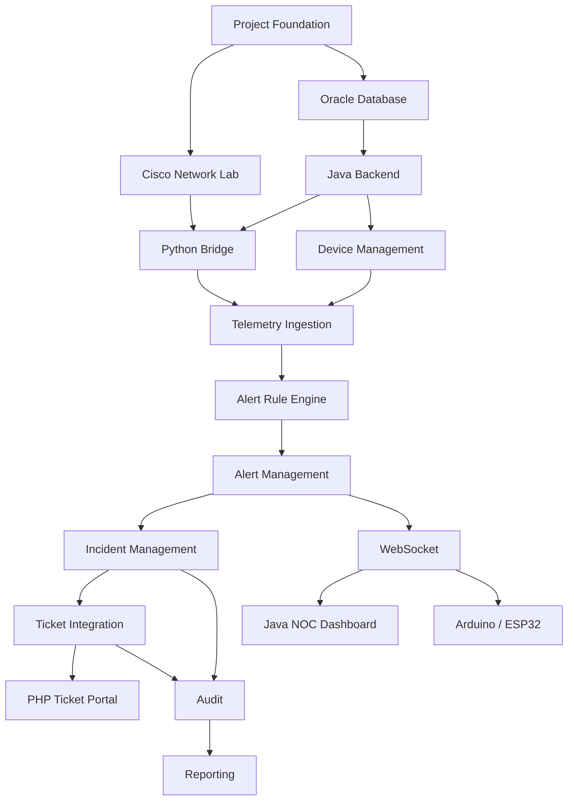

### دليل البدء بالتنفيذ من الصفر حتى النظام المتكامل

> **الهدف من هذا الملف:** تحويل Architecture Design Document إلى خطة تنفيذ عملية مرتبة حسب **الأهمية، الاعتمادية، والتكاملية**، بحيث يتم بناء NetPulse Feature-by-Feature دون الوقوع في مشكلة بناء أجزاء منفصلة لا تعمل مع بعضها.

---

# 1. قبل أن تبدأ: كيف تفكر في NetPulse؟

أكبر خطأ يمكن أن يحدث أثناء تنفيذ المشروع هو أن تبدأ بما تراه أمامك.

مثلاً:

```text
❌ ابدأ Dashboard
❌ ابدأ Login
❌ ابدأ Arduino
❌ ابدأ صفحة Tickets
```

ثم بعد عدة أسابيع تجد أن:

```text
Dashboard
     ↓
لا يوجد Backend حقيقي

Ticket Portal
     ↓
لا يوجد Incident System

Arduino
     ↓
لا يوجد Alert Engine

Database
     ↓
الجداول لا تتوافق مع الـ Backend
```

لذلك يجب أن تبدأ من **الأساس الذي تعتمد عليه بقية الـ Features**.

---

# 2. القاعدة الأساسية للتنفيذ

في NetPulse:

```text
Infrastructure
      ↓
Data
      ↓
Backend
      ↓
Business Logic
      ↓
Alerts
      ↓
Incidents
      ↓
Tickets
      ↓
Real-Time UI
      ↓
Physical Alerting
      ↓
Analytics / Reports
```

أي Feature في الأسفل تعتمد على Features في الأعلى.

لذلك لا نسأل:

> "ما الـ Feature الأسهل؟"

بل نسأل:

> "ما الـ Feature التي إذا بنيتها الآن ستفتح الطريق لأكبر عدد من Features بعدها؟"

وهذا هو مفهوم:

# Dependency-Driven Development

---

# 3. ترتيب التنفيذ المقترح

الترتيب الرئيسي:

```text
PHASE 0
Project Foundation
        ↓
PHASE 1
Network Lab & Event Generation
        ↓
PHASE 2
Oracle Database
        ↓
PHASE 3
Java Backend Foundation
        ↓
PHASE 4
Device Management
        ↓
PHASE 5
Telemetry/Event Ingestion
        ↓
PHASE 6
Alert Rule Engine
        ↓
PHASE 7
Alert Management
        ↓
PHASE 8
Incident Management
        ↓
PHASE 9
Ticket Integration
        ↓
PHASE 10
WebSocket Real-Time Communication
        ↓
PHASE 11
Java NOC Dashboard
        ↓
PHASE 12
PHP/MySQL Ticketing Portal
        ↓
PHASE 13
Arduino/ESP32 Physical Alert
        ↓
PHASE 14
Audit & Security
        ↓
PHASE 15
Reporting / Analytics
        ↓
PHASE 16
Integration Testing
        ↓
PHASE 17
Hardening & Final Demo
```

---

# 4. مفهوم Feature في NetPulse

الـ Feature ليست مجرد شاشة.

مثلاً:

```text
"Alert Management"
```

ليست:

```text
صفحة Alerts
```

بل هي منظومة كاملة:

```text
Database
+
Backend Model
+
Business Rules
+
API
+
Persistence
+
Real-Time Event
+
UI
+
Testing
```

لذلك عندما نقول:

> انتهيت من Feature Alerts

يجب أن يكون معناها:

```text
Event
 ↓
Backend
 ↓
Rule
 ↓
Alert
 ↓
Database
 ↓
API
 ↓
UI
```

يعمل فعلياً.

---

# 5. Definition of Done

قبل البدء يجب أن تحدد معنى:

> "Feature Completed"

الـ Feature لا تعتبر مكتملة حتى:

- تعمل وظيفياً.
    
- تحفظ البيانات المطلوبة.
    
- تتعامل مع الأخطاء.
    
- ترتبط بالـ Features السابقة.
    
- يتم اختبارها.
    
- لا تكسر Features موجودة.
    
- يكون لها Logging مناسب.
    
- يكون تصميمها متوافقاً مع Architecture.
    

---

# PHASE 0

# Project Foundation

## الأولوية

★★★★★

## التكاملية

★★★★★

## لماذا نبدأ بها؟

لأن كل شيء لاحق يعتمد على بيئة المشروع.

---

# Feature 0.1 — Project Structure

أنشئ هيكل المشروع قبل كتابة Business Logic.

مثال:

```text
NetPulse/
│
├── backend/
│   └── java/
│
├── bridge/
│   └── python/
│
├── desktop/
│   └── java/
│
├── web/
│   └── php/
│
├── firmware/
│   └── esp32/
│
├── database/
│   ├── oracle/
│   └── mysql/
│
├── network/
│   └── packet-tracer/
│
├── docs/
│
└── tests/
```

---

# Feature 0.2 — Git / Version Control

قبل البرمجة:

```text
git init
```

ثم:

```text
main
development
feature/*
```

مثلاً:

```text
feature/device-management
feature/event-ingestion
feature/alert-engine
```

---

# Feature 0.3 — Configuration

لا تضع:

```text
Oracle IP
Password
WebSocket Port
```

داخل Business Logic.

أنشئ Configuration Layer.

مثال منطقي:

```text
Database Configuration
Network Configuration
WebSocket Configuration
Bridge Configuration
Security Configuration
```

---

# ما يجب أن تعرفه قبل Phase 0

يجب أن تفهم:

- Git.
    
- Project structure.
    
- Environment variables.
    
- Configuration.
    
- Logging.
    
- Dependency management.
    

---

# مخرجات Phase 0

يجب أن يكون لديك:

```text
✓ Project repository
✓ Backend project
✓ Python project
✓ Database scripts directory
✓ Network lab directory
✓ Documentation
✓ Basic logging
✓ Configuration system
```

---

# PHASE 1

# Network Lab & Event Generation

## الأولوية

★★★★★

## التكاملية

★★★★★

هذه المرحلة مهمة جداً لأن NetPulse في الأساس نظام مراقبة للشبكة.

المصدر التأسيسي يجعل Cisco Packet Tracer طبقة البنية التحتية التي يولد منها النظام الأحداث.

---

# Feature 1.1 — Build Network Topology

ابدأ ببناء:

```text
Core
 ↓
Distribution
 ↓
Access
 ↓
Departments
```

مع:

```text
VLANs
Routing
Interfaces
Management IPs
```

---

# Feature 1.2 — Device Inventory

حدد الأجهزة:

```text
Core-R1
Core-R2
Access-SW-01
Access-SW-02
Server
```

كل جهاز يجب أن يكون له:

```text
Device ID
Name
IP
Type
Role
Location
Status
```

---

# Feature 1.3 — Generate Test Failure

يجب أن تستطيع عمداً إنتاج:

```text
LINK DOWN
```

ثم:

```text
LINK UP
```

هذه أول Test Case حقيقية في NetPulse.

---

# Feature 1.4 — Syslog

قم بإعداد الأجهزة لإرسال الأحداث إلى Collector.

المصدر التأسيسي يذكر استخدام `logging host` لتوجيه السجلات إلى خادم التجميع المركزي.

---

# Feature 1.5 — SNMP Events

جهز سيناريوهات SNMP التي سيستخدمها النظام.

---

# ماذا يجب أن تعرف؟

قبل هذه المرحلة يجب أن تفهم:

### CCNA

- VLAN
    
- Trunk
    
- Routing
    
- Inter-VLAN Routing
    
- Interface Status
    
- Syslog
    
- SNMP
    
- IP Addressing
    
- Subnetting
    

### والأهم:

أن تعرف الفرق بين:

```text
Network Event
```

و:

```text
Application Event
```

---

# Definition of Done

لا تنتقل للمرحلة التالية حتى تستطيع:

```text
Start Network
     ↓
Cause Failure
     ↓
Generate Event
     ↓
Receive Event
```

---

# PHASE 2

# Oracle Database Foundation

## الأولوية

★★★★★

## التكاملية

★★★★★

الـ Backend يحتاج إلى مكان يحفظ فيه حالة النظام.

المصدر يحدد Oracle كقاعدة البيانات الأساسية للـ Java Backend، لتخزين Device Inventory وAlert Rules والسجلات التاريخية وAudit Logs.

---

# Feature 2.1 — Device Table

ابدأ بـ:

```text
DEVICE
```

ولا تبدأ بكل الجداول مرة واحدة.

---

# Feature 2.2 — User Table

بعد Device:

```text
USER_ACCOUNT
```

---

# Feature 2.3 — Telemetry Event

ثم:

```text
TELEMETRY_EVENT
```

---

# Feature 2.4 — Alert Rule

ثم:

```text
ALERT_RULE
```

---

# Feature 2.5 — Alert

ثم:

```text
ALERT
```

---

# Feature 2.6 — Incident

ثم:

```text
INCIDENT
```

---

# Feature 2.7 — Audit

ثم:

```text
AUDIT_LOG
```

---

# ترتيب Database

```text
USER
DEVICE
   ↓
TELEMETRY_EVENT
   ↓
ALERT_RULE
   ↓
ALERT
   ↓
INCIDENT
   ↓
AUDIT_LOG
```

---

# ما يجب أن تعرفه؟

يجب أن تفهم:

- Primary Key.
    
- Foreign Key.
    
- Unique.
    
- NOT NULL.
    
- Indexes.
    
- Relationships.
    
- Normalization.
    
- Transactions.
    
- Constraints.
    

ولا تنتقل للـ Backend قبل أن تفهم:

```text
لماذا هذا FK موجود؟
```

وليس فقط:

```text
كيف أكتب CREATE TABLE؟
```

---

# PHASE 3

# Java Backend Foundation

## الأولوية

★★★★★

## التكاملية

★★★★★

هذه أهم مرحلة برمجية.

المصدر يصف Java Backend بأنه العقل المركزي الذي يستقبل Telemetry وLogs ويحللها ويطبق Business Logic ويبث التنبيهات عبر WebSockets.

---

# Feature 3.1 — Backend Application

أنشئ Java Server.

---

# Feature 3.2 — Database Connection

أنشئ:

```text
Oracle Connection
```

ثم اختبر:

```text
Backend
   ↓
Oracle
   ↓
SELECT 1
```

---

# Feature 3.3 — Entity Layer

مثلاً:

```text
Device
User
TelemetryEvent
AlertRule
Alert
Incident
```

---

# Feature 3.4 — Repository Layer

مسؤولة عن:

```text
INSERT
SELECT
UPDATE
DELETE
```

---

# Feature 3.5 — Service Layer

هنا يبدأ Business Logic.

مثلاً:

```text
DeviceService
AlertService
IncidentService
TelemetryService
```

---

# Feature 3.6 — API Layer

مثلاً:

```text
GET /devices
GET /alerts
GET /incidents
POST /devices
POST /alerts/{id}/ack
```

> أسماء الـ endpoints هنا أمثلة تصميمية، وليست محددة في المصدر.

---

# Architecture

استخدم:

```text
Controller
    ↓
Service
    ↓
Repository
    ↓
Database
```

ولا تجعل:

```text
Controller
    ↓
SQL
```

مباشرة.

---

# ما يجب أن تعرفه؟

- Java OOP.
    
- Interfaces.
    
- Exceptions.
    
- JDBC أو ORM المستخدم فعلياً.
    
- REST API.
    
- HTTP.
    
- JSON.
    
- DTO.
    
- Repository Pattern.
    
- Service Layer.
    
- Dependency Injection إذا تم استخدام Framework يدعمها.
    

---

# PHASE 4

# Device Management

## الأولوية

★★★★★

## التكاملية

★★★★★

هذه أول Feature Business حقيقية.

---

# Feature 4.1 — Add Device

المهندس يستطيع تسجيل:

```text
Core-R2
192.168.x.x
Router
CORE
Server Room
```

---

# Feature 4.2 — Edit Device

يمكن تعديل:

```text
IP
Name
Location
Role
Status
```

---

# Feature 4.3 — Device Details

يجب أن تعرض:

```text
Identity
Network Information
Current Status
Recent Events
Recent Alerts
```

---

# Feature 4.4 — Device Status

حالة مثل:

```text
UP
DOWN
UNKNOWN
```

---

# لماذا هذه Feature مبكرة؟

لأن Alert Engine يحتاج إلى معرفة:

```text
من أرسل الحدث؟
```

و:

```text
ما دور الجهاز؟
```

بدون Device Inventory يصبح تفسير الحدث ضعيفاً.

---

# مثال

Event:

```text
LINK_DOWN
```

ليس كافياً.

نحتاج:

```text
Device = Core-R2
Role = CORE
Interface = Uplink
```

ثم نستطيع تحديد:

```text
CRITICAL
```

---

# PHASE 5

# Telemetry / Event Ingestion

## الأولوية

★★★★★

## التكاملية

★★★★★

هذه المرحلة تربط العالم الخارجي بالـ Backend.

---

# Feature 5.1 — Event Model

صمم نموذجاً موحداً:

```text
TelemetryEvent
```

مثلاً:

```text
eventId
deviceId
source
eventType
severity
payload
receivedAt
```

---

# Feature 5.2 — Python Bridge

المصدر يحدد Python Bridge كوسيط يلتقط البيانات الخام ويجهزها لإرسالها إلى Java Backend.

---

# مسؤوليات Bridge

```text
Receive
 ↓
Parse
 ↓
Validate
 ↓
Normalize
 ↓
Forward
```

---

# Feature 5.3 — Event Validation

إذا وصل:

```text
Device = NULL
```

يجب ألا يدخل Business Logic مباشرة.

---

# Feature 5.4 — Event Persistence

بعد استقبال Event:

```text
Python
 ↓
Java
 ↓
Oracle
```

ويجب أن تستطيع رؤية Event في قاعدة البيانات.

---

# أول Integration Test حقيقي

نفذ:

```text
Cisco
 ↓
Syslog
 ↓
Python
 ↓
Java
 ↓
Oracle
```

ثم افحص Oracle.

إذا نجحت هذه السلسلة:

> لديك أول Vertical Slice حقيقي في NetPulse.

---

# PHASE 6

# Alert Rule Engine

## الأولوية

★★★★★

## التكاملية

★★★★★

هنا يبدأ "ذكاء" النظام.

---

# السؤال الأساسي

ماذا يفعل النظام عندما يستقبل Event؟

الإجابة:

```text
Event
 ↓
Rule Engine
 ↓
Decision
```

---

# Feature 6.1 — Rule Definition

مثال:

```text
RULE:
CORE_UPLINK_DOWN
```

شرط:

```text
event = LINK_DOWN
device.role = CORE
interface.role = UPLINK
```

نتيجة:

```text
severity = CRITICAL
```

---

# Feature 6.2 — Rule Matching

```text
Incoming Event
      ↓
Load Active Rules
      ↓
Evaluate
      ↓
Match?
```

---

# Feature 6.3 — Severity

يمكن أن تكون:

```text
INFO
LOW
MEDIUM
HIGH
CRITICAL
```

لكن يجب أن تكون Configurable.

---

# Feature 6.4 — Deduplication

لا تنشئ 100 Alert لنفس المشكلة.

مثلاً:

```text
LINK_DOWN × 100
```

يمكن تمثيلها:

```text
One Active Alert
Occurrences = 100
```

---

# Feature 6.5 — Correlation

مثلاً:

```text
Core-R1 Down
     ↓
20 Access Devices Down
```

قد تكون المشكلة الأساسية:

```text
Core-R1
```

وليس 21 مشكلة مستقلة.

---

# ماذا يجب أن تعرف؟

- Boolean logic.
    
- Rule engines.
    
- Event correlation.
    
- State.
    
- Idempotency.
    
- Deduplication.
    
- Severity.
    
- Thresholds.
    

---

# PHASE 7

# Alert Management

## الأولوية

★★★★★

بعد Rule Engine أصبح بإمكاننا إنشاء Alert حقيقي.

---

# Feature 7.1 — Create Alert

```text
Event
 ↓
Rule Match
 ↓
Alert
```

---

# Feature 7.2 — Alert Status

مثلاً:

```text
OPEN
ACKNOWLEDGED
RESOLVED
CLOSED
```

---

# Feature 7.3 — Acknowledge

```text
Engineer
 ↓
ACK
 ↓
Alert.ACK_AT
 ↓
Audit
```

---

# Feature 7.4 — Resolve

عندما يعود الجهاز إلى الحالة الطبيعية:

```text
LINK_DOWN
   ↓
LINK_UP
```

يجب أن يستطيع Backend ربط Recovery Event بالـ Alert السابق.

---

# Feature 7.5 — Alert History

يجب الاحتفاظ بتاريخ:

```text
First Seen
Last Seen
Occurrences
ACK
Resolution
Closure
```

---

# PHASE 8

# Incident Management

## الأولوية

★★★★★

## التكاملية

★★★★★

هنا ننتقل من:

```text
Alert
```

إلى:

```text
Operational Problem
```

المصدر يوضح أن NetPulse لا يكتفي باكتشاف Alert، بل يصعده إلى Incident ثم Ticket ويتابع دورة حياته.

---

# Feature 8.1 — Create Incident

مثلاً:

```text
Critical Alert
       ↓
Incident
```

---

# Feature 8.2 — Incident Assignment

```text
Incident
 ↓
Engineer
```

---

# Feature 8.3 — Incident State

```text
OPEN
 ↓
ASSIGNED
 ↓
IN_PROGRESS
 ↓
RESOLVED
 ↓
CLOSED
```

---

# Feature 8.4 — Incident Root Cause

عند الحل:

```text
Root Cause:
Broken Cable
```

---

# Feature 8.5 — Incident Timeline

يجب أن تستطيع رؤية:

```text
10:01 Event
10:01 Alert
10:01 Incident
10:02 Ticket
10:03 ACK
10:10 Repair
10:11 Link Up
10:15 Closure
```

وهذا من أهم الأشياء التي تجعل النظام احترافياً.

---

# PHASE 9

# Ticketing Integration

## الأولوية

★★★★☆

## التكاملية

★★★★★

بعد أن أصبح لدينا Incident حقيقي، يمكننا إنشاء Ticket.

المصدر يحدد PHP/MySQL كطبقة Ticketing، مع إمكانية إنشاء التذكرة تلقائياً عند اكتشاف عطل حرج.

---

# Feature 9.1 — Ticket Model

```text
Ticket
```

يرتبط بـ:

```text
Incident
```

---

# Feature 9.2 — Automatic Ticket Creation

```text
Critical Incident
       ↓
Java Backend
       ↓
PHP
       ↓
MySQL
       ↓
Ticket Created
```

---

# Feature 9.3 — Ticket Assignment

```text
Ticket
 ↓
Support Engineer
```

---

# Feature 9.4 — Ticket Comments

```text
Engineer
 ↓
Comment
 ↓
Ticket
```

---

# Feature 9.5 — Ticket History

كل تغيير يجب أن يسجل:

```text
OPEN → ASSIGNED
ASSIGNED → IN_PROGRESS
IN_PROGRESS → RESOLVED
RESOLVED → CLOSED
```

---

# أهم نقطة هنا

لا تجعل MySQL بديلاً عن Oracle.

يجب أن يكون لديك تصور واضح:

```text
Oracle
    = Network / Monitoring Domain

MySQL
    = Ticketing Domain
```

---

# PHASE 10

# WebSocket Real-Time Communication

## الأولوية

★★★★☆

## التكاملية

★★★★★

المصدر يذكر WebSockets كوسيلة بث التنبيهات لحظياً إلى الشاشات وأجهزة الإنذار.

---

# Feature 10.1 — WebSocket Server

```text
Java Backend
      ⇅
WebSocket
```

---

# Feature 10.2 — Event Message

مثلاً:

```json
{
  "type": "CRITICAL_ALERT",
  "device": "Core-R2",
  "severity": "CRITICAL",
  "message": "Uplink Down"
}
```

---

# Feature 10.3 — Client Connection

Clients:

```text
Java Desktop
Arduino/ESP32
```

---

# Feature 10.4 — Real-Time Alert

```text
Backend
   ↓
WebSocket
   ↓
Desktop
```

بدون Refresh.

---

# ماذا يجب أن تعرف؟

- WebSocket.
    
- Connection lifecycle.
    
- Client/server.
    
- JSON.
    
- Reconnection.
    
- Heartbeat.
    
- Authentication.
    
- Event types.
    

---

# PHASE 11

# Java NOC Dashboard

## الأولوية

★★★★☆

## التكاملية

★★★★☆

الآن فقط يصبح من المنطقي بناء Dashboard حقيقي.

المصدر يخصص Java Desktop لمهندسي الشبكات ومديري NOC لعرض الرسوم والتنبيهات اللحظية وإدارة الأجهزة والإعدادات.

---

# Feature 11.1 — Login

```text
Username
Password
 ↓
Backend
 ↓
Authorization
```

---

# Feature 11.2 — Dashboard

اعرض:

```text
Total Devices
Online
Offline
Active Alerts
Critical Incidents
Open Tickets
```

---

# Feature 11.3 — Device Monitoring

```text
Devices
 ↓
Device Details
 ↓
Recent Events
```

---

# Feature 11.4 — Alerts Screen

```text
CRITICAL
HIGH
MEDIUM
LOW
```

---

# Feature 11.5 — Incident Screen

يعرض:

```text
Incident
Severity
Device
Engineer
Status
Timeline
```

---

# Feature 11.6 — Real-Time Notifications

عند وصول:

```text
CRITICAL_ALERT
```

تظهر Popup مباشرة.

---

# PHASE 12

# PHP/MySQL Ticketing Portal

## الأولوية

★★★★☆

## التكاملية

★★★★☆

بعد أن أصبحت Ticket Domain موجودة، نبني واجهتها.

---

# Feature 12.1 — Web Login

---

# Feature 12.2 — Ticket Dashboard

```text
Open
Assigned
In Progress
Resolved
Closed
```

---

# Feature 12.3 — Ticket Details

```text
Ticket
 ↓
Incident
 ↓
Device
 ↓
Alert
 ↓
Timeline
```

---

# Feature 12.4 — Assignment

---

# Feature 12.5 — Comments

---

# Feature 12.6 — Closure

```text
Engineer
 ↓
Resolve
 ↓
Close
```

---

# PHASE 13

# Arduino / ESP32 Physical Alert

## الأولوية

★★★☆☆

## التكاملية

★★★★☆

هذه Feature مهمة للعرض النهائي، لكنها ليست نقطة البداية.

المصدر يحدد Arduino/ESP32 كعميل يستقبل Critical Alerts ويشغل LED/Buzzer ويعرض التفاصيل، ويستمر حتى ACK.

---

# لماذا لا نبدأ به؟

لأن Arduino لا يعرف:

```text
ما هو Critical؟
```

ولا يجب أن يحتوي على:

```text
Alert Rules
Incident Rules
Ticket Rules
```

هو فقط:

```text
Receive Command
 ↓
Act
 ↓
ACK
```

---

# Feature 13.1 — Device Connection

```text
ESP32
 ↓
Backend
```

---

# Feature 13.2 — Alert Listener

```text
CRITICAL_ALERT
```

---

# Feature 13.3 — LED

```text
Critical
 ↓
RED LED
```

---

# Feature 13.4 — Buzzer

```text
Critical
 ↓
Buzzer ON
```

---

# Feature 13.5 — Display

```text
CORE-R2
LINK DOWN
```

---

# Feature 13.6 — ACK Button

```text
Button
 ↓
ACK
 ↓
Backend
 ↓
Stop Alarm
```

---

# PHASE 14

# Authentication & Authorization

## الأولوية

★★★★☆

## التكاملية

★★★★★

لا تؤجل الأمن إلى نهاية المشروع بالكامل، لكن لا تبدأ ببناء نظام IAM ضخم قبل وجود Core.

---

# Feature 14.1 — Users

```text
USER_ACCOUNT
```

---

# Feature 14.2 — Roles

```text
ADMIN
NOC_ENGINEER
SUPPORT_ENGINEER
VIEWER
```

---

# Feature 14.3 — Permissions

مثلاً:

```text
VIEW_DEVICE
ACK_ALERT
CREATE_TICKET
CLOSE_TICKET
MANAGE_RULE
MANAGE_USER
```

---

# Feature 14.4 — Audit

مثلاً:

```text
Admin
 ↓
Changed Alert Rule
 ↓
AuditLog
```

---

# PHASE 15

# Reporting & Analytics

## الأولوية

★★★☆☆

هذه تأتي بعد أن يصبح لديك Historical Data حقيقي.

---

# Feature 15.1 — Incident Statistics

```text
Incidents per Day
```

---

# Feature 15.2 — Top Failing Devices

```text
Core-R2
    15 incidents

Access-SW-03
    8 incidents
```

---

# Feature 15.3 — MTTR

Mean Time To Repair.

مثلاً:

```text
Detected:
10:00

Resolved:
10:20

MTTR = 20 minutes
```

---

# Feature 15.4 — Availability

يمكن حساب:

```text
Uptime
Downtime
Availability %
```

---

# PHASE 16

# Integration Testing

## الأولوية

★★★★★

## التكاملية

★★★★★

هذه ليست مرحلة اختيارية.

---

# Test Scenario 1 — Link Down

```text
Cisco
 ↓
Syslog
 ↓
Python
 ↓
Java
 ↓
Oracle
 ↓
Alert
```

---

# Test Scenario 2 — Critical Alert

```text
Alert
 ↓
Incident
 ↓
Ticket
 ↓
Desktop
 ↓
Arduino
```

---

# Test Scenario 3 — ACK

```text
Arduino
 ↓
ACK
 ↓
Backend
 ↓
Oracle
 ↓
Alarm OFF
```

---

# Test Scenario 4 — Recovery

```text
Link Down
 ↓
Incident
 ↓
Repair
 ↓
Link Up
 ↓
Backend
 ↓
Resolve
```

---

# Test Scenario 5 — Closure

```text
Resolved
 ↓
Engineer
 ↓
Close Ticket
 ↓
History
```

---

# 11. أهم شيء: لا تختبر Features منفردة فقط

لا يكفي:

```text
✓ Alert screen works
✓ Ticket screen works
✓ Arduino works
```

بل يجب أن تختبر:

```text
Cisco
 ↓
Bridge
 ↓
Backend
 ↓
Database
 ↓
Alert
 ↓
Incident
 ↓
Ticket
 ↓
Dashboard
 ↓
Arduino
```

وهذا يسمى:

# End-to-End Testing

---

# PHASE 17

# Final Hardening

بعد اكتمال الوظائف:

```text
Error Handling
Security
Logging
Performance
Database Indexing
Backup
Recovery
Documentation
```

---

# 6. ما الذي يجب أن تتعلمه قبل البرمجة؟

لا تحتاج أن تتعلم كل شيء مرة واحدة.

قسّم المعرفة حسب المرحلة.

---

# المستوى الأول — Network Fundamentals

يجب أن تفهم:

```text
IP
Subnet
VLAN
Trunk
Routing
Interface
Syslog
SNMP
```

لأن Cisco هي مصدر البيانات.

---

# المستوى الثاني — Database

تعلم:

```text
SQL
PK
FK
JOIN
Index
Transaction
Normalization
```

---

# المستوى الثالث — Java

تعلم:

```text
OOP
Classes
Interfaces
Exceptions
Collections
Generics
HTTP
REST
JSON
Database Access
```

---

# المستوى الرابع — Backend Architecture

تعلم:

```text
Controller
Service
Repository
DTO
Entity
Validation
Exception Handling
Logging
```

---

# المستوى الخامس — Event-Driven Systems

تعلم:

```text
Event
Producer
Consumer
Event Processing
Correlation
Deduplication
State
```

---

# المستوى السادس — WebSockets

تعلم:

```text
Connection
Message
Broadcast
Reconnect
Heartbeat
```

---

# المستوى السابع — PHP/MySQL

ركز على:

```text
HTTP
Forms
Sessions
Authentication
SQL
CRUD
Relationships
```

---

# المستوى الثامن — IoT

تعلم:

```text
ESP32
GPIO
LED
Buzzer
Button
Network Communication
```

---

# 7. الترتيب الصحيح للتعلم أثناء البناء

لا تتعلم:

```text
Java
ثم Python
ثم PHP
ثم Arduino
ثم Networking
```

ثم تبدأ المشروع.

الأفضل:

```text
Feature
 ↓
What do I need?
 ↓
Learn only what's needed
 ↓
Implement
 ↓
Test
 ↓
Move to next Feature
```

وهذا يسمى:

# Just-in-Time Learning

---

# 8. أول Vertical Slice

قبل بناء عشرات Features، يجب أن تحقق هذا الإنجاز:

```text
Cisco
  ↓
Syslog
  ↓
Python Bridge
  ↓
Java Backend
  ↓
Oracle
```

ثم:

```text
Event
 ↓
Alert Rule
 ↓
Alert
```

ثم:

```text
Alert
 ↓
Java Desktop
```

ثم:

```text
Alert
 ↓
Incident
 ↓
Ticket
```

ثم:

```text
Critical Alert
 ↓
Arduino
```

عند هذه النقطة يصبح لديك **NetPulse يعمل فعلياً من البداية إلى النهاية** حتى لو كانت الواجهات بسيطة.

---

# 9. MVP الخاص بـ NetPulse

إذا كان الوقت محدوداً، لا تحاول بناء كل شيء.

## MVP يجب أن يحتوي:

```text
✓ Cisco Topology
✓ Syslog Event
✓ Python Bridge
✓ Java Backend
✓ Oracle
✓ Device
✓ Telemetry Event
✓ Alert Rule
✓ Alert
✓ Incident
✓ Ticket
✓ Java Dashboard
✓ WebSocket
✓ Arduino Alert
✓ ACK
✓ Recovery
✓ Closure
```

---

# 10. Features يمكن تأجيلها

```text
Advanced Analytics
AI Detection
Complex Reporting
Mobile Application
Email/SMS
Advanced Correlation
Predictive Maintenance
Cloud Deployment
```

هذه ليست أولويات قبل اكتمال دورة العطل الأساسية.

---

# 11. ترتيب الأولوية النهائي

|#|Feature|Priority|Dependency|
|--:|---|:-:|---|
|1|Project Foundation|🔴 Critical|None|
|2|Cisco Network Lab|🔴 Critical|1|
|3|Oracle Schema|🔴 Critical|1|
|4|Java Backend Foundation|🔴 Critical|3|
|5|Device Management|🔴 Critical|4|
|6|Python Bridge|🔴 Critical|2,4|
|7|Telemetry/Event Ingestion|🔴 Critical|5,6|
|8|Alert Rule Engine|🔴 Critical|7|
|9|Alert Management|🔴 Critical|8|
|10|Incident Management|🔴 Critical|9|
|11|Ticket Integration|🟠 High|10|
|12|WebSocket|🟠 High|9|
|13|Java NOC Dashboard|🟠 High|12|
|14|PHP Ticket Portal|🟠 High|11|
|15|Arduino/ESP32|🟠 High|12|
|16|Security/Audit|🟠 High|Core|
|17|Reporting|🟡 Medium|Historical Data|
|18|Advanced Analytics|🟢 Later|Everything|

---

# 12. Dependency Map



---

# 13. قاعدة مهمة جداً: لا تبنِ Feature بدون Contract

قبل كل Feature اكتب:

```text
Feature Name:
Purpose:
Input:
Output:
Dependencies:
Database Changes:
API Changes:
Business Rules:
Error Cases:
Security:
Test Cases:
Definition of Done:
```

مثلاً:

---

# Feature Specification Example

## Feature: Create Alert

### Purpose

تحويل Event مطابق لقاعدة معينة إلى Alert.

### Input

```text
TelemetryEvent
```

### Dependencies

```text
Device
AlertRule
Database
```

### Process

```text
Receive Event
 ↓
Find Device
 ↓
Find Active Rules
 ↓
Evaluate
 ↓
Match?
 ↓
Create Alert
```

### Output

```text
Alert
```

### Database

```text
ALERT
```

### Error Cases

```text
Unknown Device
Invalid Event
No Matching Rule
Database Failure
```

### Test

```text
LINK_DOWN
+
CORE_UPLINK_RULE
=
CRITICAL ALERT
```

### Definition of Done

```text
✓ Alert created
✓ Alert saved
✓ Correct severity
✓ Correct device
✓ Rule recorded
✓ Duplicate handled
✓ Error logged
✓ Test passed
```

---

# 14. ماذا تفعل فعلياً عند بدء Feature جديدة؟

استخدم هذه الدورة دائماً:

```text
        ┌───────────────┐
        │ Understand    │
        │ Feature       │
        └───────┬───────┘
                ↓
        ┌───────────────┐
        │ Identify      │
        │ Dependencies  │
        └───────┬───────┘
                ↓
        ┌───────────────┐
        │ Design        │
        └───────┬───────┘
                ↓
        ┌───────────────┐
        │ Database      │
        └───────┬───────┘
                ↓
        ┌───────────────┐
        │ Backend       │
        └───────┬───────┘
                ↓
        ┌───────────────┐
        │ Integration   │
        └───────┬───────┘
                ↓
        ┌───────────────┐
        │ UI / Client   │
        └───────┬───────┘
                ↓
        ┌───────────────┐
        │ Test          │
        └───────┬───────┘
                ↓
        ┌───────────────┐
        │ Definition    │
        │ of Done       │
        └───────────────┘
```

---

# 15. أول أسبوع عملي مقترح

## Day 1

```text
Project Structure
Git
Java Project
Python Project
Oracle Connection Plan
```

## Day 2

```text
Cisco Topology
VLAN
IP
Routing
```

## Day 3

```text
Syslog
LINK_DOWN
LINK_UP
```

## Day 4

```text
Oracle
DEVICE
USER
TELEMETRY_EVENT
```

## Day 5

```text
Java Backend
Oracle Connection
Device CRUD
```

## Day 6

```text
Python Bridge
Event Parsing
Java Event Endpoint
```

## Day 7

نفذ أول Vertical Slice:

```text
Cisco
 ↓
Syslog
 ↓
Python
 ↓
Java
 ↓
Oracle
```

إذا نجحت هذه الخطوة، فأنت فعلياً بدأت بناء NetPulse.

---

# 16. أول Milestone حقيقي

لا تعتبر:

```text
"أنشأت مشروع Java"
```

Milestone.

ولا:

```text
"صممت Dashboard"
```

Milestone.

الـ Milestone الأول الحقيقي هو:

```text
MILESTONE 01

Cisco generates LINK_DOWN
        ↓
Python receives it
        ↓
Java receives it
        ↓
Java identifies device
        ↓
Oracle stores event
        ↓
Engineer can see event
```

---

# 17. Milestone 02

```text
LINK_DOWN
    ↓
Alert Rule
    ↓
Critical Alert
    ↓
Oracle
```

---

# 18. Milestone 03

```text
Critical Alert
    ↓
Incident
    ↓
Ticket
```

---

# 19. Milestone 04

```text
Critical Alert
    ↓
WebSocket
    ↓
Java Desktop
    ↓
Real-Time Popup
```

---

# 20. Milestone 05

```text
Critical Alert
    ↓
Arduino
    ↓
LED
    ↓
Buzzer
    ↓
ACK
```

---

# 21. Milestone 06 — Final NOC Workflow

```text
┌──────────────────────────────────────────────┐
│             NETPULSE FINAL FLOW              │
└──────────────────────────────────────────────┘

Cisco Failure
      ↓
Syslog / SNMP
      ↓
Python Bridge
      ↓
Java Backend
      ↓
Telemetry Event
      ↓
Alert Rule Engine
      ↓
Critical Alert
      ↓
┌─────┼─────────────┬──────────────┐
│     │             │              │
▼     ▼             ▼              ▼
Oracle Desktop    Arduino       Incident
                  │                │
                  │                ▼
                  │              Ticket
                  │                │
                  ▼                ▼
                ACK            Resolution
                                   │
                                   ▼
                                 Closure
```

---

# 22. الخلاصة: من أين تبدأ؟

إذا أردت أن تبدأ البرمجة **الآن**، فلا تبدأ بالـ Dashboard.

ابدأ بهذا الترتيب بالضبط:

```text
1. Project Foundation
        ↓
2. Cisco Packet Tracer Topology
        ↓
3. Oracle Database
        ↓
4. Java Backend
        ↓
5. Device Management
        ↓
6. Python Bridge
        ↓
7. Telemetry Ingestion
        ↓
8. Alert Rules
        ↓
9. Alerts
        ↓
10. Incidents
        ↓
11. Tickets
        ↓
12. WebSockets
        ↓
13. Java Desktop
        ↓
14. PHP Portal
        ↓
15. Arduino / ESP32
        ↓
16. Security + Audit
        ↓
17. Reports
        ↓
18. Full Integration Testing
```

والقاعدة التي يجب أن تضعها أمامك أثناء تطوير المشروع:

> **لا أبني Feature لأنها جميلة أو سهلة؛ أبنيها لأنها تفتح الطريق للـ Feature التي بعدها.**

وأهم هدف في المراحل الأولى هو الوصول إلى هذا المسار:

```text
Cisco → Python → Java → Oracle
```

ثم:

```text
Event → Rule → Alert → Incident → Ticket
```

ثم:

```text
Alert → WebSocket → Desktop / Arduino
```

ثم:

```text
Recovery → Resolution → Closure → Audit
```
