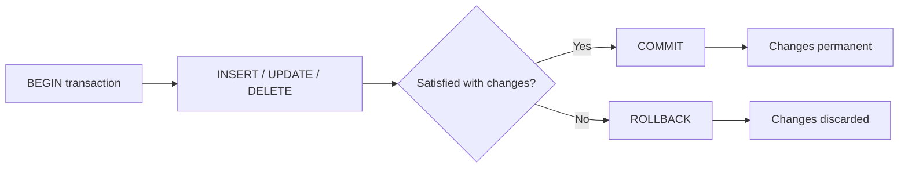
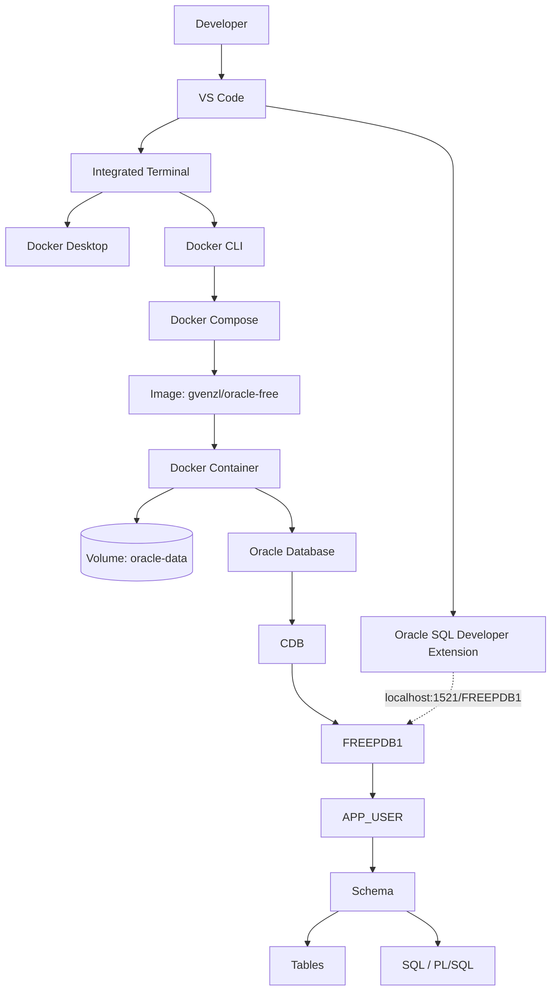

# Docker + Oracle Database Free Development Guide

## Document Metadata

| Field                    | Value                                                                                                                                                                                                                             |
| ------------------------ | --------------------------------------------------------------------------------------------------------------------------------------------------------------------------------------------------------------------------------- |
| **Purpose**              | Provide a complete, professional reference for provisioning, operating, and developing against Oracle Database Free using Docker, and for building the NetPulse NOC database on top of it                                         |
| **Scope**                | Docker fundamentals through Compose orchestration; Oracle architecture, users/schemas, SQL, and PL/SQL; VS Code + Oracle SQL Developer extension workflow; NetPulse schema and query patterns; troubleshooting and best practices |
| **Target audience**      | Developers new to Docker and/or Oracle who need a working local development environment                                                                                                                                           |
| **Prerequisites**        | Basic command-line familiarity; a machine capable of running Docker Desktop (or Docker Engine on Linux)                                                                                                                           |
| **Technologies covered** | Docker, Docker Desktop, Docker CLI, Docker Compose, Oracle Database Free, `gvenzl/oracle-free`, SQL*Plus, SQLcl, Visual Studio Code, Oracle SQL Developer for VS Code, Git                                                        |
| **Last reviewed**        | 2026-09-05                                                                                                                                                                                                                        |
| **Version assumptions**  | See YAML frontmatter above. Oracle image tags and CLI flags change over time — verify against official sources before relying on version-specific behavior (see [[32 - References]])                                              |

> [!IMPORTANT] All passwords, usernames, and connection strings in this document are **example values only** (e.g. `ExamplePassword123`). Never commit real credentials to version control. See [[24 - Environment Variables and Security]].

---

## Table of Contents

- [[#00 - Overview]]
- [[#01 - Docker Fundamentals]]
- [[#02 - Docker Images]]
- [[#03 - Docker Containers]]
- [[#04 - Docker Ports]]
- [[#05 - Docker Volumes]]
- [[#06 - Docker Networks]]
- [[#07 - Docker Compose]]
- [[#08 - Oracle Database Free]]
- [[#09 - Oracle Architecture]]
- [[#10 - gvenzl-oracle-free]]
- [[#11 - Running Oracle with Docker]]
- [[#12 - Oracle Users and Schemas]]
- [[#13 - Oracle SQLPlus]]
- [[#14 - Oracle SQLcl]]
- [[#15 - SQL Fundamentals]]
- [[#16 - Database Design]]
- [[#17 - Transactions]]
- [[#18 - Oracle Data Dictionary]]
- [[#19 - Visual Studio Code]]
- [[#20 - Oracle SQL Developer for VS Code]]
- [[#21 - Connecting VS Code to Oracle]]
- [[#22 - SQL Project Structure]]
- [[#23 - Initialization Scripts]]
- [[#24 - Environment Variables and Security]]
- [[#25 - Troubleshooting]]
- [[#26 - Persistence and Backup]]
- [[#27 - NetPulse Database]]
- [[#28 - Professional Development Workflow]]
- [[#29 - Best Practices]]
- [[#30 - Cheat Sheet]]
- [[#31 - Decision Guide]]
- [[#32 - References]]

---

## 00 - Overview

This guide documents an end-to-end local development stack: a developer uses **Visual Studio Code** (with the **Oracle SQL Developer for VS Code** extension and an integrated terminal) to interact with **Docker**, which runs an **Oracle Database Free** instance inside a container. The database exposes a pluggable database (**FREEPDB1**) in which an application schema (**APP_USER**) is created and populated with the **NetPulse** NOC schema.

### Architecture Layers

```text
Developer
   │
   ├── VS Code
   │     ├── Oracle SQL Developer Extension (SQL Worksheet, connections)
   │     └── Integrated Terminal (docker, sqlplus, sql, git)
   │
   └── Docker CLI
          │
          ▼
     Docker Engine (Docker Desktop or native)
          │
          ▼
     Oracle Container  (a Docker container — an OS-level process sandbox)
          │
          ▼
   Oracle Database Free (the RDBMS software running inside the container)
          │
          ▼
        CDB           (Container Database — the Oracle multitenant root)
          │
          ▼
      FREEPDB1        (Pluggable Database — where application data lives)
          │
          ▼
      APP_USER        (an Oracle User, which owns a Schema)
          │
          ▼
       Schema
          │
          ├── Tables
          ├── Views
          ├── Indexes
          ├── Procedures
          └── Functions
```

|Layer|Meaning|
|---|---|
|VS Code|Editor and orchestration surface; runs terminal commands and SQL|
|Docker Engine|Runs and isolates containers on the host OS|
|Docker Container|An isolated, running instance of an Image (the _process sandbox_, not the database)|
|Oracle Database Free|The RDBMS software running inside that container|
|CDB|Oracle's "Container Database" — an Oracle-internal concept, unrelated to Docker containers|
|PDB (`FREEPDB1`)|A pluggable database inside the CDB; where application objects live|
|APP_USER|An Oracle user/schema created inside `FREEPDB1` for application development|

> [!WARNING] "Container" is heavily overloaded in this stack. A **Docker container** (an OS-level sandboxed process) and an **Oracle CDB** ("Container Database", a multitenant architecture concept) are unrelated. See [[09 - Oracle Architecture]] for the explicit distinction.

---

## 01 - Docker Fundamentals

**Docker** is a platform for building, shipping, and running applications inside lightweight, isolated units called containers. Docker exists to solve the "it works on my machine" problem by packaging an application together with its runtime, libraries, and configuration into a single reproducible unit.

### Containers vs. Virtual Machines

| Aspect             | Virtual Machine             | Container                              |
| ------------------ | --------------------------- | -------------------------------------- |
| Isolation boundary | Hardware-level (hypervisor) | OS-level (kernel namespaces/cgroups)   |
| Guest OS           | Full OS per VM              | Shares host kernel; no guest OS        |
| Startup time       | Minutes                     | Seconds                                |
| Resource overhead  | High                        | Low                                    |
| Portability        | Image includes full OS      | Image includes only app + dependencies |

A container is **not** a lightweight VM. It is a process (or group of processes) running on the host kernel, isolated using Linux namespaces (PID, network, mount, etc.) and constrained using cgroups.

### Core Components

- **Docker Engine** — the background service (daemon, `dockerd`) that builds and runs containers.
- **Docker Desktop** — a desktop application (Windows/macOS/Linux) that bundles the Docker Engine, CLI, and a GUI for managing containers, images, volumes, and networks.
- **Docker CLI** — the `docker` command-line client used to issue commands to the Engine.
- **Docker Hub** — the default public **registry** for storing and distributing images.
- **Registry** — a service that stores Images and serves them on request (`pull`) or accepts them (`push`). Docker Hub is one registry; private registries also exist.

### Core Concepts

- **Image** — an immutable, read-only template containing an application and everything needed to run it. See [[02 - Docker Images]].
- **Container** — a running (or stopped) instance created from an Image. See [[03 - Docker Containers]].
- **Layer** — Images are built from stacked, cacheable filesystem layers. Each instruction in a Dockerfile typically produces one layer.
- **Container filesystem** — a writable layer placed on top of the Image's read-only layers. Changes made while the container runs are written here and are lost when the container is removed unless persisted via a volume or bind mount ([[05 - Docker Volumes]]).
- **Container lifecycle** — a container transitions through `created → running → paused → stopped → removed`. Stopping a container preserves its writable layer; removing it discards that layer permanently.

> [!NOTE] Docker Desktop is a distribution/management wrapper around the same Docker Engine and CLI referenced throughout this document. Commands shown as `docker ...` work identically whether Docker Desktop or a native Linux Engine is installed.

---

## 02 - Docker Images

An **Image** is an immutable template used to create containers. It consists of a stack of read-only filesystem layers plus metadata (entrypoint, default command, exposed ports, environment defaults).

### Image Tags and Repositories

An image reference has the form:

```text
[registry/]repository[:tag]
```

Example: `gvenzl/oracle-free:23-slim` — repository `gvenzl/oracle-free`, tag `23-slim`. If no tag is specified, `:latest` is assumed. A tag does **not** guarantee a specific immutable build unless referenced by digest (`@sha256:...`); tags can be re-pointed by the publisher.

### Common Commands

```bash
# Download an image from a registry without running it
docker pull gvenzl/oracle-free:latest

# List locally stored images
docker image ls
docker images        # alias

# View detailed metadata (layers, env, entrypoint, size)
docker image inspect gvenzl/oracle-free:latest

# Remove a specific image
docker image rm gvenzl/oracle-free:latest

# Remove all unused (dangling/untagged) images
docker image prune
```

| Command                | Purpose                                        | Key options                                      |
| ---------------------- | ---------------------------------------------- | ------------------------------------------------ |
| `docker pull`          | Download an image without creating a container | `--platform`, tag suffix                         |
| `docker image ls`      | List local images                              | `-a` (include intermediate layers)               |
| `docker image inspect` | Show full JSON metadata for an image           | `--format` for filtered output                   |
| `docker image rm`      | Delete a local image                           | `-f` (force, even if used by stopped containers) |
| `docker image prune`   | Reclaim disk space from unused images          | `-a` (remove all unused, not just dangling)      |

> [!TIP] Pull explicit, pinned tags (e.g. `gvenzl/oracle-free:23-slim`) rather than `latest` for any environment where reproducibility matters. See [[29 - Best Practices]].

---

## 03 - Docker Containers

A **Container** is a running instance created from an Image, with its own writable filesystem layer, process namespace, and (typically) network namespace.

### Command Reference

#### `docker run`

**Purpose:** Create and start a new container from an image in one step. **Syntax:** `docker run [OPTIONS] IMAGE [COMMAND] [ARGS...]` **Key options:** `-d` (detached/background), `--name`, `-p host:container` (port mapping), `-e KEY=VALUE` (environment variable), `-v` (volume/bind mount), `--network`. **Example:**

```bash
docker run -d --name oracle-db \
  -p 1521:1521 \
  -e ORACLE_PASSWORD=ExamplePassword123 \
  -v oracle-data:/opt/oracle/oradata \
  gvenzl/oracle-free:latest
```

**What happens:** Docker creates a new container from the image, allocates its writable layer, applies the requested port mapping and environment variables, mounts the named volume, and starts the container's entrypoint process. **Common mistakes:** Forgetting `-d` (the terminal blocks, attached to container output); reusing a `--name` that already exists (fails until the old container is removed); omitting `-v`, causing data loss on container removal. **Data-loss consideration:** Without a volume, all database files exist only in the container's writable layer and are destroyed when the container is removed.

#### `docker ps` / `docker ps -a`

**Purpose:** List containers. `docker ps` shows only running containers; `-a` includes stopped ones. **Example:** `docker ps -a`

#### `docker start` / `docker stop` / `docker restart`

**Purpose:** Start a stopped container, gracefully stop a running one (SIGTERM, then SIGKILL after a timeout), or stop-then-start it. **Example:** `docker stop oracle-db && docker start oracle-db` **Note:** These commands do **not** remove the container or its writable layer; data in mounted volumes and the writable layer survives.

#### `docker kill`

**Purpose:** Immediately terminate a container with SIGKILL, skipping graceful shutdown. **Caution:** For a database container, this bypasses a clean shutdown checkpoint and can leave the database in an inconsistent state requiring crash recovery on next start.

#### `docker pause` / `docker unpause`

**Purpose:** Freeze/unfreeze all processes in a container using cgroups freezer, without stopping them.

#### `docker rm`

**Purpose:** Permanently delete a stopped container and its writable layer. **Key options:** `-f` (force-remove a running container), `-v` (also remove anonymous volumes associated with it). **Data-loss consideration:** Named volumes are **not** deleted by default; only anonymous volumes are, and only with `-v`.

#### `docker rename`

**Purpose:** Rename an existing container without recreating it.

#### `docker logs`

**Purpose:** View a container's stdout/stderr. **Key options:** `-f` (follow/stream), `--tail N`. **Example:** `docker logs -f oracle-db` — essential for watching Oracle's initialization progress.

#### `docker exec`

**Purpose:** Run an additional command inside an already-running container. **Example:** `docker exec -it oracle-db bash` — opens an interactive shell inside the running container. **Key options:** `-i` (interactive), `-t` (allocate a TTY).

#### `docker inspect`

**Purpose:** Show full low-level JSON configuration and runtime state of a container (network settings, mounts, environment, restart policy).

#### `docker stats`

**Purpose:** Show a live stream of resource usage (CPU, memory, network I/O) per container.

#### `docker port`

**Purpose:** List the port mappings for a running container.

#### `docker cp`

**Purpose:** Copy files/directories between the host and a container's filesystem. **Example:** `docker cp ./seed.sql oracle-db:/tmp/seed.sql`

> [!CAUTION] `docker rm -f` on a database container that has no volume attached is irreversible: all database files are destroyed with the container. Always verify persistence (see [[05 - Docker Volumes]]) before removing a database container.

---

## 04 - Docker Ports

Port publishing exposes a container's internal network port on the host so external clients can reach it.

```bash
-p 1521:1521
```

This maps **host port 1521** to **container port 1521**. The general form is `-p HOST_PORT:CONTAINER_PORT`; the two numbers need not match (e.g. `-p 1522:1521` exposes the container's port 1521 as host port 1522).

```text
Host Port (as seen from your machine, e.g. localhost:1521)
     ↓  (Docker's userland proxy / iptables NAT rule)
Container Port (as seen inside the container's network namespace)
     ↓
Oracle Listener (bound to 0.0.0.0:1521 inside the container)
```

### `localhost:1521` vs. `oracle-db:1521`

|Address|Resolves correctly from|Why|
|---|---|---|
|`localhost:1521`|The **host machine**, or any client outside Docker (VS Code, SQL*Plus on your laptop)|The mapped host port forwards to the container|
|`oracle-db:1521`|**Another container** on the same user-defined Docker network|Docker's embedded DNS resolves the container name (or Compose service name) only within that network|

`localhost` inside one container does **not** refer to another container — each container has its own network namespace and loopback interface. A client running _inside_ another container must use the container/service name (`oracle-db`), not `localhost`. A client running _outside_ Docker (your terminal, VS Code, Oracle SQL Developer) must use `localhost` (or the mapped host port), not the container name, because it cannot resolve Docker's internal DNS.

---

## 05 - Docker Volumes

### Why Containers Are Ephemeral

A container's writable layer is tied to that specific container instance. Removing the container (`docker rm`) discards this layer permanently. Any process writing important data (like a database) directly into the container filesystem risks total data loss on removal, recreation, or certain upgrade workflows.

### Named Volumes vs. Bind Mounts

|Type|Managed by|Location|Typical use|
|---|---|---|---|
|**Named volume**|Docker (`docker volume` subsystem)|Docker-managed storage area on the host|Database files, portable persistent data|
|**Bind mount**|You (explicit host path)|Any host filesystem path you specify|Mounting source code, config files, init scripts from the host|

```bash
# Named volume
docker run -v oracle-data:/opt/oracle/oradata ...

# Bind mount
docker run -v ./init:/container-entrypoint-initdb.d ...
```

### Volume Commands

```bash
docker volume ls                    # list volumes
docker volume create oracle-data    # create a named volume explicitly
docker volume inspect oracle-data   # show mountpoint and metadata
docker volume rm oracle-data        # delete a volume (irreversible)
```

### Container Lifecycle vs. Data Lifecycle

> [!IMPORTANT] This distinction is the single most important persistence concept in this guide:
> 
> - **Container lifecycle**: created → started → stopped → removed. Governs the _process_.
> - **Data lifecycle**: governed entirely by the **volume**, independent of the container. A volume survives `docker rm`, container recreation, and image upgrades, until it is explicitly deleted (`docker volume rm`, or `docker compose down -v`).
> 
> You can delete and recreate the Oracle container as many times as needed (e.g. to pick up a new image tag) without losing data, **as long as the same named volume is reattached**.

---

## 06 - Docker Networks

Docker containers communicate over **networks**, which are virtual, software-defined switches.

- **Bridge network** — the default network driver; provides an isolated internal subnet with NAT to the host. The default `bridge` network does _not_ provide automatic DNS resolution by container name.
- **Custom (user-defined) bridge network** — created explicitly (or implicitly by Docker Compose); provides **automatic DNS resolution by container name/service name** for all containers attached to it.

### Container-to-Container Communication and DNS

When containers share a user-defined network, each can resolve the others by name:

```text
oracle-db  →  resolves to the Oracle container's internal IP
```

Docker Compose automatically creates a user-defined network per project and names each service after its Compose service key, so `oracle-db` (a service name) becomes a working DNS name for other services in the same Compose file.

### Published Ports vs. Internal Network Access

A published port (`-p 1521:1521`) is only necessary for clients **outside** the Docker network (your host, VS Code, SQL*Plus on the laptop). Containers on the same custom network can reach each other directly via the **container/service port**, without any port publishing, using the service/container name as the hostname.

|Client location|Correct hostname|Correct port|
|---|---|---|
|Host machine / VS Code / laptop terminal|`localhost`|Published host port|
|Another container on the same custom network|`oracle-db` (service/container name)|Container's internal port|

---

## 07 - Docker Compose

**Docker Compose** defines and orchestrates multi-container applications declaratively in a YAML file, replacing long `docker run` command lines.

### Minimal Example

```yaml
services:
  oracle:
    image: gvenzl/oracle-free
```

### Key Fields

|Field|Purpose|
|---|---|
|`services`|Top-level map of containers to run|
|`image`|Which image to use for this service|
|`container_name`|Explicit container name (otherwise Compose generates one)|
|`ports`|Host:container port mappings, same semantics as `docker run -p`|
|`environment`|Environment variables passed into the container|
|`volumes`|Named-volume or bind-mount attachments|
|`networks`|Attach the service to specific custom networks|
|`restart`|Restart policy (`no`, `on-failure`, `unless-stopped`, `always`)|
|`healthcheck`|Command Docker runs periodically to determine container health|

### Full Example

```yaml
services:
  oracle-db:
    image: gvenzl/oracle-free:23-slim
    container_name: oracle-db
    restart: unless-stopped
    ports:
      - "1521:1521"
    environment:
      ORACLE_PASSWORD: ${ORACLE_PASSWORD}
      APP_USER: ${APP_USER}
      APP_USER_PASSWORD: ${APP_USER_PASSWORD}
    volumes:
      - oracle-data:/opt/oracle/oradata
      - ./database/init:/container-entrypoint-initdb.d
    healthcheck:
      test:
        - CMD-SHELL
        - |
          echo "SELECT 'HEALTHY' FROM DUAL;" | sqlplus -s ${APP_USER}/${APP_USER_PASSWORD}@//localhost:1521/FREEPDB1 | grep -q HEALTHY
      interval: 30s
      timeout: 10s
      retries: 5
      start_period: 90s

volumes:
  oracle-data:
```

> [!IMPORTANT] `start_period: 90s` (or longer) is required. During **first-time initialization**, `FREEPDB1` and `APP_USER` do not exist yet, so this check will legitimately fail for several minutes while Oracle Database Free is still creating the database. Docker does not count failures during `start_period` toward `retries`, avoiding a false "unhealthy" state during first boot. Tune this value against your own hardware — first initialization time varies.

**Why this check is preferable to a TCP port check:** a plain TCP check (`nc -z localhost 1521` or Docker's own port-open detection) only confirms that _something_ is listening on the socket. The Oracle listener can accept a TCP connection well before the PDB is open, before `APP_USER` exists, or while the instance is still in mount/recovery state — all of which would report "healthy" under a TCP-only check while the database is not actually usable. The SQL*Plus check above authenticates as the actual application user, opens a session against the actual service (`FREEPDB1`), and executes a real query — validating listener, instance, PDB, and application-schema availability in one step.

**Limitation to state explicitly:** this check embeds `${APP_USER_PASSWORD}` in a shell command executed inside the container. The variable is expanded from the container's own environment at execution time (it is not exposed via `docker inspect`, since the test definition itself only shows the literal `${APP_USER_PASSWORD}` reference, not its value). However, the expanded value is briefly visible to anything with visibility into the container's process list while the healthcheck runs (e.g. `docker top`). This is an acceptable trade-off for local/controlled environments; for production, prefer a dedicated low-privilege healthcheck account with `CREATE SESSION` only, and treat this limitation as a reason the healthcheck credential should never be the same as any highly privileged account password.
### Compose Commands

```bash
docker compose up            # create and start services (foreground)
docker compose up -d         # create and start services (detached)
docker compose down          # stop and remove containers + default network
docker compose down -v       # stop and remove containers, network, AND named volumes
docker compose start         # start existing stopped services
docker compose stop          # stop running services without removing them
docker compose restart       # restart services
docker compose ps            # list services and status
docker compose logs -f       # follow logs across services
docker compose exec oracle-db bash   # run a command in a running service
docker compose pull          # pull the latest images referenced in the file
docker compose config        # validate and print the fully resolved configuration
```

### `stop` vs. `down` vs. `down -v`

|Command|Containers|Networks|Named volumes|Use case|
|---|---|---|---|---|
|`docker compose stop`|Stopped, kept|Kept|Kept|Pause work; resume later with `start`|
|`docker compose down`|Removed|Removed|**Kept**|Tear down and rebuild containers, preserve data|
|`docker compose down -v`|Removed|Removed|**Removed**|Full reset, including all persisted data|

> [!WARNING] `docker compose down -v` permanently deletes named volumes declared in the `volumes:` block, including all Oracle database files. This action cannot be undone unless a separate backup exists. Never run this against an environment containing data you need.

---

## 08 - Oracle Database Free

**Oracle Database Free** is Oracle's no-cost edition of the Oracle Database, intended for development, testing, and learning, with defined resource and feature limits (documented officially by Oracle; verify current limits before relying on them — see [[32 - References]]).

**`gvenzl/oracle-free`** is a community-maintained, widely used Docker image that packages Oracle Database Free with a container-friendly startup process: automatic first-time database creation, environment-variable-driven configuration, and support for custom initialization scripts.

### Image Tag Families

|Tag pattern|Contents|
|---|---|
|`latest`|Most recent supported full build|
|`<version>-full`|Full database feature set|
|`<version>-slim`|Reduced size; some components/features omitted|
|`<version>-faststart`|Pre-initialized database data files baked into the image for faster first startup|

> [!NOTE] Exact tag availability, default tag behavior, and feature differences between `slim`/`full`/`faststart` change over time. Verify current tags and their documented contents on the official Docker Hub page and GitHub repository before choosing one for a specific project (see [[32 - References]]).

---

## 09 - Oracle Architecture

Oracle Database uses a **multitenant architecture**: a single running database instance (the **CDB**, Container Database) hosts one or more **PDBs** (Pluggable Databases), each an isolated, portable set of application data.

```text
Oracle Database
      │
      ▼
     CDB                  (the multitenant container database)
      │
      ├── CDB$ROOT         (root container — Oracle metadata, no application data)
      │
      └── PDB
           │
           └── FREEPDB1    (the default pluggable database created by gvenzl/oracle-free)
                │
                └── User / Schema
                     │
                     └── Objects (Tables, Views, Indexes, Procedures, Functions)
```

- **CDB** — the Container Database: the single Oracle instance and its shared background processes, memory structures, and root data dictionary.
- **CDB$ROOT** — the root container within a CDB; holds Oracle-supplied metadata common to all PDBs, not application data.
- **PDB** — a Pluggable Database; a self-contained, portable collection of schemas and data that can be plugged into or unplugged from a CDB. `FREEPDB1` is the default PDB created by `gvenzl/oracle-free`.
- **User / Schema** — created inside a specific PDB; owns database objects. See [[12 - Oracle Users and Schemas]].
- **Object** — a table, view, index, sequence, procedure, function, etc., owned by a schema.
- **Service (Service Name)** — the name clients use in a connection string to reach a specific PDB (typically the PDB name itself, e.g. `FREEPDB1`).
- **Listener** — the Oracle Net process that listens on a TCP port (default 1521) and routes incoming connections to the correct service/PDB.

> [!IMPORTANT] **Docker Container ≠ Oracle CDB.** A Docker container is an OS-level process sandbox managed by the Docker Engine. A CDB ("Container Database") is an Oracle-internal multitenant concept describing how PDBs are grouped inside one database instance. One Docker container typically runs one Oracle instance (one CDB), which may host one or more PDBs. The word "container" refers to entirely different things in each system.

---

## 10 - gvenzl-oracle-free

### Key Environment Variables

| Variable            | Purpose                                                                                                      |
| ------------------- | ------------------------------------------------------------------------------------------------------------ |
| `ORACLE_PASSWORD`   | Sets the password for the privileged accounts (`SYS`, `SYSTEM`, `PDBADMIN`) on **first initialization only** |
| `APP_USER`          | Name of an optional application user/schema to create in `FREEPDB1` on **first initialization only**         |
| `APP_USER_PASSWORD` | Password for `APP_USER`, required if `APP_USER` is set                                                       |

### First Initialization Behavior

On the **first startup with an empty data directory/volume**, the entrypoint script:

1. Creates the database data files.
2. Sets `SYS`/`SYSTEM`/`PDBADMIN` passwords from `ORACLE_PASSWORD`.
3. Creates the `APP_USER` (if provided) with the given password, granted a reasonable set of development privileges.
4. Executes any scripts found in `/container-entrypoint-initdb.d/` (see [[23 - Initialization Scripts]]).

### Behavior When a Volume Already Contains a Database

If the mounted volume already contains initialized Oracle data files, the entrypoint **skips database creation entirely** and simply starts the existing database. In this case:

- `ORACLE_PASSWORD` is **ignored** (it does not reset any password).
- `APP_USER` / `APP_USER_PASSWORD` are **ignored** — no new user is created.
- Initialization scripts in `/container-entrypoint-initdb.d/` are **not** re-executed.

> [!WARNING] Changing `APP_USER` in your Compose file after the database has already been initialized once will **not** create a new user. The variable is only read during first-time database creation. To apply a changed `APP_USER`, either create the user manually with SQL, or remove the volume and reinitialize (destroying existing data — see [[26 - Persistence and Backup]]).

Refer to the image's official GitHub repository and Docker Hub page for the authoritative, versioned list of supported variables and startup behavior (see [[32 - References]]).

---

## 11 - Running Oracle with Docker

### Using `docker run`

```bash
docker run -d \
  --name oracle-db \
  -p 1521:1521 \
  -e ORACLE_PASSWORD=ExamplePassword123 \
  -e APP_USER=app_user \
  -e APP_USER_PASSWORD=ExampleAppPassword123 \
  -v oracle-data:/opt/oracle/oradata \
  gvenzl/oracle-free:latest
```

| Part                                      | Meaning                                                                      |
| ----------------------------------------- | ---------------------------------------------------------------------------- |
| `-d`                                      | Run detached (background)                                                    |
| `--name oracle-db`                        | Assign a predictable container name, usable as a DNS name on custom networks |
| `-p 1521:1521`                            | Publish the listener port to the host                                        |
| `-e ORACLE_PASSWORD=...`                  | Privileged account password (first init only)                                |
| `-e APP_USER=... / APP_USER_PASSWORD=...` | Creates a development application user (first init only)                     |
| `-v oracle-data:/opt/oracle/oradata`      | Persist database files in a named volume                                     |
| `gvenzl/oracle-free:latest`               | Image reference                                                              |

> [!NOTE] `ExamplePassword123` and `ExampleAppPassword123` are placeholder demonstration credentials. Replace them with strong, unique values, and never commit real values to version control (see [[24 - Environment Variables and Security]]).

### Recommended Docker Compose Configuration


```yaml
services:
  oracle-db:
    image: gvenzl/oracle-free:23-slim
    container_name: oracle-db
    restart: unless-stopped
    ports:
      - "1521:1521"
    environment:
      ORACLE_PASSWORD: ${ORACLE_PASSWORD}
      APP_USER: ${APP_USER}
      APP_USER_PASSWORD: ${APP_USER_PASSWORD}
    volumes:
      - oracle-data:/opt/oracle/oradata
      - ./database/init:/container-entrypoint-initdb.d
    healthcheck:
      test:
        - CMD-SHELL
        - |
          echo "SELECT 'HEALTHY' FROM DUAL;" | sqlplus -s ${APP_USER}/${APP_USER_PASSWORD}@//localhost:1521/FREEPDB1 | grep -q HEALTHY
      interval: 30s
      timeout: 10s
      retries: 5
      start_period: 90s

volumes:
  oracle-data:
```

See [[07 - Docker Compose]] for the full explanation of this healthcheck's design and limitations — it is not repeated here to avoid duplication.


Start it with:

```bash
docker compose up -d
docker compose logs -f oracle-db   # watch until "DATABASE IS READY TO USE!"
```

---

## 12 - Oracle Users and Schemas

| Account              | Role                                                                                                |
| -------------------- | --------------------------------------------------------------------------------------------------- |
| `SYS`                | Most privileged account; owns the core data dictionary; should be reserved for administrative tasks |
| `SYSTEM`             | Privileged administrative account, below `SYS`; also not intended for application use               |
| `APP_USER` (example) | An ordinary application user, intended to own the application schema                                |

### User and Schema Relationship

In Oracle, creating a **User** implicitly creates a **Schema** of the same name — they are effectively the same namespace viewed from two angles. The **User** is the authentication/authorization identity (used to log in); the **Schema** is the collection of objects (tables, views, etc.) that user owns. You cannot create a schema independently of a user in traditional Oracle terminology; every schema has exactly one owning user, and every user has exactly one associated schema.

### User and Privilege Management

```sql
-- Create a new application user in the current PDB
CREATE USER app_user IDENTIFIED BY "ExampleAppPassword123";

-- Modify an existing user, e.g. change password
ALTER USER app_user IDENTIFIED BY "NewExamplePassword456";

-- Grant privileges
GRANT CREATE SESSION TO app_user;
GRANT CREATE TABLE   TO app_user;
GRANT CREATE VIEW    TO app_user;
GRANT CREATE SEQUENCE TO app_user;
GRANT CREATE PROCEDURE TO app_user;

-- Revoke a privilege
REVOKE CREATE PROCEDURE FROM app_user;
```

| Privilege          | Grants ability to                                |
| ------------------ | ------------------------------------------------ |
| `CREATE SESSION`   | Log in / connect at all                          |
| `CREATE TABLE`     | Create tables in own schema                      |
| `CREATE VIEW`      | Create views in own schema                       |
| `CREATE SEQUENCE`  | Create sequences in own schema                   |
| `CREATE PROCEDURE` | Create stored procedures/functions in own schema |

### Why Applications Should Not Connect as `SYS` or `SYSTEM`

`SYS` and `SYSTEM` hold extensive administrative privileges over the entire database, not just one schema. An application bug, SQL injection vulnerability, or misconfigured connection using these accounts can affect the entire instance, not just application data. Least-privilege application accounts (like `APP_USER`) limit the blast radius of any error or compromise. See [[29 - Best Practices]].

---

## 13 - Oracle SQLPlus

**SQL*Plus** is Oracle's original, universally available command-line client for executing SQL and PL/SQL and running administrative commands.

```bash
sqlplus app_user/ExampleAppPassword123@//localhost:1521/FREEPDB1
```

| Segment                 | Meaning                       |
| ----------------------- | ----------------------------- |
| `app_user`              | Username                      |
| `ExampleAppPassword123` | Password                      |
| `localhost`             | Host (from outside Docker)    |
| `1521`                  | Port (published host port)    |
| `FREEPDB1`              | Service name (the target PDB) |

### Common Commands

```sql
SHOW USER;         -- display the currently connected user
SHOW CON_NAME;      -- display the current container/PDB name
DESC table_name;    -- describe a table's columns and types
EXIT;               -- disconnect and quit
```

---

## 14 - Oracle SQLcl

**SQLcl** ("SQL Command Line") is Oracle's modern command-line client: same core purpose as SQL*Plus, but adds command history, auto-completion, syntax coloring, built-in formatting commands, and native support for scripting/liquibase-style workflows.

|Aspect|SQL*Plus|SQLcl|
|---|---|---|
|Age / origin|Original Oracle client|Modern Java-based client|
|Auto-completion|No|Yes|
|History / editing|Minimal|Full readline-style|
|Extra commands (`ddl`, `apex`, formatting)|No|Yes|
|Availability|Universally bundled with Oracle client tooling|Separate download, included with Oracle SQL Developer for VS Code|

```bash
sql app_user/ExampleAppPassword123@localhost:1521/FREEPDB1
```

> [!TIP] Prefer SQLcl for interactive day-to-day development due to its usability improvements. SQL*Plus remains valuable for minimal environments, legacy scripts, and situations where only the classic client is available. They are **not** the same tool and are not always interchangeable in scripting edge cases.

---

## 15 - SQL Fundamentals

### Data Manipulation and Definition

```sql
-- Retrieve rows
SELECT device_id, hostname FROM devices;

-- Insert a row
INSERT INTO devices (device_id, hostname) VALUES (1, 'core-switch-01');

-- Update rows
UPDATE devices SET hostname = 'core-switch-01a' WHERE device_id = 1;

-- Delete rows
DELETE FROM devices WHERE device_id = 1;

-- Create a table
CREATE TABLE devices (
  device_id NUMBER PRIMARY KEY,
  hostname  VARCHAR2(100) NOT NULL
);

-- Modify a table
ALTER TABLE devices ADD (site VARCHAR2(50));

-- Remove a table (structure and data)
DROP TABLE devices;

-- Remove all rows, keep structure (fast, minimal logging)
TRUNCATE TABLE devices;
```

### Filtering, Ordering, Grouping

```sql
SELECT hostname FROM devices
WHERE site = 'DC1'
ORDER BY hostname;

SELECT site, COUNT(*) AS device_count
FROM devices
GROUP BY site
HAVING COUNT(*) > 5;
```

### Joins

```sql
SELECT a.alert_id, d.hostname
FROM alerts a
INNER JOIN devices d ON a.device_id = d.device_id;

SELECT d.hostname, a.alert_id
FROM devices d
LEFT JOIN alerts a ON a.device_id = d.device_id;
```

|Join type|Returns|
|---|---|
|`INNER JOIN`|Only matching rows in both tables|
|`LEFT JOIN`|All rows from the left table, matched rows from the right (NULLs where unmatched)|
|`RIGHT JOIN`|All rows from the right table, matched rows from the left|
|`UNION`|Combined, de-duplicated rows from two compatible result sets|

### Subqueries and CTEs

```sql
-- Subquery
SELECT hostname FROM devices
WHERE device_id IN (SELECT device_id FROM alerts WHERE severity = 'CRITICAL');

-- Common Table Expression
WITH critical_devices AS (
  SELECT DISTINCT device_id FROM alerts WHERE severity = 'CRITICAL'
)
SELECT d.hostname FROM devices d
JOIN critical_devices c ON d.device_id = c.device_id;
```

### Aggregate Functions

```sql
SELECT COUNT(*) FROM alerts;
SELECT SUM(duration_minutes) FROM incidents;
SELECT AVG(response_time_seconds) FROM alerts;
SELECT MIN(created_at), MAX(created_at) FROM incidents;
```

---

## 16 - Database Design

|Concept|Definition|
|---|---|
|**Primary Key**|One or more columns uniquely identifying each row; implicitly `NOT NULL` and unique|
|**Foreign Key**|A column (or set of columns) referencing a primary/unique key in another table, enforcing referential integrity|
|**Unique**|A constraint ensuring no two rows share the same value(s) in the constrained column(s)|
|**Not Null**|A constraint disallowing NULL in a column|
|**Check**|A constraint restricting values to those satisfying a boolean expression|

### Relationship Types

- **One-to-one** — each row in Table A relates to at most one row in Table B (typically enforced with a unique foreign key).
- **One-to-many** — each row in Table A relates to many rows in Table B; Table B holds the foreign key (e.g. one `Device` has many `Alerts`).
- **Many-to-many** — rows in Table A relate to many rows in Table B and vice versa; implemented with an intermediate junction table holding two foreign keys.

### Normalization (Practical Summary)

Normalization reduces data redundancy and update anomalies by decomposing tables so that each non-key column depends only on the full primary key, not on other non-key columns. In practice: avoid repeating groups of columns, avoid storing derived/duplicate data unless justified by performance, and ensure each table represents a single, well-defined entity.

### Why Constraints Matter

Constraints enforce data integrity at the database layer, independent of any particular application. They prevent orphaned foreign keys, invalid states, and silent data corruption that application-level validation alone cannot guarantee across all access paths (scripts, migrations, other applications).

---

## 17 - Transactions

```sql
COMMIT;     -- permanently save all changes since the last COMMIT/ROLLBACK
ROLLBACK;   -- discard all changes since the last COMMIT/ROLLBACK
SAVEPOINT sp1;          -- mark a point within a transaction
ROLLBACK TO sp1;        -- undo back to that point, keeping earlier changes
```



`INSERT`, `UPDATE`, and `DELETE` are not permanent until `COMMIT` is issued (or an implicit commit occurs, e.g. on normal client disconnect in some configurations). Until then, changes are visible only within the issuing session (depending on isolation level) and can be fully reverted with `ROLLBACK`.

> [!CAUTION] An `UPDATE` or `DELETE` without a `WHERE` clause affects **every row** in the table. Always verify the `WHERE` clause — ideally by first running the equivalent `SELECT` — before executing a modifying statement, especially against shared or production data.

---

## 18 - Oracle Data Dictionary

The data dictionary is a set of read-only views describing the objects owned by the currently connected schema.

```sql
SELECT table_name FROM USER_TABLES;

SELECT column_name, data_type, nullable
FROM USER_TAB_COLUMNS
WHERE table_name = 'DEVICES';

SELECT constraint_name, constraint_type
FROM USER_CONSTRAINTS
WHERE table_name = 'DEVICES';

SELECT constraint_name, column_name
FROM USER_CONS_COLUMNS
WHERE table_name = 'DEVICES';

SELECT index_name, uniqueness
FROM USER_INDEXES
WHERE table_name = 'DEVICES';

SELECT view_name FROM USER_VIEWS;

SELECT object_name, object_type
FROM USER_OBJECTS
ORDER BY object_type, object_name;

-- Quick structural inspection
DESC devices;
```

|View|Shows|
|---|---|
|`USER_TABLES`|Tables owned by the current schema|
|`USER_TAB_COLUMNS`|Columns of those tables|
|`USER_CONSTRAINTS`|Constraints (PK, FK, unique, check)|
|`USER_CONS_COLUMNS`|Which columns belong to which constraint|
|`USER_INDEXES`|Indexes on owned tables|
|`USER_VIEWS`|Views owned by the current schema|
|`USER_OBJECTS`|All object types owned by the current schema|

---

## 19 - Visual Studio Code

VS Code serves as the primary developer interface for this stack:

- **Integrated Terminal** — runs `docker`, `docker compose`, `sqlplus`/`sql`, and `git` commands without leaving the editor.
- **SQL files** — `.sql` scripts organized under a project structure (see [[22 - SQL Project Structure]]), editable with syntax highlighting.
- **Project structure** — a Git-tracked folder containing Compose files, environment templates, and SQL scripts.
- **Git** — version control for schema scripts, queries, and configuration (excluding secrets — see [[24 - Environment Variables and Security]]).
- **Extensions** — notably the **Oracle SQL Developer for VS Code** extension, covered next.
- **Database development workflow** — edit SQL → run against the container → inspect results in a data grid → commit scripts to Git.

---

## 20 - Oracle SQL Developer for VS Code

This is Oracle's official extension bringing SQL Developer-style database tooling into VS Code.

### Capabilities

- **Installation** — install from the VS Code Extensions marketplace (publisher: Oracle).
- **Connection management** — create, save, and organize named connections to one or more Oracle databases.
- **Schema browser** — a tree view of connections → schemas → object types.
- **Tables / Views / Indexes** — browse structure and metadata for each object type.
- **Data grids** — view and edit table data interactively.
- **SQL Worksheet** — a scratchpad for writing and executing ad-hoc SQL/PL\SQL against a selected connection.
- **SQL history** — a searchable log of previously executed statements.
- **Code completion** — context-aware suggestions for table/column names, keywords, and functions.
- **PL/SQL support** — syntax highlighting, execution, and (where supported) debugging of PL/SQL blocks.
- **SQLcl integration** — the extension uses SQLcl under the hood for connectivity and script execution.

The extension connects to the Docker-hosted Oracle database exactly like any external client: via `localhost` and the published port, using the same connection parameters as SQL*Plus/SQLcl (see [[21 - Connecting VS Code to Oracle]]).

---

## 21 - Connecting VS Code to Oracle

Example connection configuration in the Oracle SQL Developer for VS Code extension:

```text
Connection Name:  Local Oracle Docker
Username:         app_user
Password:         ExampleAppPassword123
Host:             localhost
Port:             1521
Service Name:     FREEPDB1
```

|Field|Why this value|
|---|---|
|Host: `localhost`|VS Code runs on the host machine, outside Docker's internal network; it must use the published host port, not the container's internal name|
|Port: `1521`|The host port published in `-p 1521:1521` / Compose `ports:`|
|Service Name: `FREEPDB1`|The PDB that hosts the application schema; Oracle connections target a service/PDB, not the CDB root|
|Username/Password|Credentials of the application user created during initialization|

> [!IMPORTANT] **Container Name ≠ Service Name.** `oracle-db` is the Docker **container name** (a Docker-level DNS entry usable only by other containers on the same custom network). `FREEPDB1` is the Oracle **service name** (a database-level identifier used by any Oracle client, anywhere, once it can reach the listener). VS Code, running on the host, always uses `localhost` + the service name — never the container name.

---

## 22 - SQL Project Structure

```text
oracle-project/
│
├── docker-compose.yml
├── .env
├── .gitignore
├── README.md
│
└── database/
    ├── init/
    │   ├── 01_schema.sql
    │   └── 02_seed.sql
    │
    ├── queries/
    │   ├── users.sql
    │   ├── devices.sql
    │   └── reports.sql
    │
    ├── procedures/
    │   └── procedures.sql
    │
    └── migrations/
```

|Folder|Purpose|
|---|---|
|`database/init/`|Scripts executed automatically on first container initialization (mounted as `/container-entrypoint-initdb.d`)|
|`database/queries/`|Reusable, hand-run SQL for reporting and ad-hoc inspection|
|`database/procedures/`|Stored procedure/function source, version-controlled independently of schema DDL|
|`database/migrations/`|Incremental, ordered schema-change scripts applied after initial creation|

Separating these concerns keeps one-time setup logic (`init/`) distinct from ongoing schema evolution (`migrations/`), from reusable analysis (`queries/`), and from compiled application logic (`procedures/`) — each with its own review and deployment cadence.

---

## 23 - Initialization Scripts

`gvenzl/oracle-free` automatically executes `.sql`, `.sql.gz`, or shell scripts found in `/container-entrypoint-initdb.d/` inside the container.

### When Scripts Run

- **Only** during the **first-time initialization** of an empty data directory (i.e., when the mounted volume contains no existing database files).
- Scripts run in filename sort order (hence the numeric prefixes `01_`, `02_`, ...).

### When Scripts Do Not Run

- On any subsequent container **restart**.
- On container **recreation** where the same volume (already containing an initialized database) is reattached.
- Manually adding new scripts to an already-initialized environment has no automatic effect; they must be run manually.

> [!IMPORTANT] **Container restart ≠ Database initialization.**
> 
> - _Restart_ (`docker start`, `docker compose restart`, `docker compose up` against an existing volume) simply starts the existing Oracle instance against its existing data files. No init scripts run; no passwords/users are reset.
> - _Initialization_ only happens once, the very first time a given (empty) volume is used by this image.
> 
> To force reinitialization, the volume must be removed (`docker compose down -v` or `docker volume rm`) — an irreversible, destructive action against existing data (see [[26 - Persistence and Backup]]).

---

## 24 - Environment Variables and Security

### `.env` Files

A `.env` file in the same directory as `docker-compose.yml` provides values that Compose substitutes into `${VARIABLE}` references:

```env
ORACLE_PASSWORD=ExamplePassword123
APP_USER=app_user
APP_USER_PASSWORD=ExampleAppPassword123
```

Referenced in Compose as:

```yaml
environment:
  ORACLE_PASSWORD: ${ORACLE_PASSWORD}
  APP_USER: ${APP_USER}
  APP_USER_PASSWORD: ${APP_USER_PASSWORD}
```

### `.gitignore`

```gitignore
.env
*.env.local
oracle-data/
```

### Why `.env` Should Not Be Committed

A `.env` file typically contains real credentials for at least the local environment. Committing it to version control exposes those credentials to anyone with repository access (and, for public repositories, to the public internet), and to the entire commit history even after later removal. Provide a `.env.example` with placeholder values instead, and let each developer create their own local `.env`.

```env
# .env.example — safe to commit
ORACLE_PASSWORD=changeme
APP_USER=app_user
APP_USER_PASSWORD=changeme
```

### Local Development vs. Production Secret Management

| Aspect         | Local development       | Production                                                                                    |
| -------------- | ----------------------- | --------------------------------------------------------------------------------------------- |
| Storage        | `.env` file, gitignored | Dedicated secrets manager (e.g. vault, cloud KMS-backed secret store) or orchestrator secrets |
| Rotation       | Manual, infrequent      | Automated/policy-driven                                                                       |
| Access control | Filesystem permissions  | Fine-grained IAM policies, audit logging                                                      |
| Exposure risk  | Local machine only      | Must withstand multi-tenant, networked, audited environments                                  |

`.env` files are an acceptable convenience for local development only; they are not an appropriate secret-management mechanism for production systems.

### Injecting Credentials in CI/CD (GitHub Actions)

The pattern below runs `docker compose` against Oracle Database Free inside a GitHub Actions job **without** writing `ORACLE_PASSWORD`, `APP_USER`, or `APP_USER_PASSWORD` into `.env`, `docker-compose.yml`, or any repository file. Docker Compose reads `${VARIABLE}` references from the process environment even when no `.env` file exists, so exporting the values as job-level environment variables sourced from GitHub context is sufficient.

```yaml
# .github/workflows/db-integration.yml
name: Oracle Integration Tests

on:
  push:
    branches: [ main ]
  pull_request:

jobs:
  db-integration:
    runs-on: ubuntu-latest
    env:
      ORACLE_PASSWORD: ${{ secrets.ORACLE_PASSWORD }}
      APP_USER: ${{ vars.APP_USER }}
      APP_USER_PASSWORD: ${{ secrets.APP_USER_PASSWORD }}
    steps:
      - name: Checkout repository
        uses: actions/checkout@v4

      - name: Start Oracle Database Free
        run: docker compose up -d

      - name: Wait for healthy status
        run: |
          timeout 300 bash -c '
            until [ "$(docker inspect -f "{{.State.Health.Status}}" oracle-db)" = "healthy" ]; do
              sleep 5
            done
          '

      - name: Run integration tests
        run: ./scripts/run-tests.sh

      - name: Tear down environment
        if: always()
        run: docker compose down -v
````

**Terminology used above, and only these:**

|Mechanism|What it is|Used here for|
|---|---|---|
|**GitHub Secrets** (`secrets.*`)|Encrypted at rest, injected only at runtime, automatically masked in job logs|`ORACLE_PASSWORD`, `APP_USER_PASSWORD`|
|**GitHub Variables** (`vars.*`)|Plaintext, repo/org-scoped configuration values, **not** masked in logs|`APP_USER` (a username, not treated as secret here — if your policy treats usernames as sensitive, move it to `secrets.*` instead)|
|**Environment variables**|The OS-level mechanism both of the above are delivered through into the runner process, and from there into `docker compose`|Carries all three values to Compose|

`Docker secrets` (the Swarm/Compose-native file-based secret mechanism, mounting values at `/run/secrets/`) and cloud secret managers are **not used** in this example since it targets plain `docker compose` on a single runner — they are noted only because the original request asked which mechanisms exist; they are not needed here.

> [!WARNING] GitHub Actions Secrets are appropriate for **ephemeral CI runtime injection** — spinning up a throwaway Oracle container for the duration of a test job. They are **not** a substitute for a dedicated cloud secret manager (e.g. OCI Vault, AWS Secrets Manager, Azure Key Vault) when provisioning or operating a **persistent production** database. Production credential storage, rotation, and audit logging should be handled by such a service, not by CI secrets.

**Security practices applied above:**

- No step ever runs `echo`, `printf`, or logs any of `ORACLE_PASSWORD` / `APP_USER_PASSWORD`.
- No credential is written to `.env`, `docker-compose.yml`, or any tracked file.
- The health check step avoids printing a connection string; it queries container status only.
- Use **separate** `ORACLE_PASSWORD`/`APP_USER_PASSWORD` secrets per environment (do not reuse a production secret in a CI-only workflow).
- Rotate the secrets stored in GitHub periodically, independent of this workflow's logic.
- The workflow uses least privilege implicitly: it only ever authenticates as `APP_USER`, never `SYS`/`SYSTEM`, consistent with [[12 - Oracle Users and Schemas]].

---

## 25 - Troubleshooting

| Issue                                   | Symptoms                                                   | Likely Cause                                                                                                                             | Diagnostic Command                                                | Solution                                                                                             | Verification                                                |
| --------------------------------------- | ---------------------------------------------------------- | ---------------------------------------------------------------------------------------------------------------------------------------- | ----------------------------------------------------------------- | ---------------------------------------------------------------------------------------------------- | ----------------------------------------------------------- |
| Container does not start                | `docker ps -a` shows `Exited`                              | Bad env vars, port conflict, corrupted volume                                                                                            | `docker logs oracle-db`                                           | Fix the reported cause; recreate container                                                           | `docker ps` shows `Up`                                      |
| Port 1521 already in use                | Container fails to start; bind error in logs               | Another process/container already bound to host port 1521                                                                                | `docker ps` / OS-level port check                                 | Stop the conflicting process, or map to a different host port (`-p 1522:1521`)                       | Container starts; port is listed in `docker port oracle-db` |
| Oracle is still initializing            | Connections refused shortly after `up`                     | First-time DB creation takes several minutes                                                                                             | `docker logs -f oracle-db`                                        | Wait for `DATABASE IS READY TO USE!` in logs                                                         | Log message appears; connection succeeds                    |
| Connection refused                      | Client cannot open TCP connection                          | Container not yet listening, wrong host/port, port not published                                                                         | `docker logs oracle-db`, `docker port oracle-db`                  | Verify port mapping and wait for readiness                                                           | `telnet`/client connects                                    |
| `ORA-12514`                             | TNS: listener does not currently know of service requested | Wrong service name in connection string                                                                                                  | Re-check connection string                                        | Use `FREEPDB1` (or the correct PDB name)                                                             | Connection succeeds                                         |
| `ORA-12541`                             | TNS: no listener                                           | Wrong host/port, or listener not yet up                                                                                                  | `docker logs oracle-db`                                           | Verify host/port; wait for full startup                                                              | Connection succeeds                                         |
| `ORA-01017`                             | Invalid username/password                                  | Wrong credentials, or user created with different case-sensitivity assumptions                                                           | Re-check credentials                                              | Correct username/password                                                                            | Login succeeds                                              |
| `ORA-65096`                             | Invalid common user or role name                           | Attempting to create a common user without the `C##` prefix at CDB level (uncommon in this stack, but relevant if working outside a PDB) | Check `SHOW CON_NAME;`                                            | Ensure you are connected to `FREEPDB1`, not `CDB$ROOT`, when creating ordinary application users     | User creates successfully                                   |
| User cannot log in                      | `ORA-01017` or similar on every attempt                    | `APP_USER` was never created (volume pre-existed)                                                                                        | `SELECT username FROM dba_users;` (as SYS/SYSTEM)                 | Create the user manually with `CREATE USER`                                                          | User appears in `dba_users`; login succeeds                 |
| Table does not exist                    | `ORA-00942` on `SELECT`                                    | Wrong schema/connection, or table was never created                                                                                      | `SELECT table_name FROM USER_TABLES;`                             | Reconnect as the correct user, or re-run schema script                                               | Table appears in `USER_TABLES`                              |
| Table does not appear in VS Code        | Schema browser shows empty/incomplete tree                 | Connection points to wrong schema, or extension cache is stale                                                                           | Compare connection's username to expected schema                  | Refresh connection; verify username                                                                  | Table visible in schema browser                             |
| `APP_USER` was not created              | No such user in `dba_users`                                | Volume already contained a database on first `up`                                                                                        | `docker volume inspect oracle-data`; check logs for init messages | Create user manually, or remove volume and reinitialize (destructive)                                | User exists and can log in                                  |
| Initialization script did not run       | Expected schema/data missing after first `up`              | Volume was not empty on first start, or script placed in wrong path                                                                      | `docker logs oracle-db` (look for script execution messages)      | Ensure scripts are mounted at `/container-entrypoint-initdb.d` and the volume was empty on first run | Objects from script exist                                   |
| Old database exists in Volume           | Unexpected existing schema/users after "fresh" `up`        | A previously used named volume was reattached                                                                                            | `docker volume ls`, `docker volume inspect`                       | Use a new/empty volume name, or intentionally reuse the old one                                      | Volume contents match expectation                           |
| `localhost` connection fails            | Works from another container, fails from host              | Port not published, or firewall blocking host port                                                                                       | `docker port oracle-db`                                           | Add/correct `-p`/`ports:` mapping                                                                    | Host client connects                                        |
| Container-to-container connection fails | Works from host, fails from sibling container              | Containers on different networks, or using `localhost` instead of service name                                                           | `docker network inspect <network>`                                | Attach both to the same custom network; use service/container name, not `localhost`                  | Sibling container connects                                  |
| VS Code connection fails                | Extension reports connection error                         | Any of the above; also possibly wrong Service Name                                                                                       | Test the same credentials with `sqlplus`/`sql` first              | Isolate whether the issue is Oracle-side or extension-side, then apply the matching fix above        | VS Code connection test succeeds                            |

---

## 26 - Persistence and Backup

```text
Container != Data
```

```text
Container
   │  (ephemeral: created/removed freely)
   ▼
Volume
   │  (persistent: survives container removal)
   ▼
Oracle Database Files
```

A Docker **volume** provides **persistence** — data survives container stop/removal/recreation — but persistence is not, by itself, a **backup strategy**. A volume is still a single copy of the data on a single host; it does not protect against host disk failure, accidental `docker compose down -v`, accidental `DROP TABLE`, or ransomware/corruption.

### Backup Concepts (High Level)

- **Logical backup** — export data/DDL in a portable format (e.g. Oracle Data Pump `expdp`/`impdp`), independent of the underlying storage.
- **Physical backup** — copy the actual database files or use Oracle-native tooling (e.g. RMAN) for block-level, restorable backups.
- **Volume-level backup** — periodically archive the Docker volume's contents to separate, external storage.
- **Recovery point objective (RPO) / recovery time objective (RTO)** — define, before an incident, how much data loss is acceptable and how quickly the system must be restored; choose a backup strategy that meets both.


### Logical Backups with Oracle Data Pump

Oracle Data Pump (`expdp`/`impdp`) provides a **logical backup**: it exports the *definition and data* of schema objects into a portable, version-tolerant dump file — not a copy of the underlying database files.

| It protects against                                                                     | It does NOT replace                                             |
| --------------------------------------------------------------------------------------- | --------------------------------------------------------------- |
| Accidental `DROP`/`TRUNCATE`/bad `DELETE` on the exported schema, at the time of export | Continuous point-in-time recovery (redo-based)                  |
| Schema/data corruption discovered after the fact, recoverable to the last export        | Protection against data file/volume loss between export windows |
| Migrating or cloning the `APP_USER` schema to another database/version                  | A full instance or CDB-level physical backup                    |

> [!WARNING]
> A Data Pump export is only as current as its last run. It has no knowledge of transactions committed after the export completes. It does not substitute for a physical backup strategy (e.g. RMAN backups of the database files) for the volume in [[05 - Docker Volumes]] and [[09 - Oracle Architecture]]. Backup and **restore** procedures must both be tested — an untested backup is not a verified recovery capability.

#### One-Time Setup: DIRECTORY Object

An Oracle `DIRECTORY` object is a database pointer to a filesystem path **as seen by the Oracle server process** — since Oracle runs inside the container, this path is a **container filesystem path**, unrelated to any host path unless separately bind-mounted. `docker cp` (below) is what actually moves the resulting file to the host.

**SQL\*Plus** (connect as `SYSTEM`; ordinary application users do not have `CREATE ANY DIRECTORY` by default):
```sql
CREATE OR REPLACE DIRECTORY DPUMP_DIR AS '/opt/oracle/backup';
GRANT READ, WRITE ON DIRECTORY DPUMP_DIR TO APP_USER;
```

**Host Terminal** (create the matching path inside the container once):

```bash
docker exec oracle-db mkdir -p /opt/oracle/backup
```

> [!NOTE] `/opt/oracle/backup` here is **not** on the persisted `oracle-data` volume. If the container is removed without first copying dump files out via `docker cp`, they are lost along with the container's writable layer. Copy dump files to the host promptly (see below), or bind-mount a dedicated host directory for this path if you want backups to survive container removal automatically.

#### Running the Export

**Host Terminal:**

```bash
TS=$(date +%Y%m%d_%H%M%S)

docker exec oracle-db bash -c "
  expdp \"app_user/\$APP_USER_PASSWORD@//localhost:1521/FREEPDB1\" \
    schemas=APP_USER \
    directory=DPUMP_DIR \
    dumpfile=netpulse_app_${TS}.dmp \
    logfile=netpulse_app_${TS}.log
"
```

- `TS` is generated on the **host** so the same timestamp is reused consistently across the export, verification, and copy steps below.
- `\$APP_USER_PASSWORD` is intentionally escaped: it is expanded by the **container's** shell from the container's own environment, so the password never appears in the host shell's process list or history.
- `schemas=APP_USER` exports the entire `APP_USER` schema — every existing table (`AppUsers`, `Devices`, `AlertRules`, `TelemetryEvents`, `Alerts`, `Incidents`, `Audits`) and its data, unchanged.

#### Verifying the Export

**Host Terminal:**

```bash
docker exec oracle-db bash -c "
  grep -E 'successfully completed|^ORA-' /opt/oracle/backup/netpulse_app_${TS}.log
"
```

A successful export ends its log with a line containing `successfully completed`. Any line beginning `ORA-` indicates the export failed or completed with errors — do not treat the dump file as valid without checking this.

#### Copying the Dump File to the Host

**Host Terminal:**

```bash
mkdir -p ./backups
docker cp oracle-db:/opt/oracle/backup/netpulse_app_${TS}.dmp ./backups/netpulse_app_${TS}.dmp
docker cp oracle-db:/opt/oracle/backup/netpulse_app_${TS}.log ./backups/netpulse_app_${TS}.log
```

#### Optional Cleanup Inside the Container

**Host Terminal:**

```bash
docker exec oracle-db bash -c "rm -f /opt/oracle/backup/netpulse_app_${TS}.dmp /opt/oracle/backup/netpulse_app_${TS}.log"
```

> [!CAUTION] Only run the cleanup step **after** confirming both files copied successfully to the host (`ls ./backups/`). Deleting the container-side files first with no host copy destroys the backup.


---

## 27 - NetPulse Database

> [!NOTE] The following schema uses exactly the table names required: `AppUsers`, `Devices`, `AlertRules`, `TelemetryEvents`, `Alerts`, `Incidents`, `Audits`. No source DDL for the NetPulse database was supplied with this request, so column-level definitions below are presented as a **reasonable, illustrative schema** consistent with a Network Operations Center (NOC) monitoring domain — not as a verified export of an existing system. Treat column names as a working baseline: verify them against your actual NetPulse DDL before relying on this section, and update this document once the authoritative schema is available.

### Architecture

```text
AppUsers
    │
    ├── Incidents
    │       │
    │       └── Alerts
    │              ├── AlertRules
    │              └── TelemetryEvents
    │                       │
    │                       └── Devices
    │
    └── Audits
```

### Illustrative Table Definitions

```sql
CREATE TABLE AppUsers (
  user_id      NUMBER        PRIMARY KEY,
  username     VARCHAR2(50)  NOT NULL UNIQUE,
  full_name    VARCHAR2(100),
  role         VARCHAR2(30)  NOT NULL,
  created_at   TIMESTAMP     DEFAULT SYSTIMESTAMP NOT NULL
);

CREATE TABLE Devices (
  device_id    NUMBER        PRIMARY KEY,
  hostname     VARCHAR2(100) NOT NULL,
  ip_address   VARCHAR2(45),
  site         VARCHAR2(50),
  device_type  VARCHAR2(50),
  status       VARCHAR2(20)  DEFAULT 'UNKNOWN'
);

CREATE TABLE AlertRules (
  rule_id      NUMBER        PRIMARY KEY,
  rule_name    VARCHAR2(100) NOT NULL,
  metric       VARCHAR2(50)  NOT NULL,
  threshold    NUMBER,
  severity     VARCHAR2(20)  NOT NULL
);

CREATE TABLE TelemetryEvents (
  event_id     NUMBER        PRIMARY KEY,
  device_id    NUMBER        NOT NULL REFERENCES Devices(device_id),
  metric       VARCHAR2(50)  NOT NULL,
  metric_value NUMBER,
  recorded_at  TIMESTAMP     DEFAULT SYSTIMESTAMP NOT NULL
);

CREATE TABLE Alerts (
  alert_id     NUMBER        PRIMARY KEY,
  device_id    NUMBER        NOT NULL REFERENCES Devices(device_id),
  rule_id      NUMBER        REFERENCES AlertRules(rule_id),
  event_id     NUMBER        REFERENCES TelemetryEvents(event_id),
  severity     VARCHAR2(20)  NOT NULL,
  status       VARCHAR2(20)  DEFAULT 'OPEN' NOT NULL,
  created_at   TIMESTAMP     DEFAULT SYSTIMESTAMP NOT NULL
);

CREATE TABLE Incidents (
  incident_id   NUMBER        PRIMARY KEY,
  alert_id      NUMBER        NOT NULL REFERENCES Alerts(alert_id),
  assigned_user NUMBER        REFERENCES AppUsers(user_id),
  status        VARCHAR2(20)  DEFAULT 'OPEN' NOT NULL,
  opened_at     TIMESTAMP     DEFAULT SYSTIMESTAMP NOT NULL,
  closed_at     TIMESTAMP
);

CREATE TABLE Audits (
  audit_id     NUMBER        PRIMARY KEY,
  user_id      NUMBER        REFERENCES AppUsers(user_id),
  action       VARCHAR2(100) NOT NULL,
  target_table VARCHAR2(50),
  performed_at TIMESTAMP     DEFAULT SYSTIMESTAMP NOT NULL
);
```

> [!TIP] **Design Note:** `Incidents.assigned_user` allows `NULL` to represent an unassigned incident; confirm whether your actual workflow requires mandatory assignment. `Alerts.rule_id` and `Alerts.event_id` are both nullable here since an alert could plausibly originate from either a static rule threshold breach or a specific telemetry event — verify against actual NetPulse business rules rather than assuming this is correct.

### Foreign-Key Index Optimization

Oracle automatically creates a unique index to back a **primary key** or **unique** constraint, but it does **not** automatically index a foreign-key column. An unindexed foreign key is a common, well-documented source of two distinct problems: full table scans on the child table when queried by the parent key, and unnecessary lock contention on the child table during certain operations on the parent (see below). None of the foreign-key columns below coincide with their own table's primary key, so each genuinely needs its own index — no redundant indexing of an already-covered primary/unique key is introduced here.

```sql
CREATE INDEX IDX_TELEMETRYEVENTS_DEVICEID ON TelemetryEvents (DeviceId);
CREATE INDEX IDX_ALERTS_RULEID            ON Alerts (RuleId);
CREATE INDEX IDX_ALERTS_EVENTID           ON Alerts (EventId);
CREATE INDEX IDX_INCIDENTS_ALERTID        ON Incidents (AlertId);
CREATE INDEX IDX_INCIDENTS_ASSIGNEDTO     ON Incidents (AssignedTo);
CREATE INDEX IDX_AUDITS_USERID            ON Audits (UserId);
````

**Why these indexes matter:**

- **Query performance:** joins and lookups that filter a child table by its foreign-key column (e.g. "all `TelemetryEvents` for a given `Devices.DeviceId`") avoid a full table scan and use an index range scan instead, as the child table grows.
- **Parent-row update/delete behavior and locking:** when a row in the parent table is deleted, or its referenced key is updated, Oracle must guarantee no concurrent session inserts a matching child row that would violate the constraint. If the corresponding child-table foreign-key column is **not** indexed, Oracle acquires a table-level share lock (`TM` enqueue) on the _entire_ child table for the duration of that parent operation, blocking concurrent DML (`INSERT`/`UPDATE`/`DELETE`) on the child table from other sessions — even DML unrelated to the affected parent row. Indexing the foreign-key column allows Oracle to avoid this table-level lock in that specific scenario, permitting much finer-grained locking instead.

> [!IMPORTANT] This does **not** mean foreign-key indexes "eliminate table locking" in general. They specifically reduce the table-level lock Oracle takes to protect referential integrity during parent-key delete/update operations. Locking related to ordinary concurrent DML, index maintenance, or other constraints is governed by separate Oracle mechanisms and is unaffected by this change.

**Trade-offs — indexes are not a universal performance solution:**

- Every additional index adds storage overhead and must be maintained on every `INSERT`/`UPDATE`/`DELETE` that touches the indexed column, which adds write cost.
- For very small tables, or columns with very low cardinality/selectivity, the optimizer may still choose a full table scan over the index, making the added write overhead a net cost with limited read benefit.
- Index choice should be validated against actual query and DML patterns (see [[29 - Best Practices]]) rather than added reflexively to every foreign key in every schema; in this case, the indexes are justified because these columns are the explicit join/filter paths documented throughout [[27 - NetPulse Database]]'s reference queries.
### Reference Queries

```sql
-- List users
SELECT user_id, username, role FROM AppUsers ORDER BY username;

-- List devices
SELECT device_id, hostname, site, status FROM Devices ORDER BY site, hostname;

-- List alerts
SELECT alert_id, device_id, severity, status, created_at FROM Alerts ORDER BY created_at DESC;

-- Find active alerts
SELECT alert_id, device_id, severity, created_at
FROM Alerts
WHERE status = 'OPEN'
ORDER BY severity, created_at;

-- Find incidents and assigned users
SELECT i.incident_id, i.status, u.username AS assigned_to
FROM Incidents i
LEFT JOIN AppUsers u ON i.assigned_user = u.user_id
ORDER BY i.opened_at DESC;

-- Join alerts with telemetry
SELECT a.alert_id, a.severity, t.metric, t.metric_value, t.recorded_at
FROM Alerts a
JOIN TelemetryEvents t ON a.event_id = t.event_id;

-- Join telemetry with devices
SELECT d.hostname, t.metric, t.metric_value, t.recorded_at
FROM TelemetryEvents t
JOIN Devices d ON t.device_id = d.device_id
ORDER BY t.recorded_at DESC;

-- Audit activity
SELECT au.performed_at, u.username, au.action, au.target_table
FROM Audits au
LEFT JOIN AppUsers u ON au.user_id = u.user_id
ORDER BY au.performed_at DESC;

-- Device status report
SELECT status, COUNT(*) AS device_count
FROM Devices
GROUP BY status;

-- Incident report (open duration for closed incidents)
SELECT incident_id,
       opened_at,
       closed_at,
       ROUND((closed_at - opened_at) * 24 * 60, 1) AS duration_minutes
FROM Incidents
WHERE closed_at IS NOT NULL
ORDER BY opened_at DESC;

-- Alert severity report
SELECT severity, COUNT(*) AS alert_count
FROM Alerts
GROUP BY severity
ORDER BY alert_count DESC;
```

---

## 28 - Professional Development Workflow

```text
Developer
    │
    ▼
VS Code
    │
    ├── SQL Developer Extension
    ├── SQL Files
    └── Integrated Terminal
             │
             ▼
       Docker Compose
             │
             ▼
      Oracle Container
             │
             ▼
        Oracle Database
             │
             ▼
          FREEPDB1
             │
             ▼
          APP_USER
             │
             ▼
           Schema
```

### Daily Workflow

```bash
# 1. Start the environment
docker compose up -d

# 2. Confirm the container is healthy
docker compose ps

# 3. Watch startup/initialization logs if this is a first run
docker compose logs -f oracle-db
```

4. Connect through VS Code using the Oracle SQL Developer extension (see [[21 - Connecting VS Code to Oracle]]).
5. Run SQL from the SQL Worksheet or from files under `database/queries/`.
6. Inspect tables via the schema browser and data grid, or with `DESC`/data-dictionary queries ([[18 - Oracle Data Dictionary]]).
7. Develop: add migrations under `database/migrations/`, keep procedures under `database/procedures/`, commit to Git.
8. Stop the environment when finished for the day:

```bash
docker compose stop     # pause, keep data — resume later with `docker compose start`
```

---
## 29 - Best Practices

> [!abstract] Purpose
> This section defines the recommended engineering practices for running Oracle Database Free with Docker across local development, CI/CD, staging, and production-like environments.
>
> The goal is to make the environment **reproducible, secure, maintainable, observable, and safe to operate**.

---

### 29.1 - Pin Docker Image Versions

> [!tip] Rule
> Pin the Oracle image version whenever reproducibility matters. Avoid relying on the `latest` tag in shared, CI/CD, staging, or long-lived environments.

#### ❌ Avoid

```yaml
services:
  oracle:
    image: gvenzl/oracle-free:latest
````

The `latest` tag can move to a newer image over time.

This means the same:

```bash
docker compose up -d
```

command may produce different environments on different dates.

For example:

```text
Developer A
    │
    └── docker compose up
            │
            ▼
    Oracle image version A

Developer B
    │
    └── docker compose up
            │
            ▼
    Oracle image version B
```

This can create:

- Different Oracle versions between developers
    
- Different behavior in CI
    
- Unexpected SQL or PL/SQL compatibility issues
    
- Difficult-to-reproduce bugs
    
- Unexpected image changes
    

---

#### ✅ Recommended

Use a specific image tag:

```yaml
services:
  oracle:
    image: gvenzl/oracle-free:23-slim
```

Or use the exact version/tag appropriate for your project:

```yaml
services:
  oracle:
    image: gvenzl/oracle-free:<pinned-version>
```

The important principle is not the specific tag itself, but that the version is **explicitly selected and controlled**.

---

### Real-World Use Case: CI/CD

Imagine your GitHub Actions pipeline runs:

```yaml
- name: Start Oracle
  run: docker compose up -d
```

If your Compose file uses:

```yaml
image: gvenzl/oracle-free:latest
```

your CI environment can silently change when the image is updated.

Instead:

```yaml
services:
  oracle:
    image: gvenzl/oracle-free:23-slim
```

Now the environment is predictable.

For even stronger supply-chain reproducibility, production pipelines can pin an image by digest when the registry and deployment process support it:

```yaml
services:
  oracle:
    image: gvenzl/oracle-free@sha256:<verified-digest>
```

> [!warning]  
> A digest is immutable, while a tag can move. Use digests when strict artifact reproducibility is required.

---

### 29.2 - Persist Oracle Data with Named Volumes

> [!danger] Rule  
> Never rely on the container's writable layer for Oracle database persistence.

A Docker container is disposable.

The database files should therefore live outside the container lifecycle.

#### ❌ Bad

```yaml
services:
  oracle:
    image: gvenzl/oracle-free:23-slim
```

If the container is removed:

```bash
docker rm oracle-db
```

the database files stored only inside the container filesystem are removed with it.

---

#### ✅ Recommended

Use a named volume:

```yaml
services:
  oracle:
    image: gvenzl/oracle-free:23-slim

    volumes:
      - oracle-data:/opt/oracle/oradata

volumes:
  oracle-data:
```

The architecture becomes:

```text
Docker Container
┌──────────────────────────────┐
│ Oracle Database              │
│                              │
│ /opt/oracle/oradata          │
└──────────────┬───────────────┘
               │
               │ mounted volume
               ▼
┌──────────────────────────────┐
│ oracle-data                  │
│                              │
│ Persistent database files    │
└──────────────────────────────┘
```

Now:

```bash
docker compose down
```

removes the container but keeps the volume.

Starting the environment again:

```bash
docker compose up -d
```

reuses the existing database files.

---

### Real-World Use Case: Developer Restart

A developer needs to restart Oracle:

```bash
docker compose restart oracle
```

No database recreation is required.

The data remains available.

---

### ⚠️ Destructive Operation

The following command is fundamentally different:

```bash
# WARNING: Removes containers AND named volumes.
# This permanently deletes the local Oracle database data stored in those volumes.
docker compose down -v
```

The lifecycle becomes:

```text
docker compose down
        │
        └── Containers removed
                │
                └── Volume preserved


docker compose down -v
        │
        ├── Containers removed
        │
        └── Volumes removed
                │
                └── Oracle data deleted
```

> [!warning]  
> Treat `docker compose down -v` as a database-reset operation, not a normal shutdown command.

---

### 29.3 - Use a Dedicated Application User

> [!danger] Rule  
> Applications should not connect to Oracle as `SYS` or `SYSTEM`.

`SYS` and `SYSTEM` are administrative accounts.

Your application should use a dedicated schema/user.

#### ❌ Bad

```text
Application
    │
    ▼
SYSTEM
    │
    ▼
Oracle Database
```

Even if the application only needs:

```text
SELECT
INSERT
UPDATE
DELETE
```

the administrative account may possess significantly broader privileges.

---

#### ✅ Recommended

Create a dedicated application account:

```text
Application
    │
    ▼
APP_USER
    │
    ▼
FREEPDB1
    │
    ▼
Application Schema
```

For example:

```sql
CREATE USER netpulse_app
IDENTIFIED BY "<strong-password>";
```

Then grant only the privileges required by the application.

For a development schema that owns its own tables:

```sql
GRANT CREATE SESSION TO netpulse_app;
GRANT CREATE TABLE TO netpulse_app;
GRANT CREATE VIEW TO netpulse_app;
GRANT CREATE SEQUENCE TO netpulse_app;
GRANT CREATE PROCEDURE TO netpulse_app;
```

> [!note]  
> Exact privileges should be determined by the application's responsibilities. Do not copy broad privilege grants into production without reviewing why each privilege is required.

---

### Real-World Use Case: NetPulse NOC

The NetPulse application needs to access:

```text
AppUsers
Devices
AlertRules
TelemetryEvents
Alerts
Incidents
Audits
```

The application does not need to perform administrative operations such as:

```text
Create users
Drop users
Modify database configuration
Manage other schemas
Perform unrestricted database administration
```

Therefore:

```text
Oracle Administrator
        │
        └── SYSTEM / administrative account

NetPulse Application
        │
        └── NETPULSE_APP
```

This separation reduces the blast radius of an application compromise.

---

### 29.4 - Apply Least Privilege

> [!tip] Principle  
> Every database account should receive only the permissions required to perform its role.

Avoid granting broad privileges simply because they make development easier.

#### ❌ Avoid

```sql
GRANT DBA TO netpulse_app;
```

This effectively turns an application account into a database administrator.

---

#### ✅ Better

Grant only what is needed:

```sql
GRANT CREATE SESSION TO netpulse_app;
```

If the account owns and creates application tables during deployment:

```sql
GRANT CREATE TABLE TO netpulse_app;
GRANT CREATE VIEW TO netpulse_app;
GRANT CREATE PROCEDURE TO netpulse_app;
GRANT CREATE SEQUENCE TO netpulse_app;
```

For an application that only reads/writes existing objects, the runtime account should generally have object-level privileges appropriate to those objects rather than schema-management privileges.

For example:

```sql
GRANT SELECT, INSERT, UPDATE, DELETE
ON netpulse_app.Devices
TO netpulse_runtime;
```

---

### Real-World Architecture

A mature system may separate responsibilities:

```text
                    Oracle
                      │
        ┌─────────────┼──────────────┐
        │             │              │
        ▼             ▼              ▼
   DB_ADMIN       DB_MIGRATION    APP_RUNTIME
        │             │              │
        │             │              │
 Administration   Schema changes   Application DML
```

This is safer than using one powerful account for everything.

---

### 29.5 - Protect Credentials

> [!danger] Rule  
> Never commit database passwords, API keys, or other secrets to Git.

#### ❌ Never do this

```yaml
environment:
  ORACLE_PASSWORD: MyRealProductionPassword
  APP_USER_PASSWORD: MyRealProductionPassword
```

inside a publicly or internally version-controlled Compose file.

Also avoid:

```sql
CONNECT app_user/MyRealPassword@...
```

inside committed SQL scripts.

---

### Local Development

For local development, `.env` is convenient:

```env
ORACLE_PASSWORD=LocalDevelopmentPassword
APP_USER=app_user
APP_USER_PASSWORD=LocalAppPassword
```

Compose:

```yaml
services:
  oracle:
    image: gvenzl/oracle-free:23-slim

    environment:
      ORACLE_PASSWORD: ${ORACLE_PASSWORD}
      APP_USER: ${APP_USER}
      APP_USER_PASSWORD: ${APP_USER_PASSWORD}
```

Then add `.env` to:

```text
.gitignore
```

Example:

```gitignore
.env
.env.*
!.env.example
```

Provide a safe template:

```env
# .env.example

ORACLE_PASSWORD=change-me
APP_USER=app_user
APP_USER_PASSWORD=change-me
```

Commit:

```text
.env.example
```

Do not commit:

```text
.env
```

---

### 29.6 - `.env` Is Not a Production Secret Store

`.env` is useful for local configuration.

It should not be treated as a complete production secrets-management solution.

Production systems should use a dedicated secrets-management mechanism such as:

```text
Cloud Secret Manager
Vault
CI/CD encrypted secrets
Kubernetes Secrets + external secret management
Cloud-native secret stores
```

The architecture should become:

```text
Secret Manager
      │
      │ runtime retrieval
      ▼
Deployment / CI/CD
      │
      ▼
Application
      │
      ▼
Oracle
```

rather than:

```text
Git Repository
      │
      └── production-password.txt
```

---

### 29.7 - Keep SQL Under Version Control

> [!tip] Rule  
> SQL should be treated as source code.

Do not keep important schema definitions only inside a GUI.

A recommended structure:

```text
database/
├── migrations/
│   ├── 001_initial_schema.sql
│   ├── 002_add_alert_indexes.sql
│   └── 003_add_incident_columns.sql
│
├── seed/
│   └── 001_development_data.sql
│
├── queries/
│   ├── devices.sql
│   ├── alerts.sql
│   └── incidents.sql
│
├── procedures/
│   └── incident_procedures.sql
│
└── views/
    └── noc_dashboard.sql
```

This provides:

```text
Git
 │
 ├── History
 ├── Code Review
 ├── Rollback reference
 ├── Collaboration
 └── Reproducibility
```

---

### Real-World Use Case

Suppose a developer adds an index:

```sql
CREATE INDEX idx_alerts_event_id
ON Alerts(EventId);
```

Instead of creating it manually and forgetting about it, commit:

```text
database/migrations/002_add_alert_indexes.sql
```

Now every developer and deployment environment can reproduce the change.

---

### 29.8 - Separate SQL Files by Purpose

Avoid a single file containing:

```text
Tables
Data
Reports
Procedures
Indexes
Test queries
```

Instead separate responsibilities.

Recommended:

```text
database/
│
├── migrations/
│
├── seed/
│
├── queries/
│
├── views/
│
├── procedures/
│
└── reports/
```

This makes the database easier to maintain and automate.

---

### 29.9 - Document Destructive Commands

> [!danger] Rule  
> Destructive commands must be visually obvious.

For example:

```bash
# WARNING:
# This removes the Oracle container and its associated volumes.
# All database data stored in the removed volume will be deleted.
docker compose down -v
```

SQL:

```sql
-- WARNING:
-- Permanently removes the table and its data.
DROP TABLE Alerts CASCADE CONSTRAINTS;
```

Another example:

```sql
-- WARNING:
-- Removes all rows from the table.
-- This operation is intentionally destructive.
TRUNCATE TABLE TelemetryEvents;
```

This is especially important when scripts are executed automatically.

---

### 29.10 - Verify the Target Connection Before Modifying Data

> [!danger] Rule  
> Always verify which database, PDB, schema, and user you are connected to before executing destructive or data-changing operations.

Before running:

```sql
UPDATE Devices
SET Status = 'Offline';
```

verify:

```sql
SHOW USER;
```

and:

```sql
SHOW CON_NAME;
```

You can also verify the current user:

```sql
SELECT USER
FROM dual;
```

And the current container:

```sql
SELECT SYS_CONTEXT(
    'USERENV',
    'CON_NAME'
)
FROM dual;
```

---

### Recommended Safety Check

Before modifying shared data:

```sql
SELECT USER AS current_user,
       SYS_CONTEXT('USERENV', 'CON_NAME') AS container_name
FROM dual;
```

Expected:

```text
CURRENT_USER    CONTAINER_NAME
--------------- --------------
NETPULSE_APP    FREEPDB1
```

Only continue if the result matches the intended environment.

---

### Real-World Incident

Imagine you intended to run:

```sql
DELETE FROM Alerts
WHERE Status = 'Resolved';
```

against:

```text
Development
```

but accidentally connected to:

```text
Production
```

The SQL itself is valid.

The problem is the **target environment**.

Connection verification is therefore a safety control, not merely a convenience.

---

### 29.11 - Prefer Explicit Column Lists

Avoid unnecessary:

```sql
SELECT *
FROM Devices;
```

Especially in application code, reports, and views.

Prefer:

```sql
SELECT
    DeviceId,
    Name,
    Type,
    IP,
    Status,
    Role
FROM Devices;
```

Benefits include:

- Clear intent
    
- Stable interfaces
    
- Reduced accidental data exposure
    
- Better maintainability
    
- Less unnecessary data transfer
    
- Safer schema evolution
    

---

### Real-World Example

Suppose `Devices` later receives:

```text
ManagementToken
```

With:

```sql
SELECT *
FROM Devices;
```

an existing application may unexpectedly retrieve the new sensitive column.

With:

```sql
SELECT
    DeviceId,
    Name,
    Type,
    IP,
    Status,
    Role
FROM Devices;
```

the query continues requesting only the intended data.

---

### 29.12 - Use Meaningful Constraint Names

Avoid relying on Oracle-generated constraint names.

#### ❌ Less maintainable

```sql
CREATE TABLE Alerts (
    AlertId NUMBER PRIMARY KEY,
    RuleId NUMBER,
    EventId NUMBER
);
```

Oracle may generate a system name for the primary key.

---

#### ✅ Recommended

```sql
CREATE TABLE Alerts (
    AlertId NUMBER
        CONSTRAINT pk_alerts
        PRIMARY KEY,

    RuleId NUMBER,

    EventId NUMBER,

    CONSTRAINT fk_alerts_rule_id
        FOREIGN KEY (RuleId)
        REFERENCES AlertRules(RuleId),

    CONSTRAINT fk_alerts_event_id
        FOREIGN KEY (EventId)
        REFERENCES TelemetryEvents(EventId)
);
```

A useful naming convention:

```text
pk_<table>
fk_<table>_<referenced-key>
uk_<table>_<column>
ck_<table>_<rule>
idx_<table>_<column>
```

For example:

```text
pk_devices
fk_alerts_rule_id
fk_alerts_event_id
fk_incidents_alert_id
fk_incidents_assigned_to
fk_audits_user_id
```

---

### 29.13 - Index According to Query Patterns

> [!tip] Rule  
> Do not create an index on every column.

Indexes improve certain read operations but also introduce overhead.

They can increase the cost of:

```text
INSERT
UPDATE
DELETE
Storage
Maintenance
```

Therefore, indexes should be based on actual access patterns.

---

### Example

Suppose the NetPulse application frequently executes:

```sql
SELECT *
FROM Alerts
WHERE EventId = :event_id;
```

An index may be appropriate:

```sql
CREATE INDEX idx_alerts_event_id
ON Alerts(EventId);
```

If the application frequently joins:

```sql
SELECT ...
FROM Incidents i
JOIN Alerts a
    ON i.AlertId = a.AlertId;
```

an index on:

```sql
Incidents(AlertId)
```

may be beneficial:

```sql
CREATE INDEX idx_incidents_alert_id
ON Incidents(AlertId);
```

---

### 29.14 - Foreign-Key Indexing

Foreign keys are frequently used in joins.

For example:

```sql
ALTER TABLE Incidents
ADD CONSTRAINT fk_incidents_alert_id
FOREIGN KEY (AlertId)
REFERENCES Alerts(AlertId);
```

A supporting index may be:

```sql
CREATE INDEX idx_incidents_alert_id
ON Incidents(AlertId);
```

Likewise:

```sql
CREATE INDEX idx_incidents_assigned_to
ON Incidents(AssignedTo);
```

and:

```sql
CREATE INDEX idx_alerts_rule_id
ON Alerts(RuleId);
```

and:

```sql
CREATE INDEX idx_alerts_event_id
ON Alerts(EventId);
```

and:

```sql
CREATE INDEX idx_telemetry_device_id
ON TelemetryEvents(DeviceId);
```

The exact indexing strategy should still be validated against the application's actual workload.

> [!note]  
> Foreign-key indexes are especially important for parent-row updates/deletes and high-concurrency workloads because they can reduce locking/contention behavior. They should not, however, be treated as a universal requirement for every foreign key regardless of workload.

---

### 29.15 - Analyze Queries Before Adding Indexes

Before adding an index, ask:

```text
1. Is this column frequently filtered?
2. Is it frequently used in JOIN conditions?
3. Is the table large enough for the index to matter?
4. How selective is the column?
5. What is the actual execution plan?
6. Does the index improve the workload enough to justify its DML/storage cost?
```

Use Oracle execution plans to investigate.

For example:

```sql
EXPLAIN PLAN FOR
SELECT *
FROM Alerts
WHERE EventId = 100;

SELECT *
FROM TABLE(DBMS_XPLAN.DISPLAY);
```

Do not blindly create indexes based only on the presence of a foreign key.

---

### 29.16 - Separate Development and Production Practices

> [!important] Principle  
> Development convenience and production safety are different objectives.

What may be acceptable locally:

```text
Simple passwords
.env files
Frequent database resets
docker compose down -v
Fake seed data
Broad development privileges
```

should not automatically be transferred to production.

---

### Development

```text
Docker Desktop
      │
      ▼
Oracle Free
      │
      ├── .env
      ├── Seed data
      ├── Frequent resets
      └── Developer account
```

This environment prioritizes:

```text
Speed
Convenience
Experimentation
```

---

### Production

A production architecture should prioritize:

```text
Security
Availability
Backups
Monitoring
Auditing
Least privilege
Controlled migrations
Secret management
Version pinning
Disaster recovery
```

Conceptually:

```text
CI/CD
 │
 ├── Secret Manager
 │
 ├── Migration Pipeline
 │
 └── Versioned Artifacts
          │
          ▼
      Oracle Database
          │
          ├── Monitoring
          ├── Backup
          ├── Recovery
          └── Audit
```

---

### 29.17 - Recommended Environment Matrix

|Practice|Local|CI|Staging|Production|
|---|---|---|---|---|
|`latest` image|Acceptable with caution|Avoid|Avoid|Avoid|
|Pinned image|Recommended|Required|Required|Required|
|`.env`|Acceptable|Avoid for secrets|Avoid for secrets|Avoid|
|Secret manager|Optional|Recommended|Required|Required|
|Named volume|Required|Recommended|Required|Required|
|`SYS`/`SYSTEM` application connection|Never|Never|Never|Never|
|Dedicated application user|Required|Required|Required|Required|
|Frequent database reset|Common|Common|Controlled|Never as normal workflow|
|Version-controlled SQL|Required|Required|Required|Required|
|`docker compose down -v`|Acceptable with warning|Controlled|Avoid|Never as normal operation|
|Explicit destructive-operation warnings|Required|Required|Required|Required|
|Query-plan analysis|Useful|Useful|Recommended|Required|

---

### 29.18 - Recommended NetPulse Docker Compose Baseline

A clean local baseline can look like:

```yaml
services:
  oracle:
    image: gvenzl/oracle-free:23-slim

    container_name: netpulse-db

    ports:
      - "1521:1521"

    environment:
      ORACLE_PASSWORD: ${ORACLE_PASSWORD}
      APP_USER: ${APP_USER}
      APP_USER_PASSWORD: ${APP_USER_PASSWORD}

    volumes:
      - oracle-data:/opt/oracle/oradata

volumes:
  oracle-data:
```

Local `.env`:

```env
ORACLE_PASSWORD=change-me
APP_USER=netpulse_app
APP_USER_PASSWORD=change-me
```

And:

```gitignore
.env
```

---

### 29.19 - Recommended Operational Workflow

The complete workflow should look like:

```text
                    Git Repository
                          │
                          │
              ┌───────────┴───────────┐
              │                       │
              ▼                       ▼
       docker-compose.yml        database/
                                      │
                              ┌───────┼────────┐
                              │       │        │
                              ▼       ▼        ▼
                         migrations seed    queries
                              │
                              ▼
                         CI/CD Pipeline
                              │
                     ┌────────┴────────┐
                     │                 │
                     ▼                 ▼
               Secret Manager    Pinned Image
                     │                 │
                     └────────┬────────┘
                              ▼
                       Oracle Database
                              │
                         FREEPDB1
                              │
                        NETPULSE_APP
                              │
                ┌─────────────┼─────────────┐
                ▼             ▼             ▼
             Tables         Views       Procedures
```

---

### 29.20 - Best-Practice Checklist

Use this checklist before considering the environment production-ready:

-  Oracle image version is explicitly pinned.
    
-  Oracle data files are stored in a persistent volume.
    
-  Applications do not connect as `SYS`.
    
-  Applications do not connect as `SYSTEM`.
    
-  Dedicated application users exist.
    
-  Least-privilege permissions are applied.
    
-  Production credentials are not committed to Git.
    
-  `.env` is gitignored.
    
-  Production secrets come from a dedicated secret-management system.
    
-  SQL scripts are version-controlled.
    
-  Schema, migration, seed, query, view, and procedure files are separated.
    
-  Destructive operations contain explicit warnings.
    
-  Database/PDB/user identity is verified before sensitive operations.
    
-  Application queries avoid unnecessary `SELECT *`.
    
-  Constraints use meaningful names.
    
-  Indexes are based on real query patterns.
    
-  Foreign-key indexes are evaluated where appropriate.
    
-  Execution plans are reviewed for important queries.
    
-  Development and production practices are intentionally separated.
    
-  Database backups and recovery procedures are documented.
    
-  Database health and availability are monitored.
    
-  Database schema changes are deployed through controlled migrations.
    

---

### 29.21 - Core Principle

> [!quote] Engineering Principle  
> **A database environment is not production-ready simply because the database starts successfully.**
> 
> Production readiness requires controlled versions, persistent data, secure credentials, least privilege, recoverability, observable health, reproducible schema changes, and query performance based on measured workload.

The target architecture is therefore:

```text
                  ┌──────────────────────┐
                  │      Git Repository  │
                  │                      │
                  │ Docker + SQL + Code  │
                  └──────────┬───────────┘
                             │
                             ▼
                      ┌──────────────┐
                      │    CI/CD     │
                      └──────┬───────┘
                             │
              ┌──────────────┼──────────────┐
              │              │              │
              ▼              ▼              ▼
        Secret Manager   Pinned Image   Migrations
              │              │              │
              └──────────────┼──────────────┘
                             ▼
                  ┌──────────────────────┐
                  │   Oracle Database    │
                  │                      │
                  │      FREEPDB1        │
                  │          │           │
                  │    NETPULSE_APP      │
                  │          │           │
                  │    Tables / Views    │
                  │    Procedures / SQL  │
                  └──────────┬───────────┘
                             │
                  ┌──────────┼──────────┐
                  ▼          ▼          ▼
               Backup     Health     Monitoring
```

> [!success] Final Rule  
> **Make the database reproducible, make credentials disposable, make data persistent, make permissions minimal, and make every important change traceable.**

---

## 30 - Cheat Sheet

### Docker

```bash
docker ps
docker ps -a
docker images
docker pull gvenzl/oracle-free
docker logs -f oracle-db
docker exec -it oracle-db bash
docker stop oracle-db
docker start oracle-db
docker restart oracle-db
docker rm oracle-db
```

### Compose

```bash
docker compose up -d
docker compose ps
docker compose logs -f
docker compose stop
docker compose start
docker compose restart
docker compose down
docker compose down -v   # destructive — deletes named volumes
```

### Oracle Clients

```bash
sqlplus app_user/ExampleAppPassword123@//localhost:1521/FREEPDB1
sql app_user/ExampleAppPassword123@localhost:1521/FREEPDB1
```

### SQL

```sql
SELECT ...
INSERT ...
UPDATE ...
DELETE ...
COMMIT;
ROLLBACK;
```

---

## 31 - Decision Guide

|Goal|Command|
|---|---|
|List running containers|`docker ps`|
|List all containers|`docker ps -a`|
|View logs|`docker logs`|
|Enter a container|`docker exec`|
|Stop a container|`docker stop`|
|Start a container|`docker start`|
|Restart a container|`docker restart`|
|Remove a container|`docker rm`|
|Stop Compose services|`docker compose stop`|
|Remove Compose containers|`docker compose down`|
|**Remove containers and volumes** ⚠️ destructive|`docker compose down -v`|

---

## 32 - References

Prioritize these authoritative sources, and verify version-sensitive details (image tags, environment variables, feature limits) against them before relying on this document long-term:

1. Docker official documentation — https://docs.docker.com
2. Oracle Database official documentation — https://docs.oracle.com/en/database/
3. Oracle SQL Developer for VS Code documentation — Oracle's official VS Code Marketplace listing and Oracle documentation portal
4. `gvenzl/oracle-free` official GitHub repository
5. Official Docker Hub page for `gvenzl/oracle-free`

> [!CAUTION] This document does not fabricate URLs, commands, environment variables, or behavior beyond what is generally and stably true of these tools. Any version-specific detail (exact tag names, exact default privileges granted to `APP_USER`, exact resource limits of Oracle Database Free) should be confirmed against the sources above before being treated as authoritative.

---

## Final Architecture Diagram



---

## Final Workflow

```text
Start Docker
    ↓
docker compose up -d
    ↓
Check container (docker compose ps)
    ↓
Check Oracle logs (docker compose logs -f)
    ↓
Wait for initialization ("DATABASE IS READY TO USE!")
    ↓
Connect using VS Code / SQLcl / SQL*Plus
    ↓
Connect to FREEPDB1
    ↓
Authenticate as APP_USER
    ↓
Access Schema
    ↓
Run SQL
    ↓
Inspect tables/data
```