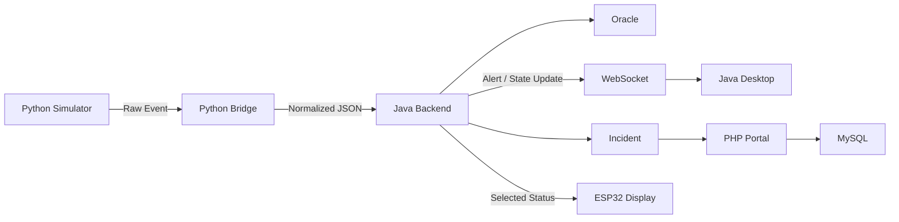
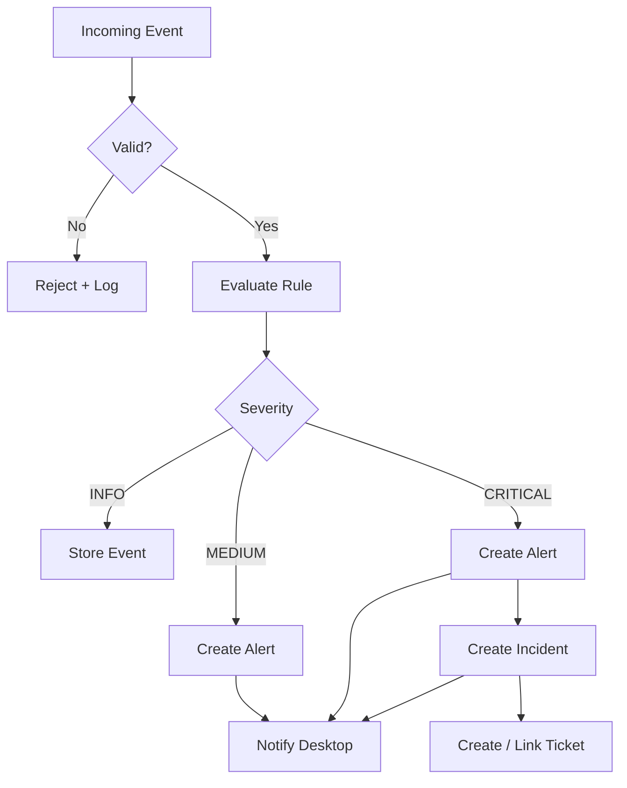
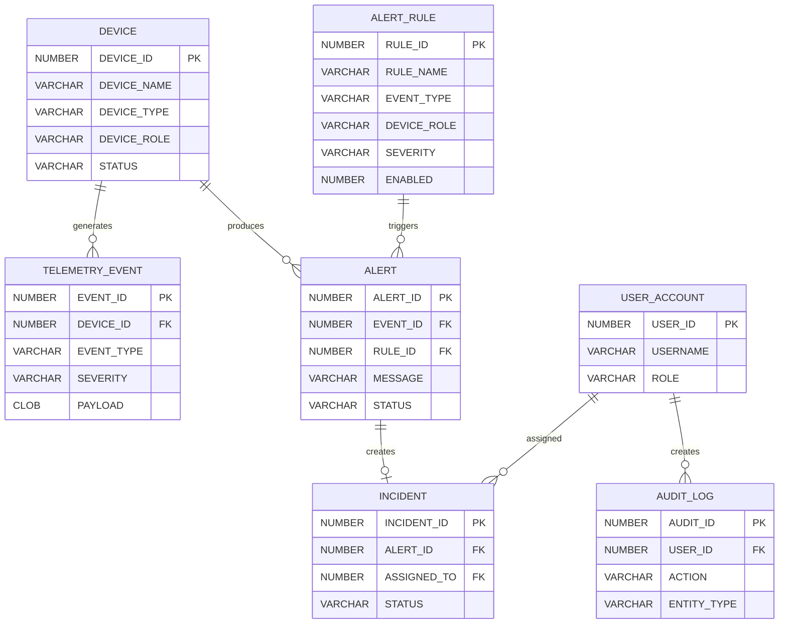
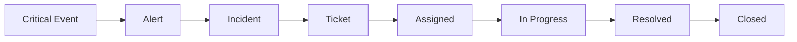

# NetPulse — MVP Architecture Design Document

> **Document Type:** Implementation Architecture  
> **Project:** NetPulse  
> **Target:** Two-Week MVP Sprint  
> **Primary Goal:** Build a working end-to-end monitoring and incident workflow without unnecessary architectural complexity.

---

## 1. Purpose

This document defines the **Minimum Viable Product (MVP) architecture for NetPulse**.

The purpose is to provide a concrete implementation guide for the next two weeks. Every component, interface, database table, and workflow described here should directly support a demonstrable end-to-end scenario.

The MVP must prove one complete path:

```text
Simulated Network Event
        ↓
Python Bridge
        ↓
Java Backend
        ↓
Business Rule
        ↓
Alert / Incident
        ↓
Oracle Persistence
        ↓
Real-Time Desktop Update
        ↓
PHP Ticketing Portal
        ↓
Ticket Resolution
```

The **ESP32 is outside the event-ingestion path**. It is a simple display endpoint that shows selected system information and does not send telemetry, events, or commands back to NetPulse.

---

# 2. MVP Definition

## 2.1 What the MVP Must Do

The two-week implementation must support:

1. Generate simulated network events.
    
2. Send events through the Python Bridge.
    
3. Normalize events into a single JSON format.
    
4. Deliver normalized events to the Java Backend.
    
5. Validate and process events.
    
6. Apply a small set of alert rules.
    
7. Persist events and alerts in Oracle.
    
8. Create an incident for critical events.
    
9. Create/manage a ticket through the PHP portal.
    
10. Display important events on the Java desktop client.
    
11. Display selected status information on the ESP32.
    
12. Record basic audit history for important user actions.
    

---

## 2.2 Explicitly Out of Scope

To protect the two-week deadline, the MVP will **not** implement:

- message brokers such as Kafka or RabbitMQ,
    
- microservices,
    
- Kubernetes or container orchestration,
    
- distributed transactions,
    
- advanced event correlation,
    
- machine learning,
    
- complex workflow engines,
    
- vendor-specific network integrations,
    
- full SNMP/Syslog infrastructure,
    
- advanced reporting,
    
- complex notification systems,
    
- mobile applications,
    
- bidirectional IoT control,
    
- ESP32 telemetry ingestion,
    
- elaborate enterprise authentication systems.
    

These can be considered future extensions only after the MVP is stable.

---

# 3. Pragmatic System Overview

The system should use a simple layered architecture.

```text
                    ┌─────────────────────┐
                    │ Network Simulator   │
                    │       Python        │
                    └──────────┬──────────┘
                               │
                         JSON / TCP
                               │
                               ▼
                    ┌─────────────────────┐
                    │   Python Bridge     │
                    │ Normalize + Validate│
                    └──────────┬──────────┘
                               │
                         JSON / HTTP
                               │
                               ▼
                    ┌─────────────────────┐
                    │    Java Backend     │
                    │                     │
                    │ Event Processing    │
                    │ Alert Rules         │
                    │ Incident Creation   │
                    └──────┬──────┬───────┘
                           │      │
                        JDBC      │ WebSocket
                           │      │
                           ▼      ▼
                    ┌──────────┐  ┌──────────────┐
                    │  Oracle  │  │ Java Desktop │
                    │ Database │  │    Client    │
                    └──────────┘  └──────────────┘
                           
                    ┌──────────────┐
                    │ PHP Portal   │
                    │ Ticketing    │
                    └──────┬───────┘
                           │
                           ▼
                       ┌───────┐
                       │ MySQL │
                       └───────┘

                    ┌──────────────┐
                    │    ESP32     │
                    │ Display Only │
                    └──────────────┘
```

### Architectural Rule

During the MVP, every component should have **one primary responsibility**.

|Component|Responsibility|
|---|---|
|Python Simulator|Generate test events|
|Python Bridge|Normalize and forward events|
|Java Backend|Process events and apply business rules|
|Oracle|Store operational system data|
|Java Desktop|Show real-time operational information|
|PHP Portal|Manage tickets|
|MySQL|Store portal data|
|ESP32|Display selected information|

---

# 4. Communication Strategy

The MVP should avoid unnecessary communication infrastructure.

## 4.1 Recommended Communication Paths

|Source|Destination|Method|Purpose|
|---|---|---|---|
|Python Simulator|Python Bridge|Local process / TCP|Send simulated events|
|Python Bridge|Java Backend|HTTP POST + JSON|Submit normalized events|
|Java Backend|Oracle|JDBC|Persist operational data|
|Java Backend|Desktop Client|WebSocket|Push real-time updates|
|PHP Portal|MySQL|PHP DB driver / PDO|Ticket operations|
|PHP Portal|Java Backend|HTTP API|Read/create/update operational records where required|
|Java Backend|ESP32|Simple HTTP/WebSocket display update|Send selected information only|

> The exact transport can be simplified further during implementation. The important requirement is that the communication contracts remain stable.

---

# 5. Core Event Pipeline

The main MVP pipeline is:



The critical path is deliberately short:

```text
Producer
   ↓
Bridge
   ↓
Backend
   ↓
Database + UI
```

---

# 6. Python Bridge

The source architecture defines the Bridge as the boundary responsible for receiving raw network data, normalizing it, validating it, and forwarding it to Java.

For the MVP, the Bridge should perform only these operations:

```text
Receive
  ↓
Parse
  ↓
Validate
  ↓
Normalize
  ↓
Forward
  ↓
Log
```

Do not implement a generalized parsing framework.

## 6.1 Input Example

```text
Device=Core-R2
Message=Interface Gi0/1 Down
Timestamp=2026-08-29T14:32:10Z
```

## 6.2 Output

```json
{
  "eventId": "evt-1001",
  "device": "Core-R2",
  "eventType": "INTERFACE_DOWN",
  "severity": "CRITICAL",
  "timestamp": "2026-08-29T14:32:10Z",
  "interface": "Gi0/1"
}
```

## 6.3 Bridge Validation

Reject events when:

- `device` is missing,
    
- `eventType` is missing,
    
- `timestamp` is invalid.
    

The Bridge should not contain business rules such as:

```text
"Core device + uplink failure = Critical"
```

That belongs to the Java Backend.

---

# 7. Java Backend

The Java Backend is the central processing component.

The source material describes it as the component that receives telemetry/log events, applies business logic, determines whether an alert is necessary, and publishes alerts through WebSockets.

For the MVP, keep its internal structure simple:

```text
Java Backend
│
├── EventController
├── EventService
├── AlertRuleService
├── IncidentService
├── WebSocketService
├── AuditService
└── OracleRepository
```

Do not implement a large enterprise framework hierarchy.

## 7.1 Event Processing

```text
Receive Event
     ↓
Validate
     ↓
Identify Device
     ↓
Evaluate Rule
     ↓
Create Alert if required
     ↓
Create Incident if Critical
     ↓
Persist
     ↓
Notify Desktop
```

---

# 8. MVP Business Rules

Only a few rules are required.

## Rule 1 — Invalid Event

```text
IF required fields are missing
THEN
    reject event
    log error
```

## Rule 2 — Known Device

```text
IF device exists
    process normally
ELSE
    store as rejected / unknown event
```

## Rule 3 — Severity

Use simple explicit rules.

```text
Core Device + Interface Down
    → CRITICAL

Access Device + Interface Down
    → MEDIUM

Informational Event
    → INFO
```

The source material gives similar examples for severity classification while noting that exact values should remain configurable.

For a two-week MVP, these rules can simply be represented in a small database table rather than building a dynamic rule engine.

---

# 9. Event, Alert, Incident, and Ticket

These terms must remain distinct.

|Term|Meaning|Example|
|---|---|---|
|**Event**|Raw observed occurrence|`Gi0/1 went DOWN`|
|**Alert**|Event classified as requiring attention|`CRITICAL: Core-R2 uplink down`|
|**Incident**|Operational problem requiring investigation|`INC-1001 Core-R2 connectivity failure`|
|**Ticket**|Formal work record used by engineers|`TKT-1001 Investigate Core-R2 uplink`|

This separation is important because not every event should generate a ticket. The source architecture explicitly distinguishes these entities and describes escalation from Alert → Incident → Ticket.

---

# 10. MVP Escalation Logic

Keep escalation deterministic.



No advanced correlation is required for the MVP.

---

# 11. Oracle Database — MVP Schema

Oracle is the primary operational database for the Java Backend. The source material identifies device inventory, alert rules, historical faults, and audit information as Oracle responsibilities.

Use only the following essential tables.

---

## 11.1 DEVICE

```sql
DEVICE
------
DEVICE_ID       NUMBER PK
DEVICE_NAME     VARCHAR2(100)
DEVICE_TYPE     VARCHAR2(50)
IP_ADDRESS      VARCHAR2(45)
DEVICE_ROLE     VARCHAR2(50)
STATUS          VARCHAR2(20)
CREATED_AT      TIMESTAMP
UPDATED_AT      TIMESTAMP
```

Example:

```text
1 | Core-R2 | Switch | 192.168.1.20 | CORE | UP
```

---

## 11.2 TELEMETRY_EVENT

```sql
TELEMETRY_EVENT
---------------
EVENT_ID        NUMBER PK
DEVICE_ID      NUMBER FK
EVENT_TYPE     VARCHAR2(50)
SEVERITY       VARCHAR2(20)
PAYLOAD        CLOB
RECEIVED_AT    TIMESTAMP
PROCESSED_AT   TIMESTAMP
```

Purpose:

Store what the system received and when it processed it.

---

## 11.3 ALERT_RULE

```sql
ALERT_RULE
----------
RULE_ID        NUMBER PK
RULE_NAME      VARCHAR2(100)
EVENT_TYPE     VARCHAR2(50)
DEVICE_ROLE    VARCHAR2(50)
SEVERITY       VARCHAR2(20)
ENABLED        NUMBER(1)
```

Example:

```text
CORE_LINK_DOWN
LINK_DOWN
CORE
CRITICAL
1
```

This is sufficient for the MVP; no `CONDITION_EXPR` scripting engine is required.

---

## 11.4 ALERT

```sql
ALERT
-----
ALERT_ID       NUMBER PK
EVENT_ID       NUMBER FK
RULE_ID        NUMBER FK
MESSAGE        VARCHAR2(500)
SEVERITY       VARCHAR2(20)
STATUS         VARCHAR2(30)
DETECTED_AT    TIMESTAMP
ACK_AT         TIMESTAMP
RESOLVED_AT    TIMESTAMP
```

---

## 11.5 INCIDENT

```sql
INCIDENT
--------
INCIDENT_ID    NUMBER PK
ALERT_ID       NUMBER FK
TITLE          VARCHAR2(200)
DESCRIPTION    CLOB
PRIORITY       VARCHAR2(20)
STATUS         VARCHAR2(30)
ASSIGNED_TO    NUMBER NULL
CREATED_AT     TIMESTAMP
RESOLVED_AT    TIMESTAMP NULL
CLOSED_AT      TIMESTAMP NULL
```

MVP incident states:

```text
OPEN
ASSIGNED
IN_PROGRESS
RESOLVED
CLOSED
```

Do not implement additional states unless required by the demo.

---

## 11.6 USER_ACCOUNT

```sql
USER_ACCOUNT
------------
USER_ID         NUMBER PK
USERNAME        VARCHAR2(100) UNIQUE
PASSWORD_HASH   VARCHAR2(255)
FULL_NAME       VARCHAR2(150)
ROLE            VARCHAR2(30)
STATUS          VARCHAR2(20)
CREATED_AT      TIMESTAMP
```

MVP roles:

```text
ADMIN
ENGINEER
VIEWER
```

---

## 11.7 AUDIT_LOG

The audit trail should remain deliberately simple.

```sql
AUDIT_LOG
---------
AUDIT_ID        NUMBER PK
USER_ID         NUMBER NULL
ACTION          VARCHAR2(100)
ENTITY_TYPE     VARCHAR2(50)
ENTITY_ID       NUMBER
DESCRIPTION     VARCHAR2(500)
CREATED_AT      TIMESTAMP
```

Example:

```text
User: Mohammed
Action: UPDATE_TICKET_STATUS
Entity: TICKET
Entity ID: 1001
Description: OPEN → RESOLVED
```

The source architecture includes an audit log with user, action, entity, old/new values, and timestamp. For the MVP, a concise human-readable description is sufficient unless detailed before/after values are specifically needed.

---

# 12. Oracle Relationships



---

# 13. PHP + MySQL Ticketing Portal

The PHP portal should remain a small CRUD application.

Its MVP responsibilities are:

- login,
    
- ticket list,
    
- ticket details,
    
- assignment,
    
- status changes,
    
- comments,
    
- basic audit history.
    

No frontend framework is required unless already established in the project.

## 13.1 MySQL Tables

### TICKET

```sql
TICKET
------
ticket_id       BIGINT PK
ticket_number   VARCHAR(50) UNIQUE
incident_id     BIGINT
title           VARCHAR(255)
description     TEXT
priority        VARCHAR(20)
status          VARCHAR(30)
assigned_to     BIGINT NULL
created_at      DATETIME
updated_at      DATETIME
closed_at       DATETIME NULL
```

### USER

```sql
WEB_USER
--------
user_id         BIGINT PK
username        VARCHAR(100) UNIQUE
password_hash   VARCHAR(255)
full_name       VARCHAR(150)
role            VARCHAR(30)
status          VARCHAR(20)
created_at      DATETIME
```

### TICKET_COMMENT

```sql
TICKET_COMMENT
--------------
comment_id      BIGINT PK
ticket_id       BIGINT FK
user_id         BIGINT FK
comment_text    TEXT
created_at      DATETIME
```

### TICKET_HISTORY

```sql
TICKET_HISTORY
--------------
history_id      BIGINT PK
ticket_id       BIGINT FK
changed_by      BIGINT FK
old_status      VARCHAR(30)
new_status      VARCHAR(30)
comment         VARCHAR(500)
created_at      DATETIME
```

This is enough to demonstrate that ticket changes are traceable.

---

# 14. Oracle vs MySQL Responsibility

Do not duplicate every entity in both databases.

Use clear ownership:

```text
              NETPULSE
                 │
        ┌────────┴────────┐
        │                 │
   Operational         Ticketing
      Domain              Domain
        │                 │
      Oracle             MySQL
        │                 │
 Events / Alerts      Tickets
 Incidents            Comments
 Devices              Ticket History
 Rules                Web Users
 Audit
```

### Oracle is the source of truth for:

- devices,
    
- events,
    
- alert rules,
    
- alerts,
    
- incidents,
    
- backend audit records.
    

### MySQL is the source of truth for:

- tickets,
    
- comments,
    
- ticket history,
    
- web portal users.
    

The two databases should share references such as:

```text
incident_id
ticket_number
```

but should not maintain competing copies of the same operational record.

---

# 15. API Contracts

Use a very small HTTP API.

## 15.1 Python → Java

### `POST /api/events`

Request:

```json
{
  "eventId": "evt-1001",
  "device": "Core-R2",
  "eventType": "INTERFACE_DOWN",
  "severity": "CRITICAL",
  "timestamp": "2026-08-29T14:32:10Z",
  "interface": "Gi0/1"
}
```

Response:

```json
{
  "success": true,
  "eventId": "evt-1001"
}
```

---

## 15.2 Java → Desktop

Use WebSocket messages.

```json
{
  "type": "ALERT",
  "alertId": 501,
  "severity": "CRITICAL",
  "message": "Core-R2 interface Gi0/1 is down",
  "timestamp": "2026-08-29T14:32:10Z"
}
```

Possible message types:

```text
ALERT
INCIDENT
STATUS
RECOVERY
```

No complex message envelope is required.

---

## 15.3 PHP → Java

Only implement this interface if the web portal needs backend-generated incident information.

### `GET /api/incidents/{id}`

Response:

```json
{
  "incidentId": 1001,
  "title": "Core-R2 Interface Failure",
  "priority": "CRITICAL",
  "status": "OPEN"
}
```

Avoid creating a large REST API for the MVP.

---

# 16. ESP32 Display Architecture

The ESP32 has one responsibility:

> **Display selected information from NetPulse.**

It is not a telemetry source.

```text
Java Backend
     │
     │ Selected Status / Alert
     ▼
┌───────────────┐
│     ESP32     │
│               │
│  LCD / OLED   │
│  LED / Display│
└───────────────┘
```

### Example Display

```text
NETPULSE

STATUS: ALERT
DEVICE: Core-R2
EVENT : LINK DOWN
LEVEL : CRITICAL
```

### ESP32 Restrictions

The MVP must not implement:

```text
ESP32 → Java
ESP32 → Oracle
ESP32 → PHP
ESP32 → Event Pipeline
```

The communication is intentionally one-way from the application toward the display.

The ESP32 should therefore be treated as a **small presentation device**, not as an IoT backend.

---

# 17. Real-Time Desktop Dashboard

The Java desktop client should expose only information needed for the MVP.

## Main Screen

```text
┌──────────────────────────────────────────────┐
│ NetPulse NOC                                 │
├──────────────────────────────────────────────┤
│ System Status: ONLINE                        │
│                                              │
│ CRITICAL ALERTS: 1                           │
│ OPEN INCIDENTS: 1                            │
│ ACTIVE DEVICES: 12                           │
│                                              │
├──────────────────────────────────────────────┤
│ Latest Events                                │
│                                              │
│ 14:32  Core-R2   LINK_DOWN    CRITICAL       │
│ 14:30  SW-03     LINK_UP      INFO           │
│ 14:27  SW-04     CPU_HIGH     MEDIUM         │
└──────────────────────────────────────────────┘
```

Do not attempt to build a full monitoring dashboard with advanced charts during the two-week MVP.

---

# 18. Ticket Workflow

The minimum ticket workflow is:



Example:

```text
EVENT
Core-R2 / Gi0/1 / LINK_DOWN

        ↓

ALERT
CRITICAL — Core-R2 uplink down

        ↓

INCIDENT
INC-1001

        ↓

TICKET
TKT-1001

        ↓

ENGINEER
Investigates failure

        ↓

RESOLVED
Link restored

        ↓

CLOSED
Audit record created
```

---

# 19. Authentication and Authorization

For the MVP, use simple role-based access control.

|Role|Permissions|
|---|---|
|**ADMIN**|Manage users and rules|
|**ENGINEER**|View alerts, incidents, and manage tickets|
|**VIEWER**|View operational information only|

Use password hashing; never store plaintext passwords.

Do not implement SSO, OAuth, LDAP, or external identity providers during the two-week sprint.

---

# 20. Error Handling

Use straightforward error handling.

## Python Bridge

```text
Invalid input
   ↓
Log error
   ↓
Do not forward
```

## Java Backend

```text
Invalid event
   ↓
HTTP 400

Database failure
   ↓
Log error
   ↓
Return controlled error

Valid event
   ↓
Process normally
```

## PHP Portal

```text
Invalid form
   ↓
Validation message

Unauthorized action
   ↓
HTTP 403 / redirect

Database failure
   ↓
User-friendly error
   ↓
Server log
```

No centralized distributed logging platform is required.

---

# 21. Security Baseline

Even for an academic MVP, implement the basics:

- password hashing,
    
- prepared SQL statements,
    
- server-side input validation,
    
- session-based authentication for PHP,
    
- role checks before protected actions,
    
- no database credentials committed to source control,
    
- no raw exception details displayed to users.
    

Do not spend the sprint on advanced security infrastructure.

---

# 22. Two-Week Implementation Plan

The schedule should optimize for an **early end-to-end demonstration**, not for completing each component independently.

## Days 1–2 — Foundation

### Deliverables

- repository structure,
    
- Oracle schema,
    
- MySQL schema,
    
- initial device records,
    
- initial users,
    
- Java project skeleton,
    
- Python Bridge skeleton,
    
- PHP project skeleton.
    

### Definition of Done

A developer can start all three application components locally.

---

## Days 3–4 — Event Ingestion

### Implement

- Python simulator,
    
- Bridge normalization,
    
- `POST /api/events`,
    
- Java event receiver,
    
- event validation,
    
- Oracle event persistence.
    

### Target

```text
Python
  ↓
Bridge
  ↓
Java
  ↓
Oracle
```

This is the first major milestone.

---

## Days 5–6 — Alerts and Incidents

### Implement

- rule evaluation,
    
- severity assignment,
    
- alert persistence,
    
- critical-event incident creation,
    
- basic audit logging.
    

### Target

```text
Event
 ↓
Rule
 ↓
Alert
 ↓
Incident
```

---

## Day 7 — WebSocket + Desktop

### Implement

- Java WebSocket server,
    
- desktop connection,
    
- alert display,
    
- incident notification.
    

### Target

A simulated critical event appears on the desktop automatically.

---

## Days 8–9 — PHP Ticket Portal

### Implement

- login,
    
- ticket list,
    
- ticket details,
    
- assignment,
    
- status changes,
    
- comments,
    
- ticket history.
    

### Target

An incident can be converted into a usable support ticket.

---

## Day 10 — Java ↔ PHP Integration

Implement only the minimum required integration.

```text
Java Incident
      ↓
PHP Ticket
      ↓
Engineer Action
      ↓
Ticket Status
```

Do not build synchronization for every field.

---

## Day 11 — ESP32

Implement:

- connection,
    
- selected status retrieval,
    
- simple display,
    
- one or two useful screens.
    

Example:

```text
SYSTEM: ONLINE
ALERTS: 1
LAST: Core-R2
```

The ESP32 remains display-only.

---

## Day 12 — End-to-End Scenario

Run a complete scenario:

```text
1. Generate LINK_DOWN
2. Bridge receives event
3. Java processes event
4. Oracle stores event
5. Alert created
6. Incident created
7. Desktop receives alert
8. Ticket opened
9. Engineer updates ticket
10. Network recovers
11. Incident resolved
12. Audit recorded
```

---

## Day 13 — Testing and Fixes

Prioritize:

1. broken integrations,
    
2. database errors,
    
3. invalid payloads,
    
4. authentication issues,
    
5. incorrect state transitions,
    
6. UI failures.
    

Do not add major new features.

---

## Day 14 — Stabilization and Demonstration

Final tasks:

- clean configuration,
    
- seed data,
    
- database scripts,
    
- README updates,
    
- architecture diagrams,
    
- screenshots,
    
- demo scenario,
    
- final bug fixes.
    

The final day should be reserved for **stabilization**, not new architecture.

---

# 23. Definition of Done

The MVP is complete when the following scenario works reliably:

```text
┌──────────────────────────────────────────┐
│ 1. Simulate a device/interface failure   │
└──────────────────┬───────────────────────┘
                   ↓
┌──────────────────────────────────────────┐
│ 2. Python Bridge normalizes the event    │
└──────────────────┬───────────────────────┘
                   ↓
┌──────────────────────────────────────────┐
│ 3. Java Backend receives the JSON        │
└──────────────────┬───────────────────────┘
                   ↓
┌──────────────────────────────────────────┐
│ 4. Java applies an alert rule            │
└──────────────────┬───────────────────────┘
                   ↓
┌──────────────────────────────────────────┐
│ 5. Oracle stores event + alert           │
└──────────────────┬───────────────────────┘
                   ↓
┌──────────────────────────────────────────┐
│ 6. Desktop displays the alert            │
└──────────────────┬───────────────────────┘
                   ↓
┌──────────────────────────────────────────┐
│ 7. Incident / ticket is created          │
└──────────────────┬───────────────────────┘
                   ↓
┌──────────────────────────────────────────┐
│ 8. Engineer updates ticket through PHP   │
└──────────────────┬───────────────────────┘
                   ↓
┌──────────────────────────────────────────┐
│ 9. Network recovers                      │
└──────────────────┬───────────────────────┘
                   ↓
┌──────────────────────────────────────────┐
│ 10. Incident is resolved and audited     │
└──────────────────────────────────────────┘
```

If this flow works, the MVP has achieved its primary architectural objective.

---

# 24. Glossary

|Term|Definition|Example|
|---|---|---|
|**Event**|A raw occurrence detected by the system|`LINK_DOWN`|
|**Telemetry**|Operational information describing system/device state|Device status or interface state|
|**Bridge**|Intermediate component that receives and normalizes data|Python Bridge|
|**Normalization**|Converting different raw formats into one structure|Raw log → JSON Event|
|**Backend**|Central application-processing layer|Java Backend|
|**Alert Rule**|Condition used to classify an event|Core + LINK_DOWN → CRITICAL|
|**Alert**|Notification generated from an evaluated event|`Core-R2 uplink down`|
|**Incident**|Operational problem requiring investigation|`INC-1001`|
|**Ticket**|Work record assigned to an engineer|`TKT-1001`|
|**Audit Log**|Record of important actions and changes|Engineer closes ticket|
|**WebSocket**|Persistent connection used for real-time updates|Backend → Desktop|
|**Persistence**|Saving system data permanently|Oracle database|
|**Source of Truth**|System responsible for owning a particular piece of data|Oracle owns incidents|
|**RBAC**|Role-Based Access Control|Engineer can update tickets|
|**MVP**|Smallest complete version proving the core system works|End-to-end monitoring workflow|
|**ESP32 Display Node**|Embedded device showing selected system information|Displaying active critical alert|

---

# 25. Practical Architecture Rules

During the two-week sprint, the following rules should be treated as constraints:

### Rule 1 — Prefer working integration over abstraction

A simple working service is more valuable than a sophisticated architecture that is only partially implemented.

### Rule 2 — One source of truth per domain

Do not duplicate incident or ticket data across Oracle and MySQL without a specific reason.

### Rule 3 — Keep business rules in Java

Python prepares events. PHP manages the web workflow. Java decides how an event affects the system.

### Rule 4 — Keep the ESP32 simple

The ESP32 displays information. It does not become another backend service.

### Rule 5 — Avoid infrastructure unless required

No message broker, service mesh, Kubernetes, or distributed processing layer is necessary for this MVP.

### Rule 6 — Finish the happy path first

The complete failure → alert → incident → ticket → resolution workflow has priority over secondary features.

### Rule 7 — Freeze the architecture near the end of Week 1

After the first end-to-end path works, changes should be limited to corrections and clearly necessary improvements.

---

# 26. Final MVP Architecture

The architecture to implement is therefore:

```text
                         NETPULSE MVP

 ┌──────────────────┐
 │ Python Simulator │
 └────────┬─────────┘
          │
          ▼
 ┌──────────────────┐
 │ Python Bridge    │
 │ Parse / Validate │
 │ Normalize        │
 └────────┬─────────┘
          │ JSON
          ▼
 ┌──────────────────────────────────┐
 │         Java Backend             │
 │                                  │
 │ Event Processing                 │
 │ Alert Rules                      │
 │ Incident Creation                │
 │ WebSocket Notifications          │
 └───────┬─────────────┬────────────┘
         │             │
       JDBC        WebSocket
         │             │
         ▼             ▼
 ┌────────────┐  ┌───────────────┐
 │   Oracle   │  │ Java Desktop  │
 │ Operational│  │    Client     │
 │    Data    │  └───────────────┘
 └────────────┘

 ┌───────────────┐
 │ PHP Portal    │
 │ Ticketing     │
 └───────┬───────┘
         │
         ▼
     ┌───────┐
     │ MySQL │
     └───────┘

 ┌───────────────┐
 │    ESP32      │
 │ Display Only  │
 └───────────────┘
```

## Final Principle

> **Build the smallest system that proves the architecture.**

For this two-week sprint, NetPulse does not need to behave like a complete enterprise NOC platform. It needs to demonstrate, reliably and clearly, that a simulated operational event can move through multiple application boundaries, become meaningful business state, be persisted, displayed in real time, converted into a ticket, and eventually resolved with a traceable history.

That is the MVP.