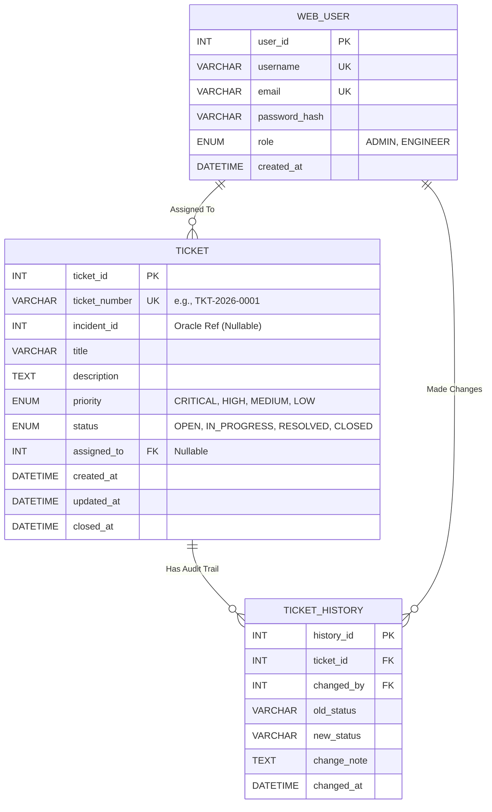

# NetPulse Portal: Enterprise-Grade Network Fault Management System

> A high-performance, secure, and lightweight ticketing and incident response portal engineered with modern PHP (PDO) and structured around clean architecture principles.

---

## 📌 Table of Contents

1. [System Overview & Objectives](https://www.google.com/search?q=%23-system-overview--objectives)
2. [Architectural Philosophy & Design Patterns](https://www.google.com/search?q=%23-architectural-philosophy--design-patterns)
3. [Database Architecture & Relational Schema](https://www.google.com/search?q=%23-database-architecture--relational-schema)
4. [Project Directory Anatomy](https://www.google.com/search?q=%23-project-directory-anatomy)
5. [Prerequisites & Environment Requirements](https://www.google.com/search?q=%23-prerequisites--environment-requirements)
6. [Step-by-Step Setup & Installation Guide](https://www.google.com/search?q=%23-step-by-step-setup--installation-guide)
7. [Under-the-Hood Code Mechanics](https://www.google.com/search?q=%23-under-the-hood-code-mechanics)
8. [Testing & Verification Protocol](https://www.google.com/search?q=%23-testing--verification-protocol)
9. [Git Version Control & Contribution Workflow](https://www.google.com/search?q=%23-git-version-control--contribution-workflow)
10. [Author & Governance](https://www.google.com/search?q=%23-author--governance)

---

## 🔍 1. System Overview & Objectives

**NetPulse Portal** is designed to serve as the core operational backbone for network operations centers (NOC) and IT support teams. Its primary purpose is to ingest, track, assign, and resolve infrastructure faults, network disruptions, and hardware degradations with absolute reliability and speed.

By eliminating the bloat of heavy monolithic frameworks, the system achieves maximum execution velocity while maintaining strict enterprise-level security, type safety, and robust auditing standards.

---

## 🏗️ 2. Architectural Philosophy & Design Patterns

The application follows a modular, decoupled architecture inspired by Clean Architecture principles:

- **Singleton Design Pattern (`Database.php`):** Centralizes database connection management, ensuring that only a single active `PDO` instance is instantiated during the entire lifecycle of an HTTP request. This prevents memory leaks and optimizes server resource utilization under heavy loads.
- **Native Prepared Statements & Strict Security:** All queries utilize native prepared statements with parameter binding (`ATTR_EMULATE_PREPARES => false`) and explicit error handling (`PDO::ERRMODE_EXCEPTION`), completely neutralizing SQL Injection vectors.
- **Domain Model Mapping (`TicketRepository.php` & `Ticket.php`):** Raw associative arrays returned by database drivers are automatically mapped into strongly-typed domain model objects. This encapsulates data behavior and provides auto-completion support in modern IDEs.
- **Audit Trail Immutability (`TICKET_HISTORY`):** Separates operational transactional states from historical logging to preserve accountability and track precise state transitions over time.

---

## 📊 3. Database Architecture & Relational Schema

The database is built on MySQL using the InnoDB storage engine, leveraging strict foreign key constraints and UTF-8mb4 encoding to support multilingual deployments (specifically Arabic and technical logs).

### Entity-Relationship Diagram (ERD)



### Relational Schema Dictionary

- **`WEB_USER`**: Manages credentials and security roles (`ADMIN` or `ENGINEER`) for platform operators. Features unique indexes on `username` and `email` for instant lookup.
- **`TICKET`**: The primary operational table. Relates to users via `assigned_to` with an `ON DELETE SET NULL` constraint, ensuring that if an engineer account is deleted, historical tickets remain intact rather than causing orphaned records or database constraint violations.
- **`TICKET_HISTORY`**: An immutable audit log tracking every workflow state mutation, linked via `ON DELETE CASCADE` to ensure logs are cleaned up only if their parent ticket is purged.

---

## 📁 4. Project Directory Anatomy

```text
netpulse-portal/
│
├── core/
│   └── Database.php           # Centralized PDO Singleton connection manager
│
├── src/
│   ├── Models/
│   │   └── Ticket.php         # Strongly-typed Ticket domain entity class
│   │
│   └── Repositories/
│       └── TicketRepository.php # Persistence layer handling SQL mapping & CRUD
│
├── public/
│   └── test_db.php            # Automated connection and object-mapping verification script
│
├── database/                  # SQL DDL migrations and seed datasets
│   └── schema.sql
│
├── .gitignore                 # Excludes system junk and local configuration files
└── README.md                  # Comprehensive architectural project documentation

```

---

## ⚙️ 5. Prerequisites & Environment Requirements

Before deploying or running the project locally, verify that your environment satisfies these criteria:

- **PHP Runtime:** Version `8.0` or higher (with `pdo_mysql` extension enabled).
- **Database Server:** MySQL `5.7+` or MariaDB (packaged via Laragon, XAMPP, or Docker containers).
- **Web Server:** Built-in PHP CLI development server or Apache/Nginx virtual host.

---

## 🚀 6. Step-by-Step Setup & Installation Guide

### Step 1: Clone the Repository & Switch Branch

Open your terminal and clone the project, then checkout to the development branch:

```bash
git clone https://github.com/Git-Mohammed/netpulse.git
cd netpulse-portal
git checkout dev

```

### Step 2: Initialize the Database Schema

1. Open your database administration tool (e.g., phpMyAdmin, HeidiSQL, or DataGrip).
2. Create a new database named `netpulse_portal` with `utf8mb4_unicode_ci` collation.
3. Execute the DDL schema script provided in the documentation to construct tables, constraints, and indexes.
4. Execute your bulk seed data script to populate test records for stress testing and UI evaluation.

### Step 3: Configure Database Credentials

Verify or update your connection parameters inside `core/Database.php`:

```php
$host     = '127.0.0.1';
$db_name  = 'netpulse_portal';
$username = 'root';
$password = ''; // Set your local database root password
$port     = '3306';

```

---

## 🔍 7. Under-the-Hood Code Mechanics

### A. The Singleton Connection (`core/Database.php`)

The `Database` class prevents multiple concurrent connections by keeping a private static instance variable:

- The constructor (`__construct`) and cloning (`__clone`) are declared `private` to block direct instantiation via the `new` keyword.
- The public static method `getInstance()` checks if `self::$instance` is `null`. If so, it initializes a strict `PDO` connection with exception error modes enabled; otherwise, it returns the cached instance instantly.

### B. Domain Object Hydration (`src/Models/Ticket.php` & `TicketRepository.php`)

When queries are executed via `TicketRepository`:

1. `fetchAll()` retrieves raw associative arrays from MySQL.
2. The repository iterates through the raw records, passing each record array into `new Ticket($record)`.
3. The constructor inside `Ticket.php` safely casts data types (e.g., casting primary keys to `int`, handling nullable fields via ternary checks) to ensure absolute type safety across the application layer.

---

## 🧪 8. Testing & Verification Protocol

### Launching the Local Development Server

Navigate to the `public` directory and start the built-in PHP server:

```bash
cd public
php -S localhost:8000

```

### Running the Diagnostic Script

Open your web browser and navigate to:

```text
http://localhost:8000/test_db.php

```

- **Expected Result:** A clean confirmation box reading `✅ Database connection established successfully via Singleton!` followed by a structured HTML data table rendering the top recent operational tickets fetched directly from the database through the repository layer.

---

## 🔄 9. Git Version Control & Contribution Workflow

To maintain clean commit histories and stable releases, we adhere strictly to **Conventional Commits** and branch segregation:

- **`main`**: Production-ready, stable, and tested code releases.
- **`dev`**: Active feature integration and development branch.

### Standard Commit Format:

```bash
git status
git add .
git commit -m "feat: implement ticket repository object mapping and connection test"
git push origin dev

```

---

## ✍️ 10. Author & Governance

- **Developer & Architect:** Mohammed Bin Fares
- **Specialization:** Software Engineering
