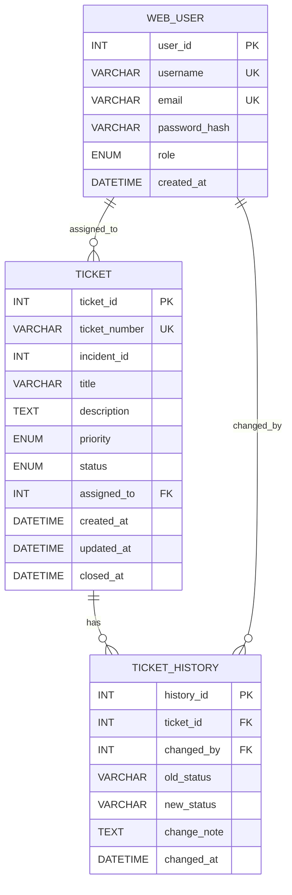

## title: "NetPulse Portal — Database Schema & Column Impact"

project: "NetPulse Ticketing Portal"  
database: "MySQL / InnoDB"

# NetPulse Portal — Database Schema

## 1. Database Overview

The NetPulse Ticketing Portal uses three core tables:

```text
WEB_USER
    │
    ├── TICKET
    │
    └── TICKET_HISTORY
```

| Table            | Purpose                                            |
| ---------------- | -------------------------------------------------- |
| `WEB_USER`       | Stores system users, engineers, and administrators |
| `TICKET`         | Stores operational incidents and support tickets   |
| `TICKET_HISTORY` | Stores ticket status changes and audit information |

The design supports two ticket sources:

```text
Automated Monitoring
        │
        ▼
   incident_id
        │
        ▼
      TICKET


Manual Support
        │
        ▼
 incident_id = NULL
        │
        ▼
      TICKET
```

> [!important]  
> `incident_id` is optional because not every ticket originates from an automated monitoring system.

---

# 2. Entity Relationship Diagram



---

# 3. `WEB_USER`

### Purpose

Stores the identities and roles of users who access the NetPulse Portal.

| Column          | Type           | Constraint         | Purpose                 | System Impact                                                     |
| --------------- | -------------- | ------------------ | ----------------------- | ----------------------------------------------------------------- |
| `user_id`       | `INT`          | PK, AUTO_INCREMENT | Unique internal user ID | Used by other tables to identify the user                         |
| `username`      | `VARCHAR(50)`  | UNIQUE, NOT NULL   | Login username          | Prevents duplicate accounts and identifies the user               |
| `email`         | `VARCHAR(100)` | UNIQUE, NOT NULL   | User email              | Prevents duplicate emails and supports communication              |
| `password_hash` | `VARCHAR(255)` | NOT NULL           | Stores password hash    | Protects user credentials; plaintext passwords must not be stored |
| `role`          | `ENUM`         | NOT NULL           | `ADMIN` or `ENGINEER`   | Determines user permissions and available operations              |
| `created_at`    | `DATETIME`     | NOT NULL           | Account creation time   | Supports user auditing and account lifecycle tracking             |

### Important Relationship

```text
WEB_USER.user_id
       │
       ├── TICKET.assigned_to
       │
       └── TICKET_HISTORY.changed_by
```

> [!important]  
> `user_id` is the internal identity used throughout the database. It should be used for relationships instead of `username` or `email`.

---

# 4. `TICKET`

### Purpose

The main operational table. It stores network incidents, IT support issues, their priority, status, and assigned engineer.

| Column          | Type           | Constraint         | Purpose                                     | System Impact                                                            |
| --------------- | -------------- | ------------------ | ------------------------------------------- | ------------------------------------------------------------------------ |
| `ticket_id`     | `INT`          | PK, AUTO_INCREMENT | Internal ticket ID                          | Used for relationships with history records                              |
| `ticket_number` | `VARCHAR(20)`  | UNIQUE, NOT NULL   | Human-readable ticket number                | Used by engineers and users to identify tickets                          |
| `incident_id`   | `INT`          | NULLABLE           | External monitoring incident ID             | Connects automated alerts to tickets; `NULL` means manually created      |
| `title`         | `VARCHAR(150)` | NOT NULL           | Short incident title                        | Used in dashboards, lists, and search results                            |
| `description`   | `TEXT`         | NOT NULL           | Detailed problem description                | Provides engineers with technical information required for investigation |
| `priority`      | `ENUM`         | NOT NULL           | `CRITICAL`, `HIGH`, `MEDIUM`, `LOW`         | Determines urgency and operational attention                             |
| `status`        | `ENUM`         | NOT NULL           | `OPEN`, `IN_PROGRESS`, `RESOLVED`, `CLOSED` | Controls the ticket workflow                                             |
| `assigned_to`   | `INT`          | FK, NULLABLE       | Assigned engineer ID                        | Determines who is responsible for the ticket                             |
| `created_at`    | `DATETIME`     | NOT NULL           | Creation time                               | Used for timeline tracking and reporting                                 |
| `updated_at`    | `DATETIME`     | NULLABLE           | Last modification time                      | Shows when the ticket was last changed                                   |
| `closed_at`     | `DATETIME`     | NULLABLE           | Closure time                                | Determines when the ticket was formally closed                           |

---

## 4.1 `ticket_id`

Internal primary key.

```text
TICKET.ticket_id
```

### Impact

Used by:

```text
TICKET_HISTORY.ticket_id
```

to connect historical records to the correct ticket.

---

## 4.2 `ticket_number`

Human-readable identifier.

Example:

```text
TKT-2026-0001
```

### Impact

Used by:

- Engineers
- Administrators
- Dashboard
- Search
- Reports

Unlike `ticket_id`, this is the identifier users normally see.

---

## 4.3 `incident_id`

External incident reference.

Example:

```text
incident_id = 10045
```

means the ticket originated from an external monitoring event.

If:

```text
incident_id = NULL
```

the ticket is manually created.

### Impact

Provides the connection:

```text
Monitoring System
       ↓
Incident ID
       ↓
NetPulse Ticket
```

This allows the ticketing system to remain independent from the monitoring engine.

---

## 4.4 `title`

Short description of the incident.

Example:

```text
Core Switch Packet Loss - Sector A
```

### Impact

Used for quick identification in:

- Ticket lists
- Dashboards
- Search
- Notifications

---

## 4.5 `description`

Detailed technical explanation.

Example:

```text
High packet loss detected on the primary core switch.
```

### Impact

Provides the engineer with the information needed to understand and troubleshoot the incident.

---

## 4.6 `priority`

Defines operational urgency.

```text
CRITICAL
HIGH
MEDIUM
LOW
```

### Impact

Controls how urgently the ticket should be handled.

Example:

```text
CRITICAL
    ↓
Immediate investigation
```

---

## 4.7 `status`

Defines the ticket lifecycle.

```text
OPEN
  ↓
IN_PROGRESS
  ↓
RESOLVED
  ↓
CLOSED
```

### Impact

Controls the workflow and determines what stage the incident is currently in.

---

## 4.8 `assigned_to`

References:

```text
WEB_USER.user_id
```

Example:

```text
assigned_to = 2
```

means the ticket is assigned to the user whose:

```text
user_id = 2
```

### Impact

Determines which engineer is responsible for the incident.

### Delete Behavior

```sql
ON DELETE SET NULL
```

If the engineer's account is deleted:

```text
assigned_to → NULL
```

but the ticket remains.

This protects historical operational data.

---

## 4.9 `created_at`

Records when the ticket was created.

### Impact

Used for:

- Ticket age
- SLA calculations
- Reports
- Incident timelines

---

## 4.10 `updated_at`

Records the latest modification.

### Impact

Allows the system to determine when the ticket was last changed.

---

## 4.11 `closed_at`

Records the official closure time.

### Impact

Used to calculate how long it took to resolve the incident.

Example:

```text
created_at
    ↓
investigation
    ↓
resolution
    ↓
closed_at
```

---

# 5. `TICKET_HISTORY`

### Purpose

Stores the history of ticket status changes.

| Column        | Type          | Constraint         | Purpose                  | System Impact                            |
| ------------- | ------------- | ------------------ | ------------------------ | ---------------------------------------- |
| `history_id`  | `INT`         | PK, AUTO_INCREMENT | Unique history record    | Identifies each audit event              |
| `ticket_id`   | `INT`         | FK, NOT NULL       | Related ticket           | Connects the history record to a ticket  |
| `changed_by`  | `INT`         | FK, NULLABLE       | User who made the change | Provides accountability                  |
| `old_status`  | `VARCHAR(20)` | NOT NULL           | Previous status          | Shows the ticket state before the change |
| `new_status`  | `VARCHAR(20)` | NOT NULL           | New status               | Shows the resulting state                |
| `change_note` | `TEXT`        | NULLABLE           | Explanation of change    | Provides technical context               |
| `changed_at`  | `DATETIME`    | NOT NULL           | Change timestamp         | Reconstructs the ticket timeline         |

---

## 5.1 `history_id`

Unique identifier for the audit record.

### Impact

Allows every history event to be individually identified.

---

## 5.2 `ticket_id`

References:

```text
TICKET.ticket_id
```

### Impact

Determines which ticket the history event belongs to.

Relationship:

```text
TICKET
   │
   ├── History 1
   ├── History 2
   └── History 3
```

A ticket can therefore have many history records.

---

## 5.3 `changed_by`

References:

```text
WEB_USER.user_id
```

### Impact

Answers:

> Who changed this ticket?

If the user account is deleted:

```text
changed_by → NULL
```

The audit record remains available.

---

## 5.4 `old_status`

Stores the status before the change.

Example:

```text
OPEN
```

---

## 5.5 `new_status`

Stores the status after the change.

Example:

```text
IN_PROGRESS
```

Together:

```text
old_status       new_status
    OPEN    →    IN_PROGRESS
```

### Impact

Allows the system to reconstruct the ticket workflow.

---

## 5.6 `change_note`

Stores the reason or technical explanation for the change.

Example:

```text
IP conflict resolved by reserving a static DHCP lease.
```

### Impact

Provides technical context that cannot be understood from status values alone.

---

## 5.7 `changed_at`

Records exactly when the change occurred.

### Impact

Allows the system to build a chronological incident timeline.

---

# 6. Relationship Summary

| Relationship                | Meaning                     | System Impact              |
| --------------------------- | --------------------------- | -------------------------- |
| `WEB_USER → TICKET`         | Engineer assigned to ticket | Determines responsibility  |
| `TICKET → TICKET_HISTORY`   | Ticket has history          | Preserves workflow changes |
| `WEB_USER → TICKET_HISTORY` | User changed ticket         | Provides accountability    |

---

# 7. Most Important Design Rules

### Rule 1 — Never Delete Tickets When an Engineer Is Deleted

```text
WEB_USER deleted
      ↓
assigned_to = NULL
      ↓
TICKET remains
```

### Rule 2 — `incident_id` Is Optional

```text
Automated ticket → incident_id = value
Manual ticket    → incident_id = NULL
```

### Rule 3 — Status Represents Workflow

```text
OPEN
 ↓
IN_PROGRESS
 ↓
RESOLVED
 ↓
CLOSED
```

### Rule 4 — History Provides Accountability

Every important status transition should create a corresponding history record.

### Rule 5 — Primary Keys and Foreign Keys Maintain Integrity

```text
WEB_USER.user_id
       ↓
TICKET.assigned_to

TICKET.ticket_id
       ↓
TICKET_HISTORY.ticket_id

WEB_USER.user_id
       ↓
TICKET_HISTORY.changed_by
```

---

# 8. Final Database Model

```text
                WEB_USER
              /          \
             /            \
            ▼              ▼
        TICKET        TICKET_HISTORY
            │
            └───────────────┘
```

### In one sentence:

> **`WEB_USER` defines who works in the system, `TICKET` defines what problem is being handled, and `TICKET_HISTORY` records what happened to that problem and who performed each change.**

This three-table structure forms the core relational foundation of the NetPulse Ticketing Portal.

# NetPulse Portal — Database Architecture & Relational Schema

> [!info] Document Overview
> This document defines the database architecture, relational schema, Entity-Relationship Diagram (ERD), data dictionary, operational behavior, audit model, and production SQL implementation for the **NetPulse Ticketing Portal**.
>
> The database is designed to support operational network incidents, manual IT support tickets, engineer assignment, workflow management, and historical auditing.

---

# 9.1 `WEB_USER`

### Purpose

The `WEB_USER` table manages identities authorized to access the NetPulse Ticketing Portal.

It represents:

- Administrators
- Network Engineers
- Support Engineers

### Schema

| Column          | Data Type      | Constraints        | Purpose                    |
| --------------- | -------------- | ------------------ | -------------------------- |
| `user_id`       | `INT`          | PK, AUTO_INCREMENT | Internal user identifier   |
| `username`      | `VARCHAR(50)`  | UNIQUE, NOT NULL   | Login username             |
| `email`         | `VARCHAR(100)` | UNIQUE, NOT NULL   | Official email             |
| `password_hash` | `VARCHAR(255)` | NOT NULL           | Password hash              |
| `role`          | `ENUM`         | NOT NULL           | User authorization role    |
| `created_at`    | `DATETIME`     | NOT NULL           | Account creation timestamp |

---

## 9.1.1 `user_id`

```text
Type:
INT

Constraint:
PRIMARY KEY
AUTO_INCREMENT
```

### Purpose

Provides a unique internal identifier for every user.

Example:

```text
user_id = 2
username = eng_sara
```

The database uses:

```text
2
```

for relationships instead of storing:

```text
"eng_sara"
```

inside every related table.

### Why?

This reduces redundancy and provides efficient joins.

---

## 9.1.2 `username`

```text
VARCHAR(50)
UNIQUE
NOT NULL
```

The username is used for authentication and identification within the portal.

Example:

```text
eng_sara
eng_khaled
eng_layla
```

Two users cannot have the same username.

---

## 9.1.3 `email`

```text
VARCHAR(100)
UNIQUE
NOT NULL
```

The email identifies the user's official communication address.

Example:

```text
sara@netpulse.local
```

The unique constraint prevents duplicate accounts using the same email address.

---

## 9.1.4 `password_hash`

```text
VARCHAR(255)
NOT NULL
```

The field stores a password hash rather than the original password.

Example representation:

```text
$2y$10$...
```

The database should never store plaintext passwords.

> [!warning] Security Note  
> A password hash is not the original password. Authentication should compare a supplied password against the stored hash using a secure password verification mechanism.

---

## 9.1.5 `role`

Possible values:

```text
ADMIN
ENGINEER
```

### `ADMIN`

An administrator can manage:

- Users
- System configuration
- Tickets
- Operational reports
- Administrative functions

### `ENGINEER`

An engineer primarily handles:

- Incident investigation
- Ticket resolution
- Network troubleshooting
- Status updates
- Technical notes

Default:

```sql
DEFAULT 'ENGINEER'
```

---

## 9.1.6 `created_at`

Stores the account creation timestamp.

Example:

```text
2026-01-12 09:30:00
```

This supports:

- Account auditing
- User lifecycle reporting
- Administrative analysis

---

# 10. `TICKET` Table

## 10.1 Purpose

`TICKET` is the core operational table of the NetPulse Ticketing Portal.

It stores:

- Network incidents
- IT support requests
- Automated monitoring alerts
- Manual support tickets
- Priority
- Workflow status
- Engineer assignment
- Lifecycle timestamps

---

## 10.2 Schema

| Column          | Data Type      | Constraints        | Purpose                        |
| --------------- | -------------- | ------------------ | ------------------------------ |
| `ticket_id`     | `INT`          | PK, AUTO_INCREMENT | Internal ticket identifier     |
| `ticket_number` | `VARCHAR(20)`  | UNIQUE, NOT NULL   | Human-readable ticket number   |
| `incident_id`   | `INT`          | NULLABLE           | External monitoring reference  |
| `title`         | `VARCHAR(150)` | NOT NULL           | Short incident title           |
| `description`   | `TEXT`         | NOT NULL           | Detailed technical description |
| `priority`      | `ENUM`         | NOT NULL           | Operational urgency            |
| `status`        | `ENUM`         | NOT NULL           | Workflow state                 |
| `assigned_to`   | `INT`          | FK, NULLABLE       | Assigned engineer              |
| `created_at`    | `DATETIME`     | NOT NULL           | Ticket creation time           |
| `updated_at`    | `DATETIME`     | NULLABLE           | Last update time               |
| `closed_at`     | `DATETIME`     | NULLABLE           | Closure time                   |

---

# 11. Ticket Identification

## 11.1 `ticket_id`

Internal database identifier.

Example:

```text
ticket_id = 1
```

This value is optimized for database relationships.

---

## 11.2 `ticket_number`

Human-readable ticket identifier.

Example:

```text
TKT-2026-0001
```

Unlike `ticket_id`, this value is intended for communication between people.

### Example

An engineer might say:

> "Please investigate ticket TKT-2026-0001."

Instead of:

> "Please investigate ticket ID 1."

---

# 12. The `incident_id` Integration Bridge

## 12.1 Purpose

The `incident_id` field connects the ticketing system to external monitoring or incident-management systems.

Example external systems may include:

- Network monitoring engines
- Telemetry services
- Automated probes
- Oracle-based incident systems
- Webhook integrations
- NOC alerting systems

The field is intentionally nullable.

```sql
incident_id INT DEFAULT NULL
```

---

# 13. Why Can `incident_id` Be NULL?

Not every ticket originates from an automated monitoring system.

The portal supports two primary ticket-generation paths.

---

## 13.1 Path A — Automated Ticket

```text
Network Device
      │
      ▼
Monitoring Engine
      │
      ▼
Incident / Alert
      │
      ▼
API / Webhook
      │
      ▼
NetPulse Ticket
```

Example:

```text
incident_id = 10045
```

This means the ticket originated from an external monitoring event.

### Example Scenario

A core switch begins experiencing significant packet loss.

The monitoring engine detects:

```text
Packet Loss > Threshold
```

The monitoring system generates:

```text
Incident ID = 10045
```

The portal then creates:

```text
TKT-2026-0001
incident_id = 10045
```

The ticket remains traceable back to the external incident.

---

# 14. Path B — Manual Ticket

A support engineer may create a ticket manually.

```text
Employee
   │
   ▼
Portal UI
   │
   ▼
Manual Ticket
```

In this situation:

```text
incident_id = NULL
```

### Examples

A manually created ticket may report:

- DNS resolution failure
- Printer IP conflict
- VLAN configuration problem
- Wi-Fi authentication issue
- Internal workstation problem

There is no external monitoring incident.

---

# 15. Why Nullable `incident_id` Is Architecturally Important

Allowing `incident_id` to be nullable provides **decoupling**.

The ticketing system does not require every ticket to originate from the monitoring system.

Therefore:

```text
Monitoring System
       │
       ├── Automated tickets
       │
       ▼
   NetPulse Portal

Internal Users
       │
       ├── Manual tickets
       │
       ▼
   NetPulse Portal
```

Both workflows coexist.

> [!important] Architectural Principle  
> `incident_id` is an integration bridge, not the primary identity of a ticket.

The primary ticket identity remains:

```text
ticket_id
ticket_number
```

---

# 16. Ticket Priority

The system supports four priority levels:

| Priority   | Meaning                   | Example                   |
| ---------- | ------------------------- | ------------------------- |
| `CRITICAL` | Severe operational impact | Backbone outage           |
| `HIGH`     | Major service degradation | VPN gateway latency       |
| `MEDIUM`   | Limited service impact    | VLAN DNS problem          |
| `LOW`      | Routine operational issue | NTP synchronization drift |

---

## 16.1 `CRITICAL`

A critical incident may cause severe infrastructure disruption.

Example:

```text
Core Switch Packet Loss
```

Possible impact:

```text
Multiple services
      ↓
Multiple departments
      ↓
Network-wide degradation
```

Such incidents require immediate investigation.

---

## 16.2 `HIGH`

A high-priority incident significantly affects a service or group of users.

Example:

```text
VPN Gateway Latency Spike
```

Remote branches may experience degraded connectivity.

---

## 16.3 `MEDIUM`

A medium-priority incident has a limited operational impact.

Example:

```text
DNS Resolution Failure in VLAN 20
```

Only devices within the affected VLAN may be impacted.

---

## 16.4 `LOW`

A low-priority issue generally does not cause major service interruption.

Example:

```text
NTP Synchronization Drift
```

It should still be tracked but does not necessarily require emergency intervention.

---

# 17. Ticket Workflow

The ticket lifecycle is:

```text
OPEN
  │
  ▼
IN_PROGRESS
  │
  ▼
RESOLVED
  │
  ▼
CLOSED
```

---

## 17.1 `OPEN`

The ticket exists but active remediation has not started.

Example:

```text
TKT-2026-0010
Status = OPEN
```

---

## 17.2 `IN_PROGRESS`

An engineer is actively investigating or resolving the issue.

Example:

```text
Engineer:
Eng. Sara

Status:
IN_PROGRESS
```

---

## 17.3 `RESOLVED`

The technical problem has been corrected and the solution has been verified.

Example:

```text
Problem:
Printer IP conflict

Action:
DHCP reservation created

Verification:
Printer connectivity restored

Status:
RESOLVED
```

---

## 17.4 `CLOSED`

The incident has completed its operational lifecycle and is formally closed.

Example:

```text
RESOLVED
   ↓
CLOSED
```

The `closed_at` field records the closure timestamp.

---

# 18. Engineer Assignment

## 18.1 `assigned_to`

This column identifies the engineer currently responsible for the ticket.

Example:

```text
assigned_to = 2
```

This references:

```text
WEB_USER.user_id = 2
```

which may represent:

```text
Eng. Sara
```

---

## 18.2 `ON DELETE SET NULL`

The relationship intentionally uses:

```sql
ON DELETE SET NULL
```

### Example

Before deleting a user:

```text
WEB_USER
user_id = 2
username = eng_sara
```

Ticket:

```text
TKT-2026-0001
assigned_to = 2
```

After deleting the user:

```text
TKT-2026-0001
assigned_to = NULL
```

The ticket remains.

> [!important] Data Preservation  
> Historical tickets must survive user-account deletion.

---

# 19. Ticket Timestamps

## 19.1 `created_at`

Records when the ticket was created or ingested.

Example:

```text
2026-08-22 07:50:00
```

---

## 19.2 `updated_at`

Records the latest modification.

The schema uses:

```sql
ON UPDATE CURRENT_TIMESTAMP
```

This allows the database to update the timestamp automatically when the record changes.

---

## 19.3 `closed_at`

Stores the formal closure time.

For an open ticket:

```text
closed_at = NULL
```

For a closed ticket:

```text
closed_at = 2026-08-20 09:00:00
```

---

# 20. `TICKET_HISTORY` Table

## 20.1 Purpose

`TICKET_HISTORY` is the audit trail for ticket state transitions.

It provides accountability by recording:

- Ticket
- User
- Previous status
- New status
- Change note
- Timestamp

---

## 20.2 Schema

| Column        | Data Type     | Constraints        | Purpose                     |
| ------------- | ------------- | ------------------ | --------------------------- |
| `history_id`  | `INT`         | PK, AUTO_INCREMENT | Audit entry identifier      |
| `ticket_id`   | `INT`         | FK, NOT NULL       | Related ticket              |
| `changed_by`  | `INT`         | FK, NULLABLE       | User responsible for change |
| `old_status`  | `VARCHAR(20)` | NOT NULL           | Previous state              |
| `new_status`  | `VARCHAR(20)` | NOT NULL           | New state                   |
| `change_note` | `TEXT`        | NULLABLE           | Explanation of change       |
| `changed_at`  | `DATETIME`    | NOT NULL           | Time of change              |

---

# 21. `history_id`

Unique identifier for each audit record.

Example:

```text
history_id = 4
```

represents one specific state transition.

---

# 22. `ticket_id`

References the ticket whose state changed.

Example:

```text
ticket_id = 5
```

means the history entry belongs to:

```text
TKT-2026-0005
```

The relationship uses:

```sql
ON DELETE CASCADE
```

Therefore, if a ticket is permanently deleted, its dependent history records are also deleted.

> [!note]  
> This is different from `assigned_to`, which uses `ON DELETE SET NULL`.

---

# 23. `changed_by`

Identifies the user who performed the state transition.

Example:

```text
changed_by = 3
```

could correspond to:

```text
eng_khaled
```

The relationship uses:

```sql
ON DELETE SET NULL
```

This ensures that deleting the user account does not destroy the audit record.

---

# 24. `old_status` and `new_status`

These two fields record the transition.

Example:

```text
old_status = OPEN
new_status = IN_PROGRESS
```

This means:

```text
OPEN
  ↓
IN_PROGRESS
```

Another example:

```text
old_status = IN_PROGRESS
new_status = RESOLVED
```

---

# 25. `change_note`

Provides human-readable context.

Example:

```text
"IP conflict resolved by reserving static leases for printer pool devices."
```

This is extremely useful when reviewing historical incidents.

---

# 26. `changed_at`

Stores the exact time of the state transition.

Example:

```text
2026-08-16 15:30:00
```

This allows the system to reconstruct the operational timeline.

---

# 27. Complete Ticket Lifecycle Example

Consider:

```text
TKT-2026-0005
```

### Step 1 — Ticket Created

```text
Status:
OPEN
```

### Step 2 — Engineer Starts Investigation

```text
OPEN
 ↓
IN_PROGRESS
```

History:

```text
old_status = OPEN
new_status = IN_PROGRESS
```

Note:

```text
Investigating DHCP lease table and static assignments.
```

### Step 3 — Problem Resolved

```text
IN_PROGRESS
 ↓
RESOLVED
```

Note:

```text
IP conflict resolved by reserving static leases for printer pool devices.
```

### Step 4 — Final Closure

Depending on the operational workflow:

```text
RESOLVED
 ↓
CLOSED
```

This complete sequence creates an auditable operational timeline.

---

# 28. Production SQL DDL

> [!warning] Environment  
> The following SQL is intended for the MySQL / InnoDB environment described by this document.

```sql
-- =========================================================================
-- Project: NetPulse Ticketing Portal
-- Author: Mohammed Bin Fares
-- Engine: MySQL / InnoDB
-- Description: Core Database Architecture and Relational Schema
-- =========================================================================

CREATE DATABASE IF NOT EXISTS netpulse_portal
CHARACTER SET utf8mb4
COLLATE utf8mb4_unicode_ci;

USE netpulse_portal;

-- =========================================================================
-- 1. WEB_USER TABLE
-- =========================================================================

CREATE TABLE WEB_USER (
    user_id INT(11) NOT NULL AUTO_INCREMENT,
    username VARCHAR(50) NOT NULL,
    email VARCHAR(100) NOT NULL,
    password_hash VARCHAR(255) NOT NULL,
    role ENUM('ADMIN', 'ENGINEER') NOT NULL DEFAULT 'ENGINEER',
    created_at DATETIME NOT NULL DEFAULT CURRENT_TIMESTAMP,

    PRIMARY KEY (user_id),
    UNIQUE KEY uk_username (username),
    UNIQUE KEY uk_email (email)
) ENGINE=InnoDB DEFAULT CHARSET=utf8mb4;

-- =========================================================================
-- 2. TICKET TABLE
-- =========================================================================

CREATE TABLE TICKET (
    ticket_id INT(11) NOT NULL AUTO_INCREMENT,
    ticket_number VARCHAR(20) NOT NULL,
    incident_id INT(11) DEFAULT NULL,
    title VARCHAR(150) NOT NULL,
    description TEXT NOT NULL,
    priority ENUM('CRITICAL', 'HIGH', 'MEDIUM', 'LOW')
        NOT NULL DEFAULT 'MEDIUM',
    status ENUM('OPEN', 'IN_PROGRESS', 'RESOLVED', 'CLOSED')
        NOT NULL DEFAULT 'OPEN',
    assigned_to INT(11) DEFAULT NULL,
    created_at DATETIME NOT NULL DEFAULT CURRENT_TIMESTAMP,
    updated_at DATETIME DEFAULT NULL ON UPDATE CURRENT_TIMESTAMP,
    closed_at DATETIME DEFAULT NULL,

    PRIMARY KEY (ticket_id),
    UNIQUE KEY uk_ticket_number (ticket_number),

    CONSTRAINT fk_ticket_assigned_user
        FOREIGN KEY (assigned_to)
        REFERENCES WEB_USER (user_id)
        ON DELETE SET NULL
        ON UPDATE CASCADE

) ENGINE=InnoDB DEFAULT CHARSET=utf8mb4;

-- =========================================================================
-- 3. TICKET_HISTORY TABLE
-- =========================================================================

CREATE TABLE TICKET_HISTORY (
    history_id INT(11) NOT NULL AUTO_INCREMENT,
    ticket_id INT(11) NOT NULL,
    changed_by INT(11) DEFAULT NULL,
    old_status VARCHAR(20) NOT NULL,
    new_status VARCHAR(20) NOT NULL,
    change_note TEXT DEFAULT NULL,
    changed_at DATETIME NOT NULL DEFAULT CURRENT_TIMESTAMP,

    PRIMARY KEY (history_id),

    CONSTRAINT fk_history_ticket
        FOREIGN KEY (ticket_id)
        REFERENCES TICKET (ticket_id)
        ON DELETE CASCADE
        ON UPDATE CASCADE,

    CONSTRAINT fk_history_user
        FOREIGN KEY (changed_by)
        REFERENCES WEB_USER (user_id)
        ON DELETE SET NULL
        ON UPDATE CASCADE

) ENGINE=InnoDB DEFAULT CHARSET=utf8mb4;
```

---

# 29. Database Initialization

The database can be initialized using:

```sql
CREATE DATABASE IF NOT EXISTS netpulse_portal
CHARACTER SET utf8mb4
COLLATE utf8mb4_unicode_ci;
```

Then:

```sql
USE netpulse_portal;
```

This ensures all subsequent tables are created inside the correct database.

---

# 30. Test and Seed Data

The source architecture also defines sample data for UI testing, operational testing, and stress testing.

> [!warning] Development Security  
> Seed credentials and example hashes are development/test data. Production environments should use securely generated credentials and environment-specific secrets.

---

## 30.1 Reset Existing Data

```sql
SET FOREIGN_KEY_CHECKS = 0;

TRUNCATE TABLE TICKET_HISTORY;
TRUNCATE TABLE TICKET;
TRUNCATE TABLE WEB_USER;

SET FOREIGN_KEY_CHECKS = 1;
```

This sequence clears the existing test data while temporarily disabling foreign-key checks.

---

```sql
-- =========================================================================
-- 1. Insert Diverse System Users (Admins & Engineers)
-- Note: Passwords are pre-hashed using BCRYPT for 'Password123!'
-- =========================================================================
INSERT INTO WEB_USER (user_id, username, email, password_hash, role, created_at) VALUES
(1, 'admin_fares', 'fares@netpulse.local', '$2y$10$92IXUNpkjO0rOQ5byMi.Ye4oKoEa3Ro9llC/.og/at2.uheWG/igi', 'ADMIN', '2026-01-10 08:00:00'),
(2, 'eng_sara', 'sara@netpulse.local', '$2y$10$92IXUNpkjO0rOQ5byMi.Ye4oKoEa3Ro9llC/.og/at2.uheWG/igi', 'ENGINEER', '2026-01-12 09:30:00'),
(3, 'eng_khaled', 'khaled@netpulse.local', '$2y$10$92IXUNpkjO0rOQ5byMi.Ye4oKoEa3Ro9llC/.og/at2.uheWG/igi', 'ENGINEER', '2026-01-15 10:15:00'),
(4, 'eng_layla', 'layla@netpulse.local', '$2y$10$92IXUNpkjO0rOQ5byMi.Ye4oKoEa3Ro9llC/.og/at2.uheWG/igi', 'ENGINEER', '2026-02-01 11:00:00'),
(5, 'eng_omar', 'omar@netpulse.local', '$2y$10$92IXUNpkjO0rOQ5byMi.Ye4oKoEa3Ro9llC/.og/at2.uheWG/igi', 'ENGINEER', '2026-02-10 14:20:00'),
(6, 'admin_reem', 'reem@netpulse.local', '$2y$10$92IXUNpkjO0rOQ5byMi.Ye4oKoEa3Ro9llC/.og/at2.uheWG/igi', 'ADMIN', '2026-03-01 08:45:00');

-- =========================================================================
-- 2. Insert Comprehensive Operational Tickets across all Priorities & Statuses
-- =========================================================================
INSERT INTO TICKET (ticket_id, ticket_number, incident_id, title, description, priority, status, assigned_to, created_at, updated_at, closed_at) VALUES
(1, 'TKT-2026-0001', 10045, 'Core Switch Packet Loss - Sector A', 'High packet loss detected on the primary core switch at Sector A data center affecting backbone routing.', 'CRITICAL', 'IN_PROGRESS', 2, '2026-08-10 09:15:00', '2026-08-10 11:00:00', NULL),
(2, 'TKT-2026-0002', 10046, 'VPN Gateway Latency Spike', 'Remote branch offices experiencing high latency connecting through the main enterprise VPN gateway.', 'HIGH', 'OPEN', 3, '2026-08-12 10:20:00', NULL, NULL),
(3, 'TKT-2026-0003', NULL, 'DNS Resolution Failure in VLAN 20', 'Internal workstations on VLAN 20 unable to resolve internal domain names and active directory services.', 'MEDIUM', 'OPEN', NULL, '2026-08-13 14:00:00', NULL, NULL),
(4, 'TKT-2026-0004', 10050, 'Fiber Optic Link Degradation (Line 4)', 'Signal attenuation reported on optical fiber line 4 connecting to North Tower distribution box.', 'CRITICAL', 'IN_PROGRESS', 4, '2026-08-14 06:30:00', '2026-08-14 08:15:00', NULL),
(5, 'TKT-2026-0005', NULL, 'Printer VLAN IP Conflict', 'Duplicate IP address assignment causing intermittent connectivity loss on floor 3 printer pool.', 'LOW', 'RESOLVED', 5, '2026-08-15 11:45:00', '2026-08-16 15:30:00', '2026-08-16 15:30:00'),
(6, 'TKT-2026-0006', 10058, 'BGP Route Flapping on Edge Router 2', 'Frequent route withdrawals observed on external BGP peering link with upstream ISP provider.', 'CRITICAL', 'OPEN', 2, '2026-08-17 01:10:00', NULL, NULL),
(7, 'TKT-2026-0007', NULL, 'Wi-Fi Authentication Timeout (Guest SSID)', 'Users unable to complete captive portal authentication due to RADIUS server timeout errors.', 'HIGH', 'IN_PROGRESS', 3, '2026-08-18 09:00:00', '2026-08-18 10:30:00', NULL),
(8, 'TKT-2026-0008', 10062, 'Firewall Rule Blockage on Port 8443', 'API microservices unable to communicate across DMZ due to strict outbound firewall filtering rules.', 'MEDIUM', 'CLOSED', 4, '2026-08-19 13:20:00', '2026-08-20 09:00:00', '2026-08-20 09:00:00'),
(9, 'TKT-2026-0009', NULL, 'Storage SAN Multipath Failure', 'Primary storage area network controller lost redundant path connection on controller B.', 'CRITICAL', 'IN_PROGRESS', 5, '2026-08-20 16:40:00', '2026-08-20 18:10:00', NULL),
(10, 'TKT-2026-0010', 10070, 'NTP Synchronization Drift on Rack 5', 'System clocks across servers in rack 5 drifting by more than 500ms causing authentication token expiry issues.', 'LOW', 'OPEN', NULL, '2026-08-21 08:15:00', NULL, NULL),
(11, 'TKT-2026-0011', NULL, 'Unresponsive Access Point in Cafeteria', 'Ceiling-mounted wireless access point crashed and stopped broadcasting SSID signals.', 'LOW', 'RESOLVED', 3, '2026-08-21 11:30:00', '2026-08-21 14:00:00', '2026-08-21 14:00:00'),
(12, 'TKT-2026-0012', 10075, 'SQL Server Deadlocks on Transaction Log', 'High concurrency workloads triggering frequent database deadlocks during peak billing hours.', 'HIGH', 'OPEN', 2, '2026-08-22 07:50:00', NULL, NULL);

-- =========================================================================
-- 3. Insert Detailed Ticket History & Audit Trail
-- =========================================================================
INSERT INTO TICKET_HISTORY (history_id, ticket_id, changed_by, old_status, new_status, change_note, changed_at) VALUES
(1, 1, 1, 'OPEN', 'IN_PROGRESS', 'Ticket reviewed and assigned to Eng. Sara for immediate hardware inspection.', '2026-08-10 11:00:00'),
(2, 4, 1, 'OPEN', 'IN_PROGRESS', 'Escalated to fiber optic specialized response team under Eng. Layla.', '2026-08-14 08:15:00'),
(3, 5, 3, 'OPEN', 'IN_PROGRESS', 'Investigating DHCP lease table and static assignments.', '2026-08-15 13:00:00'),
(4, 5, 3, 'IN_PROGRESS', 'RESOLVED', 'IP conflict resolved by reserving static leases for printer pool devices.', '2026-08-16 15:30:00'),
(5, 7, 1, 'OPEN', 'IN_PROGRESS', 'Assigned to Eng. Khaled to check RADIUS backend connectivity.', '2026-08-18 10:30:00'),
(6, 8, 4, 'OPEN', 'IN_PROGRESS', 'Rule reviewed with security officer and approved.', '2026-08-19 15:00:00'),
(7, 8, 4, 'IN_PROGRESS', 'CLOSED', 'Firewall rule applied successfully and verified via test curl requests.', '2026-08-20 09:00:00'),
(8, 9, 1, 'OPEN', 'IN_PROGRESS', 'High priority SAN alert dispatched to Eng. Omar for fiber channel cable check.', '2026-08-20 18:10:00'),
(9, 11, 3, 'OPEN', 'RESOLVED', 'Power cycle performed via PoE switch port reset. AP operational.', '2026-08-21 14:00:00');

-- =========================================================================

```

# 31. Sample Users

The test environment defines administrators and engineers.

|  ID | Username      | Role       |
| --: | ------------- | ---------- |
|   1 | `admin_fares` | `ADMIN`    |
|   2 | `eng_sara`    | `ENGINEER` |
|   3 | `eng_khaled`  | `ENGINEER` |
|   4 | `eng_layla`   | `ENGINEER` |
|   5 | `eng_omar`    | `ENGINEER` |
|   6 | `admin_reem`  | `ADMIN`    |

Example:

```text
admin_fares
     │
     └── ADMIN

eng_sara
     │
     └── ENGINEER
```

---

# 32. Operational Ticket Examples

The test dataset intentionally contains different priorities and workflow states.

| Ticket          | Incident | Priority | Status      | Assignment |
| --------------- | -------: | -------- | ----------- | ---------- |
| `TKT-2026-0001` |  `10045` | CRITICAL | IN_PROGRESS | Sara       |
| `TKT-2026-0002` |  `10046` | HIGH     | OPEN        | Khaled     |
| `TKT-2026-0003` |   `NULL` | MEDIUM   | OPEN        | Unassigned |
| `TKT-2026-0004` |  `10050` | CRITICAL | IN_PROGRESS | Layla      |
| `TKT-2026-0005` |   `NULL` | LOW      | RESOLVED    | Omar       |
| `TKT-2026-0006` |  `10058` | CRITICAL | OPEN        | Sara       |
| `TKT-2026-0007` |   `NULL` | HIGH     | IN_PROGRESS | Khaled     |
| `TKT-2026-0008` |  `10062` | MEDIUM   | CLOSED      | Layla      |
| `TKT-2026-0009` |   `NULL` | CRITICAL | IN_PROGRESS | Omar       |
| `TKT-2026-0010` |  `10070` | LOW      | OPEN        | Unassigned |
| `TKT-2026-0011` |   `NULL` | LOW      | RESOLVED    | Khaled     |
| `TKT-2026-0012` |  `10075` | HIGH     | OPEN        | Sara       |

---

# 33. Example Operational Incidents

## Example 1 — Core Switch Packet Loss

```text
Ticket:
TKT-2026-0001

Incident:
10045

Priority:
CRITICAL

Status:
IN_PROGRESS
```

Description:

```text
High packet loss detected on the primary core switch
at Sector A data center affecting backbone routing.
```

This represents an automated monitoring incident.

---

## Example 2 — DNS Failure

```text
Ticket:
TKT-2026-0003

Incident:
NULL

Priority:
MEDIUM

Status:
OPEN
```

Description:

```text
Internal workstations on VLAN 20 are unable to resolve
internal domain names and Active Directory services.
```

This represents a manually created support ticket.

---

## Example 3 — BGP Route Flapping

```text
Ticket:
TKT-2026-0006

Incident:
10058

Priority:
CRITICAL
```

Description:

```text
Frequent route withdrawals observed on external BGP
peering link with upstream ISP provider.
```

This is an example of a network-level event that can be detected automatically.

---

# 34. Example Ticket History

The history table may contain records such as:

| History ID | Ticket          | User   | Old Status  | New Status  | Description                        |
| ---------: | --------------- | ------ | ----------- | ----------- | ---------------------------------- |
|          1 | `TKT-2026-0001` | Admin  | OPEN        | IN_PROGRESS | Ticket reviewed and assigned       |
|          2 | `TKT-2026-0004` | Admin  | OPEN        | IN_PROGRESS | Escalated to fiber response team   |
|          3 | `TKT-2026-0005` | Khaled | OPEN        | IN_PROGRESS | DHCP investigation started         |
|          4 | `TKT-2026-0005` | Khaled | IN_PROGRESS | RESOLVED    | IP conflict resolved               |
|          5 | `TKT-2026-0007` | Admin  | OPEN        | IN_PROGRESS | RADIUS connectivity investigation  |
|          6 | `TKT-2026-0008` | Layla  | OPEN        | IN_PROGRESS | Firewall rule reviewed             |
|          7 | `TKT-2026-0008` | Layla  | IN_PROGRESS | CLOSED      | Firewall rule successfully applied |

---

# 35. End-to-End Architecture Example

The database can participate in an operational workflow such as:

```text
┌─────────────────────────────┐
│ Network Device              │
│                             │
│ Core Switch / Router / AP   │
└──────────────┬──────────────┘
               │
               │ Telemetry / Monitoring
               ▼
┌─────────────────────────────┐
│ Monitoring / NOC Engine     │
└──────────────┬──────────────┘
               │
               │ Incident
               ▼
┌─────────────────────────────┐
│ NetPulse Ticketing Portal   │
│                             │
│ incident_id = 10045         │
└──────────────┬──────────────┘
               │
               ▼
        ┌───────────────┐
        │ TICKET        │
        └───────┬───────┘
                │
                ▼
        Engineer Assignment
                │
                ▼
        Investigation
                │
                ▼
        Status Updates
                │
                ▼
        TICKET_HISTORY
```

---

# 36. Manual Ticket Architecture

Manual support requests follow a different path:

```text
┌─────────────────────────┐
│ Internal User / Engineer│
└────────────┬────────────┘
             │
             │ Manual Ticket
             ▼
┌─────────────────────────┐
│ NetPulse Portal         │
└────────────┬────────────┘
             │
             ▼
      TICKET
             │
             ├── incident_id = NULL
             │
             ▼
      Engineer Assignment
             │
             ▼
      Resolution
```

This demonstrates why `incident_id` must not be mandatory.

---

# 37. Data Integrity Model

The architecture protects data through several mechanisms.

## 37.1 Primary Keys

Every table has a unique primary key.

```text
WEB_USER.user_id
TICKET.ticket_id
TICKET_HISTORY.history_id
```

---

## 37.2 Unique Constraints

The following values must be unique:

```text
username
email
ticket_number
```

---

## 37.3 Foreign Keys

Relationships are explicitly enforced.

```text
TICKET.assigned_to
        ↓
WEB_USER.user_id
```

and:

```text
TICKET_HISTORY.ticket_id
        ↓
TICKET.ticket_id
```

and:

```text
TICKET_HISTORY.changed_by
        ↓
WEB_USER.user_id
```

---

# 38. Referential Actions

The schema uses two important deletion strategies.

## 38.1 `ON DELETE SET NULL`

Used for relationships where historical data must survive deletion of a related user.

Examples:

```text
TICKET.assigned_to
TICKET_HISTORY.changed_by
```

---

## 38.2 `ON DELETE CASCADE`

Used for dependent history records belonging directly to a ticket.

Example:

```text
TICKET
  │
  └── TICKET_HISTORY
```

If the parent ticket is permanently deleted, its dependent history records are removed automatically.

---

# 39. Why the Database Is Structured This Way

The design separates three responsibilities.

### Identity

```text
WEB_USER
```

Answers:

> Who is using the system?

### Operations

```text
TICKET
```

Answers:

> What operational problem is being managed?

### Accountability

```text
TICKET_HISTORY
```

Answers:

> What happened to the ticket over time, and who changed it?

This separation keeps the relational model clear and extensible.

---

# 40. Database-to-Business Mapping

| Business Requirement    | Database Implementation                 |
| ----------------------- | --------------------------------------- |
| User authentication     | `WEB_USER`                              |
| User roles              | `WEB_USER.role`                         |
| Ticket creation         | `TICKET`                                |
| Ticket identification   | `ticket_number`                         |
| Monitoring integration  | `incident_id`                           |
| Engineer assignment     | `assigned_to`                           |
| Priority management     | `priority`                              |
| Workflow management     | `status`                                |
| Ticket timestamps       | `created_at`, `updated_at`, `closed_at` |
| Auditability            | `TICKET_HISTORY`                        |
| Change accountability   | `changed_by`                            |
| Multilingual support    | `utf8mb4`                               |
| Referential integrity   | Foreign keys                            |
| Historical preservation | `ON DELETE SET NULL`                    |

---

# 41. Example SQL Queries

## 41.1 Find All Open Tickets

```sql
SELECT *
FROM TICKET
WHERE status = 'OPEN';
```

---

## 41.2 Find Critical Incidents

```sql
SELECT *
FROM TICKET
WHERE priority = 'CRITICAL';
```

---

## 41.3 Find Tickets Assigned to a Specific Engineer

```sql
SELECT
    t.ticket_number,
    t.title,
    t.priority,
    t.status
FROM TICKET t
JOIN WEB_USER u
    ON t.assigned_to = u.user_id
WHERE u.username = 'eng_sara';
```

---

## 41.4 Retrieve Ticket History

```sql
SELECT
    h.history_id,
    hz
```

---

title: "NetPulse Portal — Database Architecture & Relational Schema"
author: "Mohammed Bin Fares"
project: "NetPulse Ticketing Portal"
database_engine: "MySQL / InnoDB"
character_set: "utf8mb4"
document_type: "Database Architecture & Technical Documentation"

---

## title: "NetPulse Portal — Database Schema & Column Impact"

project: "NetPulse Ticketing Portal"  
database: "MySQL / InnoDB"

# NetPulse Portal — Database Schema

## 1. Database Overview

The NetPulse Ticketing Portal uses three core tables:

```text
WEB_USER
    │
    ├── TICKET
    │
    └── TICKET_HISTORY
```

| Table            | Purpose                                            |
| ---------------- | -------------------------------------------------- |
| `WEB_USER`       | Stores system users, engineers, and administrators |
| `TICKET`         | Stores operational incidents and support tickets   |
| `TICKET_HISTORY` | Stores ticket status changes and audit information |

The design supports two ticket sources:

```text
Automated Monitoring
        │
        ▼
   incident_id
        │
        ▼
      TICKET


Manual Support
        │
        ▼
 incident_id = NULL
        │
        ▼
      TICKET
```

> [!important]  
> `incident_id` is optional because not every ticket originates from an automated monitoring system.

---

# 2. Entity Relationship Diagram


---

# 3. `WEB_USER`

### Purpose

Stores the identities and roles of users who access the NetPulse Portal.

| Column          | Type           | Constraint         | Purpose                 | System Impact                                                     |
| --------------- | -------------- | ------------------ | ----------------------- | ----------------------------------------------------------------- |
| `user_id`       | `INT`          | PK, AUTO_INCREMENT | Unique internal user ID | Used by other tables to identify the user                         |
| `username`      | `VARCHAR(50)`  | UNIQUE, NOT NULL   | Login username          | Prevents duplicate accounts and identifies the user               |
| `email`         | `VARCHAR(100)` | UNIQUE, NOT NULL   | User email              | Prevents duplicate emails and supports communication              |
| `password_hash` | `VARCHAR(255)` | NOT NULL           | Stores password hash    | Protects user credentials; plaintext passwords must not be stored |
| `role`          | `ENUM`         | NOT NULL           | `ADMIN` or `ENGINEER`   | Determines user permissions and available operations              |
| `created_at`    | `DATETIME`     | NOT NULL           | Account creation time   | Supports user auditing and account lifecycle tracking             |

### Important Relationship

```text
WEB_USER.user_id
       │
       ├── TICKET.assigned_to
       │
       └── TICKET_HISTORY.changed_by
```

> [!important]  
> `user_id` is the internal identity used throughout the database. It should be used for relationships instead of `username` or `email`.

---

# 4. `TICKET`

### Purpose

The main operational table. It stores network incidents, IT support issues, their priority, status, and assigned engineer.

| Column          | Type           | Constraint         | Purpose                                     | System Impact                                                            |
| --------------- | -------------- | ------------------ | ------------------------------------------- | ------------------------------------------------------------------------ |
| `ticket_id`     | `INT`          | PK, AUTO_INCREMENT | Internal ticket ID                          | Used for relationships with history records                              |
| `ticket_number` | `VARCHAR(20)`  | UNIQUE, NOT NULL   | Human-readable ticket number                | Used by engineers and users to identify tickets                          |
| `incident_id`   | `INT`          | NULLABLE           | External monitoring incident ID             | Connects automated alerts to tickets; `NULL` means manually created      |
| `title`         | `VARCHAR(150)` | NOT NULL           | Short incident title                        | Used in dashboards, lists, and search results                            |
| `description`   | `TEXT`         | NOT NULL           | Detailed problem description                | Provides engineers with technical information required for investigation |
| `priority`      | `ENUM`         | NOT NULL           | `CRITICAL`, `HIGH`, `MEDIUM`, `LOW`         | Determines urgency and operational attention                             |
| `status`        | `ENUM`         | NOT NULL           | `OPEN`, `IN_PROGRESS`, `RESOLVED`, `CLOSED` | Controls the ticket workflow                                             |
| `assigned_to`   | `INT`          | FK, NULLABLE       | Assigned engineer ID                        | Determines who is responsible for the ticket                             |
| `created_at`    | `DATETIME`     | NOT NULL           | Creation time                               | Used for timeline tracking and reporting                                 |
| `updated_at`    | `DATETIME`     | NULLABLE           | Last modification time                      | Shows when the ticket was last changed                                   |
| `closed_at`     | `DATETIME`     | NULLABLE           | Closure time                                | Determines when the ticket was formally closed                           |

---

## 4.1 `ticket_id`

Internal primary key.

```text
TICKET.ticket_id
```

### Impact

Used by:

```text
TICKET_HISTORY.ticket_id
```

to connect historical records to the correct ticket.

---

## 4.2 `ticket_number`

Human-readable identifier.

Example:

```text
TKT-2026-0001
```

### Impact

Used by:

- Engineers
- Administrators
- Dashboard
- Search
- Reports

Unlike `ticket_id`, this is the identifier users normally see.

---

## 4.3 `incident_id`

External incident reference.

Example:

```text
incident_id = 10045
```

means the ticket originated from an external monitoring event.

If:

```text
incident_id = NULL
```

the ticket is manually created.

### Impact

Provides the connection:

```text
Monitoring System
       ↓
Incident ID
       ↓
NetPulse Ticket
```

This allows the ticketing system to remain independent from the monitoring engine.

---

## 4.4 `title`

Short description of the incident.

Example:

```text
Core Switch Packet Loss - Sector A
```

### Impact

Used for quick identification in:

- Ticket lists
- Dashboards
- Search
- Notifications

---

## 4.5 `description`

Detailed technical explanation.

Example:

```text
High packet loss detected on the primary core switch.
```

### Impact

Provides the engineer with the information needed to understand and troubleshoot the incident.

---

## 4.6 `priority`

Defines operational urgency.

```text
CRITICAL
HIGH
MEDIUM
LOW
```

### Impact

Controls how urgently the ticket should be handled.

Example:

```text
CRITICAL
    ↓
Immediate investigation
```

---

## 4.7 `status`

Defines the ticket lifecycle.

```text
OPEN
  ↓
IN_PROGRESS
  ↓
RESOLVED
  ↓
CLOSED
```

### Impact

Controls the workflow and determines what stage the incident is currently in.

---

## 4.8 `assigned_to`

References:

```text
WEB_USER.user_id
```

Example:

```text
assigned_to = 2
```

means the ticket is assigned to the user whose:

```text
user_id = 2
```

### Impact

Determines which engineer is responsible for the incident.

### Delete Behavior

```sql
ON DELETE SET NULL
```

If the engineer's account is deleted:

```text
assigned_to → NULL
```

but the ticket remains.

This protects historical operational data.

---

## 4.9 `created_at`

Records when the ticket was created.

### Impact

Used for:

- Ticket age
- SLA calculations
- Reports
- Incident timelines

---

## 4.10 `updated_at`

Records the latest modification.

### Impact

Allows the system to determine when the ticket was last changed.

---

## 4.11 `closed_at`

Records the official closure time.

### Impact

Used to calculate how long it took to resolve the incident.

Example:

```text
created_at
    ↓
investigation
    ↓
resolution
    ↓
closed_at
```

---

# 5. `TICKET_HISTORY`

### Purpose

Stores the history of ticket status changes.

| Column        | Type          | Constraint         | Purpose                  | System Impact                            |
| ------------- | ------------- | ------------------ | ------------------------ | ---------------------------------------- |
| `history_id`  | `INT`         | PK, AUTO_INCREMENT | Unique history record    | Identifies each audit event              |
| `ticket_id`   | `INT`         | FK, NOT NULL       | Related ticket           | Connects the history record to a ticket  |
| `changed_by`  | `INT`         | FK, NULLABLE       | User who made the change | Provides accountability                  |
| `old_status`  | `VARCHAR(20)` | NOT NULL           | Previous status          | Shows the ticket state before the change |
| `new_status`  | `VARCHAR(20)` | NOT NULL           | New status               | Shows the resulting state                |
| `change_note` | `TEXT`        | NULLABLE           | Explanation of change    | Provides technical context               |
| `changed_at`  | `DATETIME`    | NOT NULL           | Change timestamp         | Reconstructs the ticket timeline         |

---

## 5.1 `history_id`

Unique identifier for the audit record.

### Impact

Allows every history event to be individually identified.

---

## 5.2 `ticket_id`

References:

```text
TICKET.ticket_id
```

### Impact

Determines which ticket the history event belongs to.

Relationship:

```text
TICKET
   │
   ├── History 1
   ├── History 2
   └── History 3
```

A ticket can therefore have many history records.

---

## 5.3 `changed_by`

References:

```text
WEB_USER.user_id
```

### Impact

Answers:

> Who changed this ticket?

If the user account is deleted:

```text
changed_by → NULL
```

The audit record remains available.

---

## 5.4 `old_status`

Stores the status before the change.

Example:

```text
OPEN
```

---

## 5.5 `new_status`

Stores the status after the change.

Example:

```text
IN_PROGRESS
```

Together:

```text
old_status       new_status
    OPEN    →    IN_PROGRESS
```

### Impact

Allows the system to reconstruct the ticket workflow.

---

## 5.6 `change_note`

Stores the reason or technical explanation for the change.

Example:

```text
IP conflict resolved by reserving a static DHCP lease.
```

### Impact

Provides technical context that cannot be understood from status values alone.

---

## 5.7 `changed_at`

Records exactly when the change occurred.

### Impact

Allows the system to build a chronological incident timeline.

---

# 6. Relationship Summary

| Relationship                | Meaning                     | System Impact              |
| --------------------------- | --------------------------- | -------------------------- |
| `WEB_USER → TICKET`         | Engineer assigned to ticket | Determines responsibility  |
| `TICKET → TICKET_HISTORY`   | Ticket has history          | Preserves workflow changes |
| `WEB_USER → TICKET_HISTORY` | User changed ticket         | Provides accountability    |

---

# 7. Most Important Design Rules

### Rule 1 — Never Delete Tickets When an Engineer Is Deleted

```text
WEB_USER deleted
      ↓
assigned_to = NULL
      ↓
TICKET remains
```

### Rule 2 — `incident_id` Is Optional

```text
Automated ticket → incident_id = value
Manual ticket    → incident_id = NULL
```

### Rule 3 — Status Represents Workflow

```text
OPEN
 ↓
IN_PROGRESS
 ↓
RESOLVED
 ↓
CLOSED
```

### Rule 4 — History Provides Accountability

Every important status transition should create a corresponding history record.

### Rule 5 — Primary Keys and Foreign Keys Maintain Integrity

```text
WEB_USER.user_id
       ↓
TICKET.assigned_to

TICKET.ticket_id
       ↓
TICKET_HISTORY.ticket_id

WEB_USER.user_id
       ↓
TICKET_HISTORY.changed_by
```

---

# 8. Final Database Model

```text
                WEB_USER
              /          \
             /            \
            ▼              ▼
        TICKET        TICKET_HISTORY
            │
            └───────────────┘
```

### In one sentence:

> **`WEB_USER` defines who works in the system, `TICKET` defines what problem is being handled, and `TICKET_HISTORY` records what happened to that problem and who performed each change.**

This three-table structure forms the core relational foundation of the NetPulse Ticketing Portal.

# NetPulse Portal — Database Architecture & Relational Schema

> [!info] Document Overview
> This document defines the database architecture, relational schema, Entity-Relationship Diagram (ERD), data dictionary, operational behavior, audit model, and production SQL implementation for the **NetPulse Ticketing Portal**.
>
> The database is designed to support operational network incidents, manual IT support tickets, engineer assignment, workflow management, and historical auditing.

---

# 9.1 `WEB_USER`

### Purpose

The `WEB_USER` table manages identities authorized to access the NetPulse Ticketing Portal.

It represents:

- Administrators
- Network Engineers
- Support Engineers

### Schema

| Column          | Data Type      | Constraints        | Purpose                    |
| --------------- | -------------- | ------------------ | -------------------------- |
| `user_id`       | `INT`          | PK, AUTO_INCREMENT | Internal user identifier   |
| `username`      | `VARCHAR(50)`  | UNIQUE, NOT NULL   | Login username             |
| `email`         | `VARCHAR(100)` | UNIQUE, NOT NULL   | Official email             |
| `password_hash` | `VARCHAR(255)` | NOT NULL           | Password hash              |
| `role`          | `ENUM`         | NOT NULL           | User authorization role    |
| `created_at`    | `DATETIME`     | NOT NULL           | Account creation timestamp |

---

## 9.1.1 `user_id`

```text
Type:
INT

Constraint:
PRIMARY KEY
AUTO_INCREMENT
```

### Purpose

Provides a unique internal identifier for every user.

Example:

```text
user_id = 2
username = eng_sara
```

The database uses:

```text
2
```

for relationships instead of storing:

```text
"eng_sara"
```

inside every related table.

### Why?

This reduces redundancy and provides efficient joins.

---

## 9.1.2 `username`

```text
VARCHAR(50)
UNIQUE
NOT NULL
```

The username is used for authentication and identification within the portal.

Example:

```text
eng_sara
eng_khaled
eng_layla
```

Two users cannot have the same username.

---

## 9.1.3 `email`

```text
VARCHAR(100)
UNIQUE
NOT NULL
```

The email identifies the user's official communication address.

Example:

```text
sara@netpulse.local
```

The unique constraint prevents duplicate accounts using the same email address.

---

## 9.1.4 `password_hash`

```text
VARCHAR(255)
NOT NULL
```

The field stores a password hash rather than the original password.

Example representation:

```text
$2y$10$...
```

The database should never store plaintext passwords.

> [!warning] Security Note  
> A password hash is not the original password. Authentication should compare a supplied password against the stored hash using a secure password verification mechanism.

---

## 9.1.5 `role`

Possible values:

```text
ADMIN
ENGINEER
```

### `ADMIN`

An administrator can manage:

- Users
- System configuration
- Tickets
- Operational reports
- Administrative functions

### `ENGINEER`

An engineer primarily handles:

- Incident investigation
- Ticket resolution
- Network troubleshooting
- Status updates
- Technical notes

Default:

```sql
DEFAULT 'ENGINEER'
```

---

## 9.1.6 `created_at`

Stores the account creation timestamp.

Example:

```text
2026-01-12 09:30:00
```

This supports:

- Account auditing
- User lifecycle reporting
- Administrative analysis

---

# 10. `TICKET` Table

## 10.1 Purpose

`TICKET` is the core operational table of the NetPulse Ticketing Portal.

It stores:

- Network incidents
- IT support requests
- Automated monitoring alerts
- Manual support tickets
- Priority
- Workflow status
- Engineer assignment
- Lifecycle timestamps

---

## 10.2 Schema

| Column          | Data Type      | Constraints        | Purpose                        |
| --------------- | -------------- | ------------------ | ------------------------------ |
| `ticket_id`     | `INT`          | PK, AUTO_INCREMENT | Internal ticket identifier     |
| `ticket_number` | `VARCHAR(20)`  | UNIQUE, NOT NULL   | Human-readable ticket number   |
| `incident_id`   | `INT`          | NULLABLE           | External monitoring reference  |
| `title`         | `VARCHAR(150)` | NOT NULL           | Short incident title           |
| `description`   | `TEXT`         | NOT NULL           | Detailed technical description |
| `priority`      | `ENUM`         | NOT NULL           | Operational urgency            |
| `status`        | `ENUM`         | NOT NULL           | Workflow state                 |
| `assigned_to`   | `INT`          | FK, NULLABLE       | Assigned engineer              |
| `created_at`    | `DATETIME`     | NOT NULL           | Ticket creation time           |
| `updated_at`    | `DATETIME`     | NULLABLE           | Last update time               |
| `closed_at`     | `DATETIME`     | NULLABLE           | Closure time                   |

---

# 11. Ticket Identification

## 11.1 `ticket_id`

Internal database identifier.

Example:

```text
ticket_id = 1
```

This value is optimized for database relationships.

---

## 11.2 `ticket_number`

Human-readable ticket identifier.

Example:

```text
TKT-2026-0001
```

Unlike `ticket_id`, this value is intended for communication between people.

### Example

An engineer might say:

> "Please investigate ticket TKT-2026-0001."

Instead of:

> "Please investigate ticket ID 1."

---

# 12. The `incident_id` Integration Bridge

## 12.1 Purpose

The `incident_id` field connects the ticketing system to external monitoring or incident-management systems.

Example external systems may include:

- Network monitoring engines
- Telemetry services
- Automated probes
- Oracle-based incident systems
- Webhook integrations
- NOC alerting systems

The field is intentionally nullable.

```sql
incident_id INT DEFAULT NULL
```

---

# 13. Why Can `incident_id` Be NULL?

Not every ticket originates from an automated monitoring system.

The portal supports two primary ticket-generation paths.

---

## 13.1 Path A — Automated Ticket

```text
Network Device
      │
      ▼
Monitoring Engine
      │
      ▼
Incident / Alert
      │
      ▼
API / Webhook
      │
      ▼
NetPulse Ticket
```

Example:

```text
incident_id = 10045
```

This means the ticket originated from an external monitoring event.

### Example Scenario

A core switch begins experiencing significant packet loss.

The monitoring engine detects:

```text
Packet Loss > Threshold
```

The monitoring system generates:

```text
Incident ID = 10045
```

The portal then creates:

```text
TKT-2026-0001
incident_id = 10045
```

The ticket remains traceable back to the external incident.

---

# 14. Path B — Manual Ticket

A support engineer may create a ticket manually.

```text
Employee
   │
   ▼
Portal UI
   │
   ▼
Manual Ticket
```

In this situation:

```text
incident_id = NULL
```

### Examples

A manually created ticket may report:

- DNS resolution failure
- Printer IP conflict
- VLAN configuration problem
- Wi-Fi authentication issue
- Internal workstation problem

There is no external monitoring incident.

---

# 15. Why Nullable `incident_id` Is Architecturally Important

Allowing `incident_id` to be nullable provides **decoupling**.

The ticketing system does not require every ticket to originate from the monitoring system.

Therefore:

```text
Monitoring System
       │
       ├── Automated tickets
       │
       ▼
   NetPulse Portal

Internal Users
       │
       ├── Manual tickets
       │
       ▼
   NetPulse Portal
```

Both workflows coexist.

> [!important] Architectural Principle  
> `incident_id` is an integration bridge, not the primary identity of a ticket.

The primary ticket identity remains:

```text
ticket_id
ticket_number
```

---

# 16. Ticket Priority

The system supports four priority levels:

| Priority   | Meaning                   | Example                   |
| ---------- | ------------------------- | ------------------------- |
| `CRITICAL` | Severe operational impact | Backbone outage           |
| `HIGH`     | Major service degradation | VPN gateway latency       |
| `MEDIUM`   | Limited service impact    | VLAN DNS problem          |
| `LOW`      | Routine operational issue | NTP synchronization drift |

---

## 16.1 `CRITICAL`

A critical incident may cause severe infrastructure disruption.

Example:

```text
Core Switch Packet Loss
```

Possible impact:

```text
Multiple services
      ↓
Multiple departments
      ↓
Network-wide degradation
```

Such incidents require immediate investigation.

---

## 16.2 `HIGH`

A high-priority incident significantly affects a service or group of users.

Example:

```text
VPN Gateway Latency Spike
```

Remote branches may experience degraded connectivity.

---

## 16.3 `MEDIUM`

A medium-priority incident has a limited operational impact.

Example:

```text
DNS Resolution Failure in VLAN 20
```

Only devices within the affected VLAN may be impacted.

---

## 16.4 `LOW`

A low-priority issue generally does not cause major service interruption.

Example:

```text
NTP Synchronization Drift
```

It should still be tracked but does not necessarily require emergency intervention.

---

# 17. Ticket Workflow

The ticket lifecycle is:

```text
OPEN
  │
  ▼
IN_PROGRESS
  │
  ▼
RESOLVED
  │
  ▼
CLOSED
```

---

## 17.1 `OPEN`

The ticket exists but active remediation has not started.

Example:

```text
TKT-2026-0010
Status = OPEN
```

---

## 17.2 `IN_PROGRESS`

An engineer is actively investigating or resolving the issue.

Example:

```text
Engineer:
Eng. Sara

Status:
IN_PROGRESS
```

---

## 17.3 `RESOLVED`

The technical problem has been corrected and the solution has been verified.

Example:

```text
Problem:
Printer IP conflict

Action:
DHCP reservation created

Verification:
Printer connectivity restored

Status:
RESOLVED
```

---

## 17.4 `CLOSED`

The incident has completed its operational lifecycle and is formally closed.

Example:

```text
RESOLVED
   ↓
CLOSED
```

The `closed_at` field records the closure timestamp.

---

# 18. Engineer Assignment

## 18.1 `assigned_to`

This column identifies the engineer currently responsible for the ticket.

Example:

```text
assigned_to = 2
```

This references:

```text
WEB_USER.user_id = 2
```

which may represent:

```text
Eng. Sara
```

---

## 18.2 `ON DELETE SET NULL`

The relationship intentionally uses:

```sql
ON DELETE SET NULL
```

### Example

Before deleting a user:

```text
WEB_USER
user_id = 2
username = eng_sara
```

Ticket:

```text
TKT-2026-0001
assigned_to = 2
```

After deleting the user:

```text
TKT-2026-0001
assigned_to = NULL
```

The ticket remains.

> [!important] Data Preservation  
> Historical tickets must survive user-account deletion.

---

# 19. Ticket Timestamps

## 19.1 `created_at`

Records when the ticket was created or ingested.

Example:

```text
2026-08-22 07:50:00
```

---

## 19.2 `updated_at`

Records the latest modification.

The schema uses:

```sql
ON UPDATE CURRENT_TIMESTAMP
```

This allows the database to update the timestamp automatically when the record changes.

---

## 19.3 `closed_at`

Stores the formal closure time.

For an open ticket:

```text
closed_at = NULL
```

For a closed ticket:

```text
closed_at = 2026-08-20 09:00:00
```

---

# 20. `TICKET_HISTORY` Table

## 20.1 Purpose

`TICKET_HISTORY` is the audit trail for ticket state transitions.

It provides accountability by recording:

- Ticket
- User
- Previous status
- New status
- Change note
- Timestamp

---

## 20.2 Schema

| Column        | Data Type     | Constraints        | Purpose                     |
| ------------- | ------------- | ------------------ | --------------------------- |
| `history_id`  | `INT`         | PK, AUTO_INCREMENT | Audit entry identifier      |
| `ticket_id`   | `INT`         | FK, NOT NULL       | Related ticket              |
| `changed_by`  | `INT`         | FK, NULLABLE       | User responsible for change |
| `old_status`  | `VARCHAR(20)` | NOT NULL           | Previous state              |
| `new_status`  | `VARCHAR(20)` | NOT NULL           | New state                   |
| `change_note` | `TEXT`        | NULLABLE           | Explanation of change       |
| `changed_at`  | `DATETIME`    | NOT NULL           | Time of change              |

---

# 21. `history_id`

Unique identifier for each audit record.

Example:

```text
history_id = 4
```

represents one specific state transition.

---

# 22. `ticket_id`

References the ticket whose state changed.

Example:

```text
ticket_id = 5
```

means the history entry belongs to:

```text
TKT-2026-0005
```

The relationship uses:

```sql
ON DELETE CASCADE
```

Therefore, if a ticket is permanently deleted, its dependent history records are also deleted.

> [!note]  
> This is different from `assigned_to`, which uses `ON DELETE SET NULL`.

---

# 23. `changed_by`

Identifies the user who performed the state transition.

Example:

```text
changed_by = 3
```

could correspond to:

```text
eng_khaled
```

The relationship uses:

```sql
ON DELETE SET NULL
```

This ensures that deleting the user account does not destroy the audit record.

---

# 24. `old_status` and `new_status`

These two fields record the transition.

Example:

```text
old_status = OPEN
new_status = IN_PROGRESS
```

This means:

```text
OPEN
  ↓
IN_PROGRESS
```

Another example:

```text
old_status = IN_PROGRESS
new_status = RESOLVED
```

---

# 25. `change_note`

Provides human-readable context.

Example:

```text
"IP conflict resolved by reserving static leases for printer pool devices."
```

This is extremely useful when reviewing historical incidents.

---

# 26. `changed_at`

Stores the exact time of the state transition.

Example:

```text
2026-08-16 15:30:00
```

This allows the system to reconstruct the operational timeline.

---

# 27. Complete Ticket Lifecycle Example

Consider:

```text
TKT-2026-0005
```

### Step 1 — Ticket Created

```text
Status:
OPEN
```

### Step 2 — Engineer Starts Investigation

```text
OPEN
 ↓
IN_PROGRESS
```

History:

```text
old_status = OPEN
new_status = IN_PROGRESS
```

Note:

```text
Investigating DHCP lease table and static assignments.
```

### Step 3 — Problem Resolved

```text
IN_PROGRESS
 ↓
RESOLVED
```

Note:

```text
IP conflict resolved by reserving static leases for printer pool devices.
```

### Step 4 — Final Closure

Depending on the operational workflow:

```text
RESOLVED
 ↓
CLOSED
```

This complete sequence creates an auditable operational timeline.

---

# 28. Production SQL DDL

> [!warning] Environment  
> The following SQL is intended for the MySQL / InnoDB environment described by this document.

```sql
-- =========================================================================
-- Project: NetPulse Ticketing Portal
-- Author: Mohammed Bin Fares
-- Engine: MySQL / InnoDB
-- Description: Core Database Architecture and Relational Schema
-- =========================================================================

CREATE DATABASE IF NOT EXISTS netpulse_portal
CHARACTER SET utf8mb4
COLLATE utf8mb4_unicode_ci;

USE netpulse_portal;

-- =========================================================================
-- 1. WEB_USER TABLE
-- =========================================================================

CREATE TABLE WEB_USER (
    user_id INT(11) NOT NULL AUTO_INCREMENT,
    username VARCHAR(50) NOT NULL,
    email VARCHAR(100) NOT NULL,
    password_hash VARCHAR(255) NOT NULL,
    role ENUM('ADMIN', 'ENGINEER') NOT NULL DEFAULT 'ENGINEER',
    created_at DATETIME NOT NULL DEFAULT CURRENT_TIMESTAMP,

    PRIMARY KEY (user_id),
    UNIQUE KEY uk_username (username),
    UNIQUE KEY uk_email (email)
) ENGINE=InnoDB DEFAULT CHARSET=utf8mb4;

-- =========================================================================
-- 2. TICKET TABLE
-- =========================================================================

CREATE TABLE TICKET (
    ticket_id INT(11) NOT NULL AUTO_INCREMENT,
    ticket_number VARCHAR(20) NOT NULL,
    incident_id INT(11) DEFAULT NULL,
    title VARCHAR(150) NOT NULL,
    description TEXT NOT NULL,
    priority ENUM('CRITICAL', 'HIGH', 'MEDIUM', 'LOW')
        NOT NULL DEFAULT 'MEDIUM',
    status ENUM('OPEN', 'IN_PROGRESS', 'RESOLVED', 'CLOSED')
        NOT NULL DEFAULT 'OPEN',
    assigned_to INT(11) DEFAULT NULL,
    created_at DATETIME NOT NULL DEFAULT CURRENT_TIMESTAMP,
    updated_at DATETIME DEFAULT NULL ON UPDATE CURRENT_TIMESTAMP,
    closed_at DATETIME DEFAULT NULL,

    PRIMARY KEY (ticket_id),
    UNIQUE KEY uk_ticket_number (ticket_number),

    CONSTRAINT fk_ticket_assigned_user
        FOREIGN KEY (assigned_to)
        REFERENCES WEB_USER (user_id)
        ON DELETE SET NULL
        ON UPDATE CASCADE

) ENGINE=InnoDB DEFAULT CHARSET=utf8mb4;

-- =========================================================================
-- 3. TICKET_HISTORY TABLE
-- =========================================================================

CREATE TABLE TICKET_HISTORY (
    history_id INT(11) NOT NULL AUTO_INCREMENT,
    ticket_id INT(11) NOT NULL,
    changed_by INT(11) DEFAULT NULL,
    old_status VARCHAR(20) NOT NULL,
    new_status VARCHAR(20) NOT NULL,
    change_note TEXT DEFAULT NULL,
    changed_at DATETIME NOT NULL DEFAULT CURRENT_TIMESTAMP,

    PRIMARY KEY (history_id),

    CONSTRAINT fk_history_ticket
        FOREIGN KEY (ticket_id)
        REFERENCES TICKET (ticket_id)
        ON DELETE CASCADE
        ON UPDATE CASCADE,

    CONSTRAINT fk_history_user
        FOREIGN KEY (changed_by)
        REFERENCES WEB_USER (user_id)
        ON DELETE SET NULL
        ON UPDATE CASCADE

) ENGINE=InnoDB DEFAULT CHARSET=utf8mb4;
```

---

# 29. Database Initialization

The database can be initialized using:

```sql
CREATE DATABASE IF NOT EXISTS netpulse_portal
CHARACTER SET utf8mb4
COLLATE utf8mb4_unicode_ci;
```

Then:

```sql
USE netpulse_portal;
```

This ensures all subsequent tables are created inside the correct database.

---

# 30. Test and Seed Data

The source architecture also defines sample data for UI testing, operational testing, and stress testing.

> [!warning] Development Security  
> Seed credentials and example hashes are development/test data. Production environments should use securely generated credentials and environment-specific secrets.

---

## 30.1 Reset Existing Data

```sql
SET FOREIGN_KEY_CHECKS = 0;

TRUNCATE TABLE TICKET_HISTORY;
TRUNCATE TABLE TICKET;
TRUNCATE TABLE WEB_USER;

SET FOREIGN_KEY_CHECKS = 1;
```

This sequence clears the existing test data while temporarily disabling foreign-key checks.

---

```sql
-- =========================================================================
-- 1. Insert Diverse System Users (Admins & Engineers)
-- Note: Passwords are pre-hashed using BCRYPT for 'Password123!'
-- =========================================================================
INSERT INTO WEB_USER (user_id, username, email, password_hash, role, created_at) VALUES
(1, 'admin_fares', 'fares@netpulse.local', '$2y$10$92IXUNpkjO0rOQ5byMi.Ye4oKoEa3Ro9llC/.og/at2.uheWG/igi', 'ADMIN', '2026-01-10 08:00:00'),
(2, 'eng_sara', 'sara@netpulse.local', '$2y$10$92IXUNpkjO0rOQ5byMi.Ye4oKoEa3Ro9llC/.og/at2.uheWG/igi', 'ENGINEER', '2026-01-12 09:30:00'),
(3, 'eng_khaled', 'khaled@netpulse.local', '$2y$10$92IXUNpkjO0rOQ5byMi.Ye4oKoEa3Ro9llC/.og/at2.uheWG/igi', 'ENGINEER', '2026-01-15 10:15:00'),
(4, 'eng_layla', 'layla@netpulse.local', '$2y$10$92IXUNpkjO0rOQ5byMi.Ye4oKoEa3Ro9llC/.og/at2.uheWG/igi', 'ENGINEER', '2026-02-01 11:00:00'),
(5, 'eng_omar', 'omar@netpulse.local', '$2y$10$92IXUNpkjO0rOQ5byMi.Ye4oKoEa3Ro9llC/.og/at2.uheWG/igi', 'ENGINEER', '2026-02-10 14:20:00'),
(6, 'admin_reem', 'reem@netpulse.local', '$2y$10$92IXUNpkjO0rOQ5byMi.Ye4oKoEa3Ro9llC/.og/at2.uheWG/igi', 'ADMIN', '2026-03-01 08:45:00');

-- =========================================================================
-- 2. Insert Comprehensive Operational Tickets across all Priorities & Statuses
-- =========================================================================
INSERT INTO TICKET (ticket_id, ticket_number, incident_id, title, description, priority, status, assigned_to, created_at, updated_at, closed_at) VALUES
(1, 'TKT-2026-0001', 10045, 'Core Switch Packet Loss - Sector A', 'High packet loss detected on the primary core switch at Sector A data center affecting backbone routing.', 'CRITICAL', 'IN_PROGRESS', 2, '2026-08-10 09:15:00', '2026-08-10 11:00:00', NULL),
(2, 'TKT-2026-0002', 10046, 'VPN Gateway Latency Spike', 'Remote branch offices experiencing high latency connecting through the main enterprise VPN gateway.', 'HIGH', 'OPEN', 3, '2026-08-12 10:20:00', NULL, NULL),
(3, 'TKT-2026-0003', NULL, 'DNS Resolution Failure in VLAN 20', 'Internal workstations on VLAN 20 unable to resolve internal domain names and active directory services.', 'MEDIUM', 'OPEN', NULL, '2026-08-13 14:00:00', NULL, NULL),
(4, 'TKT-2026-0004', 10050, 'Fiber Optic Link Degradation (Line 4)', 'Signal attenuation reported on optical fiber line 4 connecting to North Tower distribution box.', 'CRITICAL', 'IN_PROGRESS', 4, '2026-08-14 06:30:00', '2026-08-14 08:15:00', NULL),
(5, 'TKT-2026-0005', NULL, 'Printer VLAN IP Conflict', 'Duplicate IP address assignment causing intermittent connectivity loss on floor 3 printer pool.', 'LOW', 'RESOLVED', 5, '2026-08-15 11:45:00', '2026-08-16 15:30:00', '2026-08-16 15:30:00'),
(6, 'TKT-2026-0006', 10058, 'BGP Route Flapping on Edge Router 2', 'Frequent route withdrawals observed on external BGP peering link with upstream ISP provider.', 'CRITICAL', 'OPEN', 2, '2026-08-17 01:10:00', NULL, NULL),
(7, 'TKT-2026-0007', NULL, 'Wi-Fi Authentication Timeout (Guest SSID)', 'Users unable to complete captive portal authentication due to RADIUS server timeout errors.', 'HIGH', 'IN_PROGRESS', 3, '2026-08-18 09:00:00', '2026-08-18 10:30:00', NULL),
(8, 'TKT-2026-0008', 10062, 'Firewall Rule Blockage on Port 8443', 'API microservices unable to communicate across DMZ due to strict outbound firewall filtering rules.', 'MEDIUM', 'CLOSED', 4, '2026-08-19 13:20:00', '2026-08-20 09:00:00', '2026-08-20 09:00:00'),
(9, 'TKT-2026-0009', NULL, 'Storage SAN Multipath Failure', 'Primary storage area network controller lost redundant path connection on controller B.', 'CRITICAL', 'IN_PROGRESS', 5, '2026-08-20 16:40:00', '2026-08-20 18:10:00', NULL),
(10, 'TKT-2026-0010', 10070, 'NTP Synchronization Drift on Rack 5', 'System clocks across servers in rack 5 drifting by more than 500ms causing authentication token expiry issues.', 'LOW', 'OPEN', NULL, '2026-08-21 08:15:00', NULL, NULL),
(11, 'TKT-2026-0011', NULL, 'Unresponsive Access Point in Cafeteria', 'Ceiling-mounted wireless access point crashed and stopped broadcasting SSID signals.', 'LOW', 'RESOLVED', 3, '2026-08-21 11:30:00', '2026-08-21 14:00:00', '2026-08-21 14:00:00'),
(12, 'TKT-2026-0012', 10075, 'SQL Server Deadlocks on Transaction Log', 'High concurrency workloads triggering frequent database deadlocks during peak billing hours.', 'HIGH', 'OPEN', 2, '2026-08-22 07:50:00', NULL, NULL);

-- =========================================================================
-- 3. Insert Detailed Ticket History & Audit Trail
-- =========================================================================
INSERT INTO TICKET_HISTORY (history_id, ticket_id, changed_by, old_status, new_status, change_note, changed_at) VALUES
(1, 1, 1, 'OPEN', 'IN_PROGRESS', 'Ticket reviewed and assigned to Eng. Sara for immediate hardware inspection.', '2026-08-10 11:00:00'),
(2, 4, 1, 'OPEN', 'IN_PROGRESS', 'Escalated to fiber optic specialized response team under Eng. Layla.', '2026-08-14 08:15:00'),
(3, 5, 3, 'OPEN', 'IN_PROGRESS', 'Investigating DHCP lease table and static assignments.', '2026-08-15 13:00:00'),
(4, 5, 3, 'IN_PROGRESS', 'RESOLVED', 'IP conflict resolved by reserving static leases for printer pool devices.', '2026-08-16 15:30:00'),
(5, 7, 1, 'OPEN', 'IN_PROGRESS', 'Assigned to Eng. Khaled to check RADIUS backend connectivity.', '2026-08-18 10:30:00'),
(6, 8, 4, 'OPEN', 'IN_PROGRESS', 'Rule reviewed with security officer and approved.', '2026-08-19 15:00:00'),
(7, 8, 4, 'IN_PROGRESS', 'CLOSED', 'Firewall rule applied successfully and verified via test curl requests.', '2026-08-20 09:00:00'),
(8, 9, 1, 'OPEN', 'IN_PROGRESS', 'High priority SAN alert dispatched to Eng. Omar for fiber channel cable check.', '2026-08-20 18:10:00'),
(9, 11, 3, 'OPEN', 'RESOLVED', 'Power cycle performed via PoE switch port reset. AP operational.', '2026-08-21 14:00:00');

-- =========================================================================

```

# 31. Sample Users

The test environment defines administrators and engineers.

|  ID | Username      | Role       |
| --: | ------------- | ---------- |
|   1 | `admin_fares` | `ADMIN`    |
|   2 | `eng_sara`    | `ENGINEER` |
|   3 | `eng_khaled`  | `ENGINEER` |
|   4 | `eng_layla`   | `ENGINEER` |
|   5 | `eng_omar`    | `ENGINEER` |
|   6 | `admin_reem`  | `ADMIN`    |

Example:

```text
admin_fares
     │
     └── ADMIN

eng_sara
     │
     └── ENGINEER
```

---

# 32. Operational Ticket Examples

The test dataset intentionally contains different priorities and workflow states.

| Ticket          | Incident | Priority | Status      | Assignment |
| --------------- | -------: | -------- | ----------- | ---------- |
| `TKT-2026-0001` |  `10045` | CRITICAL | IN_PROGRESS | Sara       |
| `TKT-2026-0002` |  `10046` | HIGH     | OPEN        | Khaled     |
| `TKT-2026-0003` |   `NULL` | MEDIUM   | OPEN        | Unassigned |
| `TKT-2026-0004` |  `10050` | CRITICAL | IN_PROGRESS | Layla      |
| `TKT-2026-0005` |   `NULL` | LOW      | RESOLVED    | Omar       |
| `TKT-2026-0006` |  `10058` | CRITICAL | OPEN        | Sara       |
| `TKT-2026-0007` |   `NULL` | HIGH     | IN_PROGRESS | Khaled     |
| `TKT-2026-0008` |  `10062` | MEDIUM   | CLOSED      | Layla      |
| `TKT-2026-0009` |   `NULL` | CRITICAL | IN_PROGRESS | Omar       |
| `TKT-2026-0010` |  `10070` | LOW      | OPEN        | Unassigned |
| `TKT-2026-0011` |   `NULL` | LOW      | RESOLVED    | Khaled     |
| `TKT-2026-0012` |  `10075` | HIGH     | OPEN        | Sara       |

---

# 33. Example Operational Incidents

## Example 1 — Core Switch Packet Loss

```text
Ticket:
TKT-2026-0001

Incident:
10045

Priority:
CRITICAL

Status:
IN_PROGRESS
```

Description:

```text
High packet loss detected on the primary core switch
at Sector A data center affecting backbone routing.
```

This represents an automated monitoring incident.

---

## Example 2 — DNS Failure

```text
Ticket:
TKT-2026-0003

Incident:
NULL

Priority:
MEDIUM

Status:
OPEN
```

Description:

```text
Internal workstations on VLAN 20 are unable to resolve
internal domain names and Active Directory services.
```

This represents a manually created support ticket.

---

## Example 3 — BGP Route Flapping

```text
Ticket:
TKT-2026-0006

Incident:
10058

Priority:
CRITICAL
```

Description:

```text
Frequent route withdrawals observed on external BGP
peering link with upstream ISP provider.
```

This is an example of a network-level event that can be detected automatically.

---

# 34. Example Ticket History

The history table may contain records such as:

| History ID | Ticket          | User   | Old Status  | New Status  | Description                        |
| ---------: | --------------- | ------ | ----------- | ----------- | ---------------------------------- |
|          1 | `TKT-2026-0001` | Admin  | OPEN        | IN_PROGRESS | Ticket reviewed and assigned       |
|          2 | `TKT-2026-0004` | Admin  | OPEN        | IN_PROGRESS | Escalated to fiber response team   |
|          3 | `TKT-2026-0005` | Khaled | OPEN        | IN_PROGRESS | DHCP investigation started         |
|          4 | `TKT-2026-0005` | Khaled | IN_PROGRESS | RESOLVED    | IP conflict resolved               |
|          5 | `TKT-2026-0007` | Admin  | OPEN        | IN_PROGRESS | RADIUS connectivity investigation  |
|          6 | `TKT-2026-0008` | Layla  | OPEN        | IN_PROGRESS | Firewall rule reviewed             |
|          7 | `TKT-2026-0008` | Layla  | IN_PROGRESS | CLOSED      | Firewall rule successfully applied |

---

# 35. End-to-End Architecture Example

The database can participate in an operational workflow such as:

```text
┌─────────────────────────────┐
│ Network Device              │
│                             │
│ Core Switch / Router / AP   │
└──────────────┬──────────────┘
               │
               │ Telemetry / Monitoring
               ▼
┌─────────────────────────────┐
│ Monitoring / NOC Engine     │
└──────────────┬──────────────┘
               │
               │ Incident
               ▼
┌─────────────────────────────┐
│ NetPulse Ticketing Portal   │
│                             │
│ incident_id = 10045         │
└──────────────┬──────────────┘
               │
               ▼
        ┌───────────────┐
        │ TICKET        │
        └───────┬───────┘
                │
                ▼
        Engineer Assignment
                │
                ▼
        Investigation
                │
                ▼
        Status Updates
                │
                ▼
        TICKET_HISTORY
```

---

# 36. Manual Ticket Architecture

Manual support requests follow a different path:

```text
┌─────────────────────────┐
│ Internal User / Engineer│
└────────────┬────────────┘
             │
             │ Manual Ticket
             ▼
┌─────────────────────────┐
│ NetPulse Portal         │
└────────────┬────────────┘
             │
             ▼
      TICKET
             │
             ├── incident_id = NULL
             │
             ▼
      Engineer Assignment
             │
             ▼
      Resolution
```

This demonstrates why `incident_id` must not be mandatory.

---

# 37. Data Integrity Model

The architecture protects data through several mechanisms.

## 37.1 Primary Keys

Every table has a unique primary key.

```text
WEB_USER.user_id
TICKET.ticket_id
TICKET_HISTORY.history_id
```

---

## 37.2 Unique Constraints

The following values must be unique:

```text
username
email
ticket_number
```

---

## 37.3 Foreign Keys

Relationships are explicitly enforced.

```text
TICKET.assigned_to
        ↓
WEB_USER.user_id
```

and:

```text
TICKET_HISTORY.ticket_id
        ↓
TICKET.ticket_id
```

and:

```text
TICKET_HISTORY.changed_by
        ↓
WEB_USER.user_id
```

---

# 38. Referential Actions

The schema uses two important deletion strategies.

## 38.1 `ON DELETE SET NULL`

Used for relationships where historical data must survive deletion of a related user.

Examples:

```text
TICKET.assigned_to
TICKET_HISTORY.changed_by
```

---

## 38.2 `ON DELETE CASCADE`

Used for dependent history records belonging directly to a ticket.

Example:

```text
TICKET
  │
  └── TICKET_HISTORY
```

If the parent ticket is permanently deleted, its dependent history records are removed automatically.

---

# 39. Why the Database Is Structured This Way

The design separates three responsibilities.

### Identity

```text
WEB_USER
```

Answers:

> Who is using the system?

### Operations

```text
TICKET
```

Answers:

> What operational problem is being managed?

### Accountability

```text
TICKET_HISTORY
```

Answers:

> What happened to the ticket over time, and who changed it?

This separation keeps the relational model clear and extensible.

---
